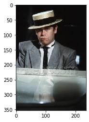
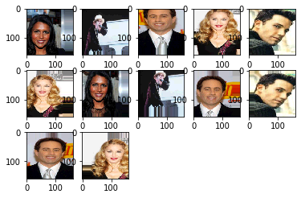
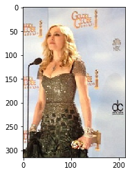
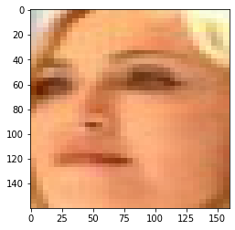
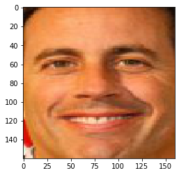

# 项目3：人脸识别

欢迎来到机器学习工程师纳米学位的第三个项目！在此文件中，有些示例代码已经提供给你，但你还需要实现更多的功能让项目成功运行。除非有明确要求，你无须修改任何已给出的代码。每一部分都会有详细的指导，需要实现的部分也会在注释中以'TODO'标出。请仔细阅读所有的提示！

除了实现代码外，你还必须回答一些与项目和你的实现有关的问题。每一个需要你回答的问题都会以'问题 X'为标题。请仔细阅读每个问题，并且在问题后的'回答问题'文字框中写出完整的答案。我们将根据你对问题的回答和撰写代码所实现的功能来对你提交的项目进行评分。

## 任务介绍

人脸识别是一个计算机视觉任务，任务是要通过一张带有人脸的图像，对图像中的人脸进行识别并判断是谁。关于人脸识别的任务，我们一定会用到2015年Google开发的FaceNet，这个模型由于其性能非常好而被广泛使用，并且该训练好的模型已经被开源。

因此，本项目的任务将要学习人脸识别任务，在此项目中，我们将先按课程所学到的知识亲手搭建一个卷积神经网络，然后，我们将用高级的网络结构，比如ResNet50再次进行人脸识别任务，最后我们将用到预训练好的FaceNet模型。在这个过程中，我们还会用到数据增强和人脸抽取技术来提升人脸识别的精确度。

在这个人脸识别项目中，我们将使用一个开源数据集[Five Celebrity Faces Dataset](kaggle.com/dansbecker/5-celebrity-faces-dataset)，这也是一个在Kaggle比赛中的一个数据集。我们也已经下载好了并放在`./5-celebrity-faces-dataset`中，数据集中包含五位名人的照片，Ben Affleck, Elton John, Jerry Seinfeld, Madonna, Mindy Kaling。文件下分`train`和`val`。

## 数据准备
我们首先要简单的观察数据，然后通过数据增强和人脸抽取技术对数据图像数据进行抽取。你需要在完成这些操作后，思考并回答相关的问题。

### 显示一张图像

所有 train下面的图像文件名都存入 images 列表中，并将该图像的人名按顺序存于 images_name 中


```python
import cv2
import matplotlib.pyplot as plt
import os
import random
import pandas as pd
%matplotlib inline

data_root = "./5-celebrity-faces-dataset/train/"
```


```python
import csv

def read_file_log(pathName, cvsName):
    with open(cvsName, 'w',encoding='utf-8') as f_cvs:
        csv_writer = csv.writer(f_cvs)
        #csv_writer.writerow(['fileNale', 'label'])
        #csv_writer.writerow(["file_path", "name"])
        all_dirs =  os.listdir(pathName)
        for dir_name in all_dirs:
            all_files =  os.listdir(pathName+dir_name)
            for file_name in all_files:
                child = os.path.join('%s/%s/%s' % (pathName, dir_name,file_name))
                label = dir_name
                ##print child.decode('gbk') # .decode('gbk')是解决中文显示乱码问题
                #print(child,label)
                csv_writer.writerow([child, label])

```


```python
train_log_file = './5-celebrity-faces-dataset/train_log.csv'
read_file_log(data_root,train_log_file)

```


```python
def read_csv(file):
    with open(file) as csvfile:
        reader = csv.reader(csvfile)
        images = []
        images_name = []
        for line in reader:
            images.append(line[0])
            images_name.append(line[1])
    
    return images,images_name

```


```python
# TODO: 把所有 train下面的图像文件名都存入 images 列表中，并将该图像的人名按顺序存于 images_name 中
images,images_name = read_csv(train_log_file)
```


```python
print(images[0])
print(images_name[0])
```

    ./5-celebrity-faces-dataset/train//elton_john/httpssmediacacheakpinimgcomxfefdacfbfdeadajpg.jpg
    elton_john


从`images`中随机读取一张图像，使用 `cv2.imread`读取图像，然后使用`pyplot.imshow`显示图像。注意：你需要同时显示该图像对应的人名，以及打印该图像的`shape`。


```python
# TODO: 从images 中随机读取一张图像，并获得该图像中的人名
from random import randrange
def random_sample(images=images, images_name=images_name):
    print("随机选取一张照片：")
    random_index = randrange(0,len(images))
   
    # TODO：从 images 和 images_name 随机读取一个图像文件路径以及该图像的人名
    im_file, im_name = images[random_index],images_name[random_index]
    # TODO：使用 cv2.imread 读取图像文件
    img = cv2.imread(im_file)
    img2=cv2.cvtColor(img, cv2.COLOR_BGR2RGB) # cv2默认为bgr顺序
    # TODO：使用 plt.imshow 和 plt.show() 显示图像
    plt.imshow(img2)
    plt.show()
    
    # 打印该图像的人名
    print(im_name)
    # 打印该图像的大小 shape
    print(img.shape)
    return im_file, im_name

random_sample(images, images_name)
```

    随机选取一张照片：





    elton_john
    (353, 236, 3)


    ('./5-celebrity-faces-dataset/train//elton_john/httpssmediacacheakpinimgcomxfefdacfbfdeadajpg.jpg',
     'elton_john')


你可以多次运行上面的代码来多观察一些人物图像，以此来对数据有一个大致的认知

用`cv2.imread`读取所有数据并存入`train_x`中，然后用 0,1,2,3,4 来标记 Ben Affleck, Elton John, Jerry Seinfeld, Madonna, Mindy Kaling，并将所有`images_name`数据存入`train_y`中。


```python
train_x = []
train_y = []
dict_name = {'ben_afflek':0,
            'elton_john':1,
            'jerry_seinfeld':2,
            'madonna':3,
            'mindy_kaling':4}
for file,name in zip(images,images_name):
    #print(file,name)
    train_x.append(cv2.imread(file))
    train_y.append(dict_name[name])
```


```python
print(train_y)
```

    [1, 1, 1, 1, 1, 1, 1, 1, 1, 1, 1, 1, 1, 1, 1, 1, 1, 0, 0, 0, 0, 0, 0, 0, 0, 0, 0, 0, 0, 0, 0, 2, 2, 2, 2, 2, 2, 2, 2, 2, 2, 2, 2, 2, 2, 2, 2, 2, 2, 2, 2, 2, 3, 3, 3, 3, 3, 3, 3, 3, 3, 3, 3, 3, 3, 3, 3, 3, 3, 3, 3, 4, 4, 4, 4, 4, 4, 4, 4, 4, 4, 4, 4, 4, 4, 4, 4, 4, 4, 4, 4, 4, 4]


### 数据增强

首先，我们需要打印训练集的数量。


```python
print(len(images))
```

    93


我们可以看到，训练集的图像数量比较少，这对模型建模并学习图像数据到人名标签的映射关系增加了难度，所以这里需要做数据增强的工作。这里有一份很不错的资料可以帮助你了解数据增强——[Data Augmentation](https://machinelearningmastery.com/how-to-configure-image-data-augmentation-when-training-deep-learning-neural-networks/)。


```python
from keras.preprocessing.image import ImageDataGenerator

# TODO: 构造图像数据增强器

data_gen = ImageDataGenerator(
    rescale = .1, # TODO：随机缩放图像RGB值的倍数
    rotation_range =0.15 , # TODO：随机旋转图像的范围
    zoom_range = 0.1,  # TODO：随机缩放图像大小范围
    width_shift_range = 0.2,  # TODO：随机水平方向平移图像(fraction of total width)
    height_shift_range= 0.2,  # TODO：随机纵向平移图像(fraction of total height)
    horizontal_flip=True,
)
```

    Using TensorFlow backend.
    /home/leon/anaconda3/lib/python3.7/site-packages/tensorflow/python/framework/dtypes.py:516: FutureWarning: Passing (type, 1) or '1type' as a synonym of type is deprecated; in a future version of numpy, it will be understood as (type, (1,)) / '(1,)type'.
      _np_qint8 = np.dtype([("qint8", np.int8, 1)])
    /home/leon/anaconda3/lib/python3.7/site-packages/tensorflow/python/framework/dtypes.py:517: FutureWarning: Passing (type, 1) or '1type' as a synonym of type is deprecated; in a future version of numpy, it will be understood as (type, (1,)) / '(1,)type'.
      _np_quint8 = np.dtype([("quint8", np.uint8, 1)])
    /home/leon/anaconda3/lib/python3.7/site-packages/tensorflow/python/framework/dtypes.py:518: FutureWarning: Passing (type, 1) or '1type' as a synonym of type is deprecated; in a future version of numpy, it will be understood as (type, (1,)) / '(1,)type'.
      _np_qint16 = np.dtype([("qint16", np.int16, 1)])
    /home/leon/anaconda3/lib/python3.7/site-packages/tensorflow/python/framework/dtypes.py:519: FutureWarning: Passing (type, 1) or '1type' as a synonym of type is deprecated; in a future version of numpy, it will be understood as (type, (1,)) / '(1,)type'.
      _np_quint16 = np.dtype([("quint16", np.uint16, 1)])
    /home/leon/anaconda3/lib/python3.7/site-packages/tensorflow/python/framework/dtypes.py:520: FutureWarning: Passing (type, 1) or '1type' as a synonym of type is deprecated; in a future version of numpy, it will be understood as (type, (1,)) / '(1,)type'.
      _np_qint32 = np.dtype([("qint32", np.int32, 1)])
    /home/leon/anaconda3/lib/python3.7/site-packages/tensorflow/python/framework/dtypes.py:525: FutureWarning: Passing (type, 1) or '1type' as a synonym of type is deprecated; in a future version of numpy, it will be understood as (type, (1,)) / '(1,)type'.
      np_resource = np.dtype([("resource", np.ubyte, 1)])
    /home/leon/anaconda3/lib/python3.7/site-packages/tensorboard/compat/tensorflow_stub/dtypes.py:541: FutureWarning: Passing (type, 1) or '1type' as a synonym of type is deprecated; in a future version of numpy, it will be understood as (type, (1,)) / '(1,)type'.
      _np_qint8 = np.dtype([("qint8", np.int8, 1)])
    /home/leon/anaconda3/lib/python3.7/site-packages/tensorboard/compat/tensorflow_stub/dtypes.py:542: FutureWarning: Passing (type, 1) or '1type' as a synonym of type is deprecated; in a future version of numpy, it will be understood as (type, (1,)) / '(1,)type'.
      _np_quint8 = np.dtype([("quint8", np.uint8, 1)])
    /home/leon/anaconda3/lib/python3.7/site-packages/tensorboard/compat/tensorflow_stub/dtypes.py:543: FutureWarning: Passing (type, 1) or '1type' as a synonym of type is deprecated; in a future version of numpy, it will be understood as (type, (1,)) / '(1,)type'.
      _np_qint16 = np.dtype([("qint16", np.int16, 1)])
    /home/leon/anaconda3/lib/python3.7/site-packages/tensorboard/compat/tensorflow_stub/dtypes.py:544: FutureWarning: Passing (type, 1) or '1type' as a synonym of type is deprecated; in a future version of numpy, it will be understood as (type, (1,)) / '(1,)type'.
      _np_quint16 = np.dtype([("quint16", np.uint16, 1)])
    /home/leon/anaconda3/lib/python3.7/site-packages/tensorboard/compat/tensorflow_stub/dtypes.py:545: FutureWarning: Passing (type, 1) or '1type' as a synonym of type is deprecated; in a future version of numpy, it will be understood as (type, (1,)) / '(1,)type'.
      _np_qint32 = np.dtype([("qint32", np.int32, 1)])
    /home/leon/anaconda3/lib/python3.7/site-packages/tensorboard/compat/tensorflow_stub/dtypes.py:550: FutureWarning: Passing (type, 1) or '1type' as a synonym of type is deprecated; in a future version of numpy, it will be understood as (type, (1,)) / '(1,)type'.
      np_resource = np.dtype([("resource", np.ubyte, 1)])


使用 `flow_from_directory` 遍历数据集 `./5-celebrity-faces-dataset/data`，来观察数据增强的表现。先得到一个图像迭代器，该迭代器每次都从路径里读取一个图像，并按照数据增强器的规则进行编辑图像


```python
# 直接运行，得到一个图像迭代器，该迭代器每次都从路径里读取一个图像，并按照数据增强器的规则进行编辑图像
dataflow_generator = data_gen.flow_from_directory(
    "./5-celebrity-faces-dataset/data",
    target_size=(160, 160),
    batch_size=3,
    color_mode='rgb',
    class_mode='categorical')

print(dataflow_generator.filenames)
```

    Found 5 images belonging to 5 classes.
    ['ben_afflek/httpcsvkmeuaeccjpg.jpg', 'elton_john/httpftqncomymusicLxZeltonjohnjpg.jpg', 'jerry_seinfeld/httpgraphicsnytimescomimagessectionmoviesfilmographyWireImagejpg.jpg', 'madonna/httpiamediaimdbcomimagesMMVBMTANDQNTAxNDVeQTJeQWpwZBbWUMDIMjQOTYVUXCRALjpg.jpg', 'mindy_kaling/httpgonetworthcomwpcontentuploadsthumbsjpg.jpg']


```python
# TODO：从 迭代器中 读取10张图片，并显示图像
from keras.preprocessing.image import array_to_img
sample_count = 10
i = 0
filenames = dataflow_generator.filenames
labels = dataflow_generator.class_indices
print(filenames)
print(len(filenames))
print(labels)
#此处image_data是一个二维序列，
#image_data[0][...]存放batch_size张图片
#image_data[1][...]存放batch_size对应标签
for image_data in dataflow_generator:
    # TODO：使用 plt.imshow 和 plt.show() 显示图像
    print(len(image_data[1]))
    for j in range(0,len(image_data[1])):
        if i >= 12:
            break
        plt.subplot(3,5,1+i)
        image = image_data[0][j].astype('uint8')
        #print(type(image_data))
        plt.imshow(array_to_img(image))
        #plt.imshow(image)
        i += 1
        print(image_data[1][j])          #label
        print(image_data[0][0].shape) #image
   
    sample_count -= 1
    if sample_count <= 0:
        break
```

    ['ben_afflek/httpcsvkmeuaeccjpg.jpg', 'elton_john/httpftqncomymusicLxZeltonjohnjpg.jpg', 'jerry_seinfeld/httpgraphicsnytimescomimagessectionmoviesfilmographyWireImagejpg.jpg', 'madonna/httpiamediaimdbcomimagesMMVBMTANDQNTAxNDVeQTJeQWpwZBbWUMDIMjQOTYVUXCRALjpg.jpg', 'mindy_kaling/httpgonetworthcomwpcontentuploadsthumbsjpg.jpg']
    5
    {'ben_afflek': 0, 'elton_john': 1, 'jerry_seinfeld': 2, 'madonna': 3, 'mindy_kaling': 4}
    3
    [0. 0. 0. 0. 1.]
    (160, 160, 3)
    [0. 1. 0. 0. 0.]
    (160, 160, 3)
    [0. 0. 1. 0. 0.]
    (160, 160, 3)
    2
    [0. 0. 0. 1. 0.]
    (160, 160, 3)
    [1. 0. 0. 0. 0.]
    (160, 160, 3)
    3
    [0. 0. 0. 1. 0.]
    (160, 160, 3)
    [0. 0. 0. 0. 1.]
    (160, 160, 3)
    [0. 1. 0. 0. 0.]
    (160, 160, 3)
    2
    [0. 0. 1. 0. 0.]
    (160, 160, 3)
    [1. 0. 0. 0. 0.]
    (160, 160, 3)
    3
    [0. 0. 1. 0. 0.]
    (160, 160, 3)
    [0. 0. 0. 1. 0.]
    (160, 160, 3)
    2
    3
    2
    3
    2





**问题1**：观察以上人脸图像，简单说说产生的图像中存在哪些增强的部分，然后再详细阐述你对数据增强的思考，包括为什么数据增强能够帮助人脸识别？你需要参考一些论文，并列出你的引用。

**问题回答：**

左右平移，上下平移，旋转

用CNN处理图片特征，具有平移不变形，旋转不变性。

因为对同一个人拍照，可以采取不同角度和构图，所以做数据增强可以更好泛化

数据增强能够补充数据数量，防止过拟合，增强模型的泛化能力。数据增强有助于产生更多的数据训练网络。增强模型的泛化的性能,使网络能够泛化到不在训练集中的图像。正如本项目的训练集的图像数量比较少，模型建模并学习就很困难。通过数据增强的方式，就可以在很少数据情况下产生足够多的数据，建立图片分类器。

增强模型的泛化的性能，一般的手段有数据增强和正则化方法，而用于数据增强的一般方法有：随机裁剪、随机水平翻转、平移、旋转、增加噪音和生成网络方法等（前两个方法用的最多，也最有效）。

https://nanonets.com/blog/data-augmentation-how-to-use-deep-learning-when-you-have-limited-data-part-2/

https://machinelearningmastery.com/how-to-configure-image-data-augmentation-when-training-deep-learning-neural-networks/

### 人脸抽取

在做人脸识别任务中，一项常用的图像数据处理的技术是人脸检测（Face Detection）。人脸检测是将输入的图片中的人脸部分自动检测出来，具体来说就是要通过预测一个矩形边界框（Bounding Box）从整个图像中定位人脸部分，这里的矩形边界框由矩形左下角坐标以及矩形高和宽来定义。人脸检测是一个比较成熟的任务，接下来在我们这个项目中，我们将使用 Multi-Task Cascaded Convolutional Neural Network，MTCNN，你也可以参考论文：[Joint Face Detection and Alignment Using Multitask Cascaded Convolutional Networks](https://arxiv.org/abs/1604.02878)，来学习人脸检测任务。


```python
# 运行下面代码，安装 mtcnn
!pip install mtcnn
```

    Requirement already satisfied: mtcnn in /home/leon/anaconda3/lib/python3.7/site-packages (0.1.0)
    Requirement already satisfied: keras>=2.0.0 in /home/leon/anaconda3/lib/python3.7/site-packages (from mtcnn) (2.3.1)
    Requirement already satisfied: opencv-python>=4.1.0 in /home/leon/anaconda3/lib/python3.7/site-packages (from mtcnn) (4.2.0.32)
    Requirement already satisfied: keras-applications>=1.0.6 in /home/leon/anaconda3/lib/python3.7/site-packages (from keras>=2.0.0->mtcnn) (1.0.8)
    Requirement already satisfied: keras-preprocessing>=1.0.5 in /home/leon/anaconda3/lib/python3.7/site-packages (from keras>=2.0.0->mtcnn) (1.1.0)
    Requirement already satisfied: six>=1.9.0 in /home/leon/anaconda3/lib/python3.7/site-packages (from keras>=2.0.0->mtcnn) (1.13.0)
    Requirement already satisfied: pyyaml in /home/leon/anaconda3/lib/python3.7/site-packages (from keras>=2.0.0->mtcnn) (5.2)
    Requirement already satisfied: h5py in /home/leon/anaconda3/lib/python3.7/site-packages (from keras>=2.0.0->mtcnn) (2.8.0)
    Requirement already satisfied: scipy>=0.14 in /home/leon/anaconda3/lib/python3.7/site-packages (from keras>=2.0.0->mtcnn) (1.3.2)
    Requirement already satisfied: numpy>=1.9.1 in /home/leon/anaconda3/lib/python3.7/site-packages (from keras>=2.0.0->mtcnn) (1.17.4)


```python
# 定义人脸抽取的函数
from PIL import Image
from mtcnn.mtcnn import MTCNN
import numpy as np

def extract_face(filename, image_size=(160, 160)):
    # 加载图像
    image = Image.open(filename)
    # 转换RGB
    image = image.convert('RGB')
    # 转成 numpy.array 格式的数据
    image_data = np.asarray(image)
    # 创建一个人脸检测，
    detector = MTCNN()
    # 从图像中检测
    results = detector.detect_faces(image_data)
    # 返回的结果是图像中所有出现的人脸的矩形边界框，由于我们的图像中只有一张人脸，所所以只需要取结果中第一个
    box_x, box_y, width, height = results[0]['box']
    # 处理下标为负的情况
    box_x, box_y = abs(box_x), abs(box_y)
    box_x_up, box_y_up = box_x + width, box_y + height
    # 获得人脸部分的数据
    face = image_data[box_y:box_y_up, box_x:box_x_up]
    print("face.shape",face.shape)
    
    # TODO：把抽取出来的人脸图像 resize 至需要的图像大小，并返回numpy格式的数据
    #face_array = cv2.resize(face,image_size,interpolation=cv2.INTER_CUBIC)
    image = Image.fromarray(face)
    image = image.resize(image_size)
    face_array = np.asarray(image)

    return face_array
```


```python
ran_img_file, ran_img_name = random_sample()
img = extract_face(ran_img_file)
plt.imshow(img)
#plt.show()
print(img.shape)
```

    随机选取一张照片：





    madonna
    (315, 214, 3)
    WARNING:tensorflow:From /home/leon/anaconda3/lib/python3.7/site-packages/keras/backend/tensorflow_backend.py:4070: The name tf.nn.max_pool is deprecated. Please use tf.nn.max_pool2d instead.
    
    WARNING:tensorflow:From /home/leon/anaconda3/lib/python3.7/site-packages/keras/backend/tensorflow_backend.py:422: The name tf.global_variables is deprecated. Please use tf.compat.v1.global_variables instead.
    
    face.shape (44, 33, 3)
    (160, 160, 3)





**问题2：**通过多次运行以上代码并观察人脸抽取后的图像，你认为人脸检测对人脸识别有帮助吗？为什么？你需要参考一些论文，并列出你的reference。

**回答问题：**

当然有帮助，只有准确检测出人脸区域，才能进一步做人脸识别

从数据整理的角度，通过检测是否有图像包含人脸，可以更好的清理训练图像数据。

人脸识别的所需的信息既有特征，又有结构。人类检测的矩形边界框定义人脸，其实是最基本的结构。

人脸识别过程中常常要做人脸对齐（Face Alignment），而人脸检测是进行这一步骤的基础。对齐的人类图像，会降低模型识别的难度。

现实场景的图像可能包括大量背景信息，而不是我们关注的人类。人类对齐可以有助于把人脸和背景分离，更好的让模型专注于人类的特征。

Bruce Cheen. 人脸检测和人脸识别.https://blog.csdn.net/czp_374/article/details/81162923

如何应用MTCNN和FaceNet模型实现人脸检测及识别.http://www.uml.org.cn/ai/201806124.asp

### 构造数据

现在我们可以应用以上的数据增强和人脸检测技术来构造完整的数据。

这里可以直接使用前面定义好的图像数据增强器 `data_gen`，然后使用 [ImageDataGenerator](https://keras.io/preprocessing/image/)中的 `random_transform` 对单个图像做随机增强操作。

另外，在构造数据之前，你需要先构造一个人名到类别的映射，使得在构造数据的label的时候将string格式的人名转换为int格式的类别。

编程练习：
1. 你需要 构造人名字典，将 ben_afflek、elton_john、jerry_seinfeld、madonna、mindy_kaling 分别映射到 0-1-2-3-4
2. 定义 `load_dataset`函数，遍历train或者val文件夹，读取文件夹下5个人名文件夹，以该文件夹名映射至0到4 的标签；然后分别从人名文件夹中遍历所有图像文件，读取图像，如果是train文件夹下的图像，则需要用`data_gen.random_transform`来增强图像数据，增强次数为augment_times；如果是val文件夹下的图像，则不需要进行图像增强


```python

def extract_face2(detector,image, image_size=(160, 160)):
    # 转成 numpy.array 格式的数据
    image_data = image
    # 创建一个人脸检测，
    # 从图像中检测
    results = detector.detect_faces(image_data)
    flag = True
    if len(results) > 0:
        # 返回的结果是图像中所有出现的人脸的矩形边界框，由于我们的图像中只有一张人脸，所所以只需要取结果中第一个
        box_x, box_y, width, height = results[0]['box']
        # 处理下标为负的情况
        box_x, box_y = abs(box_x), abs(box_y)
        box_x_up, box_y_up = box_x + width, box_y + height
        # 获得人脸部分的数据
        face = image_data[box_y:box_y_up, box_x:box_x_up]
        #print("face.shape",face.shape)

        # TODO：把抽取出来的人脸图像 resize 至需要的图像大小，并返回numpy格式的数据
        flag = True
        face_array = cv2.resize(face,image_size,interpolation=cv2.INTER_CUBIC)
    else:
        flag = False
        face_array = None

    return flag,face_array
# TODO：构造人名字典，将 ben_afflek、elton_john、jerry_seinfeld、madonna、mindy_kaling 分别映射到 0-1-2-3-4
name_dict = {'ben_afflek':0,
            'elton_john':1,
            'jerry_seinfeld':2,
            'madonna':3,
            'mindy_kaling':4}


# TODO：定义数据加载函数，data_dir为文件路径，augment_times为数据增强次数，is_train为判断是训练集还是测试集（测试集不需要数据增强）
def load_dataset2(data_dir = "./5-celebrity-faces-dataset/train/", augment_times=2, is_train=True):
    data_x = []
    data_y = []
    images = []
    labels = []
    if is_train:
        data_gen2 = ImageDataGenerator(rescale = .3, rotation_range =0.2 , zoom_range = 0.2,  width_shift_range = 0.2,  height_shift_range= 0.2)
        dataflow_generator2 = data_gen2.flow_from_directory(data_dir,target_size=(160, 160),batch_size=1,color_mode='rgb',class_mode='categorical')
        labels_dict = dataflow_generator2.class_indices
        print("labels_dict",labels_dict)
        sample_count = len(dataflow_generator2.filenames)*augment_times
        print('sample_count:',sample_count)
        #filenames = dataflow_generator2.filenames
        #labels = dataflow_generator2.class_indices
        #print(filenames)
        #print(labels)
        for image_data in dataflow_generator:
            # TODO：使用 plt.imshow 和 plt.show() 显示图像
            #print(len(image_data[1]))
            for j in range(0,len(image_data[1])):
                image = image_data[0][j].astype('uint8')
                images.append(image)
                labels.append(image_data[1][j])

            #print(image_data[1])          #label
            #print(image_data[0][0].shape) #image

            sample_count -= 1
            if sample_count <= 0:
                images = np.array(images)
                labels = np.array(labels)
                break
    else:
        images = []
        labels = []
        all_dirs =  os.listdir(data_dir)
        print("all_dirs:",all_dirs)
        for dir_name in all_dirs:
            all_files =  os.listdir(data_dir+dir_name)
            for file_name in all_files:
                im_file = os.path.join('%s/%s/%s' % (data_dir, dir_name,file_name))
                img = Image.open(filename)
                image = image.convert('RGB')
                label = dir_name
                images.append(img)
                labels.append(name_dict[label])
                #print("im_file:{},label:{}".format(im_file,label))
    
        
        images = np.array(images)
        labels = np.eye(5)[np.array(labels)]

    detector = MTCNN()
    
    for i in range(0,len(labels)):
        flag,face = extract_face2(detector,images[i])
        if flag:
            data_x.append(face)
            data_y.append(labels[i])
            
        
    data_x =np.array(data_x)
    data_y =np.array(data_y)
    
    return data_x, data_y


```


```python
def extract_face3(detector, filename, image_size=(160, 160)):
    # 加载图像
    image = Image.open(filename)
    # 转换RGB
    image = image.convert('RGB')
    # 转成 numpy.array 格式的数据
    image_data = np.asarray(image)
    
    # 从图像中检测
    results = detector.detect_faces(image_data)
    # 返回的结果是图像中所有出现的人脸的矩形边界框，由于我们的图像中只有一张人脸，所所以只需要取结果中第一个
    box_x, box_y, width, height = results[0]['box']
    # 处理下标为负的情况
    box_x, box_y = abs(box_x), abs(box_y)
    box_x_up, box_y_up = box_x + width, box_y + height
    # 获得人脸部分的数据
    face = image_data[box_y:box_y_up, box_x:box_x_up]

    # TODO：把抽取出来的人脸图像 resize 至需要的图像大小，并返回numpy格式的数据
    image = Image.fromarray(face)
    image = image.resize(image_size)
    face_array = np.asarray(image)
    
    return face_array
```


```python
# TODO：构造人名字典，将 ben_afflek、elton_john、jerry_seinfeld、madonna、mindy_kaling 分别映射到 0-1-2-3-4
name_dict = {'ben_afflek':0,
            'elton_john':1,
            'jerry_seinfeld':2,
            'madonna':3,
            'mindy_kaling':4}

# TODO：定义数据加载函数，data_dir为文件路径，augment_times为数据增强次数，is_train为判断是训练集还是测试集（测试集不需要数据增强）
def load_dataset(data_dir = "./5-celebrity-faces-dataset/train/", augment_times=2, is_train=True):
    data_x = []
    data_y = []
    detector = MTCNN()
    # TODO:
    for subdir in os.listdir(data_dir):
        path = os.path.join(data_dir, subdir)
        for filename in os.listdir(path):
            face = extract_face3(detector,os.path.join(path, filename))
            #print(face.shape)
            data_x.append(face)
            data_y.append(name_dict[subdir])
            # 如果是测试数据，则不需要进行数据增强
            if is_train:
                for _ in range(augment_times):
                    face_aug = data_gen.random_transform(face)
                    data_x.append(face_aug)
                    data_y.append(name_dict[subdir])
                
    return data_x, data_y
```


```python
train_x, train_y = load_dataset("./5-celebrity-faces-dataset/train/", augment_times=2, is_train=True)
test_x, test_y = load_dataset("./5-celebrity-faces-dataset/val/", is_train=False)
```


```python
# 最终构造好训练和测试数据
train_X = np.asarray(train_x)
train_Y = np.eye(5)[np.array(train_y)]
test_X = np.asarray(test_x)
test_Y = np.eye(5)[np.array(test_y)]
```


```python
print(train_X.shape)
print(train_Y.shape,train_Y)
```

    (279, 160, 160, 3)
    (279, 5) [[0. 1. 0. 0. 0.]
     [0. 1. 0. 0. 0.]
     [0. 1. 0. 0. 0.]
     ...
     [0. 0. 0. 0. 1.]
     [0. 0. 0. 0. 1.]
     [0. 0. 0. 0. 1.]]


```python
index = [i for i in range(len(train_y))]    
random.shuffle(index)   

train_X = train_X[index]  
train_Y = train_Y[index]  
```


```python
print(len(train_X))
print(train_X[0].shape)
print(len(train_Y))
print(train_Y)
plt.imshow(train_X[10])
```

    279
    (160, 160, 3)
    279
    [[1. 0. 0. 0. 0.]
     [0. 0. 0. 0. 1.]
     [0. 0. 1. 0. 0.]
     ...
     [0. 0. 1. 0. 0.]
     [0. 0. 1. 0. 0.]
     [0. 0. 0. 0. 1.]]


    <matplotlib.image.AxesImage at 0x7f59b0724be0>





### 构建一个卷积神经网络

创建一个卷积神经网络来对人脸进行分类。在你代码块的最后，执行 `model.summary()` 来输出你模型的总结信息。
。


**问题3：**在下方的代码块中尝试使用 Keras 搭建卷积网络的架构，并回答相关的问题。

1. 你可以尝试自己搭建一个卷积网络的模型，那么你需要回答你搭建卷积网络的具体步骤（用了哪些层）以及为什么这样搭建。
2. 你也可以根据上图提示的步骤搭建卷积网络，那么请说明如上的架构能够在该问题上取得的表现。


**回答问题：**


```python
from keras.layers import Conv2D, MaxPooling2D, GlobalAveragePooling2D
from keras.layers import Dropout, Flatten, Dense
from keras.models import Sequential

model = Sequential()

### TODO: 定义你的网络架构

model.add(Conv2D(filters=32, kernel_size=3, padding='valid', activation='relu', input_shape=(160, 160, 3)))
#model.add(Conv2D(32, (3,3), input_shape=(160, 160, 3), activation="relu"))
model.add(MaxPooling2D(pool_size=2))
#model.add(MaxPooling2D(pool_size=(2,2)))
model.add(Dropout(0.5))

model.add(Conv2D(filters=64, kernel_size=3, padding='valid', activation='relu'))
model.add(MaxPooling2D(pool_size=2))

model.add(Dropout(0.5))
model.add(Conv2D(filters=128, kernel_size=3, padding='valid', activation='relu'))

model.add(GlobalAveragePooling2D())

model.add(Dropout(0.5))

model.add(Dense(5, activation='softmax'))

model.summary()

```

    Model: "sequential_2"
    _________________________________________________________________
    Layer (type)                 Output Shape              Param #   
    =================================================================
    conv2d_40 (Conv2D)           (None, 158, 158, 32)      896       
    _________________________________________________________________
    max_pooling2d_21 (MaxPooling (None, 79, 79, 32)        0         
    _________________________________________________________________
    dropout_4 (Dropout)          (None, 79, 79, 32)        0         
    _________________________________________________________________
    conv2d_41 (Conv2D)           (None, 77, 77, 64)        18496     
    _________________________________________________________________
    max_pooling2d_22 (MaxPooling (None, 38, 38, 64)        0         
    _________________________________________________________________
    dropout_5 (Dropout)          (None, 38, 38, 64)        0         
    _________________________________________________________________
    conv2d_42 (Conv2D)           (None, 36, 36, 128)       73856     
    _________________________________________________________________
    global_average_pooling2d_2 ( (None, 128)               0         
    _________________________________________________________________
    dropout_6 (Dropout)          (None, 128)               0         
    _________________________________________________________________
    dense_23 (Dense)             (None, 5)                 645       
    =================================================================
    Total params: 93,893
    Trainable params: 93,893
    Non-trainable params: 0
    _________________________________________________________________


keras.callbacks.ModelCheckpoint(filepath, monitor='val_loss', verbose=0, save_best_only=False, save_weights_only=False, mode='auto', period=1)

filepath 可以包括命名格式选项，可以由 epoch 的值和 logs 的键（由 on_epoch_end 参数传递）来填充。

例如：如果 filepath 是 weights.{epoch:02d}-{val_loss:.2f}.hdf5， 那么模型被保存的的文件名就会有训练轮数和验证损失。

参数

filepath: 字符串，保存模型的路径。

monitor: 被监测的数据。

verbose: 详细信息模式，0 或者 1 。

save_best_only: 如果 save_best_only=True， 被监测数据的最佳模型就不会被覆盖。

mode: {auto, min, max} 的其中之一。 如果 save_best_only=True，那么是否覆盖保存文件的决定就取决于被监测数据的最大或者最小值。 对于 val_acc，模式就会是 max，而对于 val_loss，模式就需要是 min，等等。 在 auto 模式中，方向会自动从被监测的数据的名字中判断出来。

save_weights_only: 如果 True，那么只有模型的权重会被保存 (model.save_weights(filepath))， 否则的话，整个模型会被保存 (model.save(filepath))。

period: 每个检查点之间的间隔（训练轮数）。


```python
from keras.callbacks import ModelCheckpoint
 
filepath='weights.best.hdf5'
    # 有一次提升, 则覆盖一次.
checkpointer = ModelCheckpoint(filepath='face.weights.best.hdf5', verbose=1, save_best_only=True)
callbacks_list = [checkpoint]

```


```python
# 直接运行编译模型和训练模型

# 编译模型
model.compile(optimizer='rmsprop', loss='categorical_crossentropy', metrics=['accuracy'])
# 模型训练
history1 = model.fit(train_X, train_Y, batch_size=16, epochs=50,callbacks=callbacks_list)
```

    Epoch 1/50
    279/279 [==============================] - 7s 24ms/step - loss: 39.8889 - accuracy: 0.1828
    Epoch 2/50


    /home/leon/anaconda3/lib/python3.7/site-packages/keras/callbacks/callbacks.py:707: RuntimeWarning: Can save best model only with val_acc available, skipping.
      'skipping.' % (self.monitor), RuntimeWarning)


    279/279 [==============================] - 6s 22ms/step - loss: 2.7463 - accuracy: 0.2366
    Epoch 3/50
    279/279 [==============================] - 6s 21ms/step - loss: 1.6863 - accuracy: 0.2437
    Epoch 4/50
    279/279 [==============================] - 6s 21ms/step - loss: 1.6230 - accuracy: 0.2401
    Epoch 5/50
    279/279 [==============================] - 6s 22ms/step - loss: 1.5912 - accuracy: 0.2652
    Epoch 6/50
    279/279 [==============================] - 6s 22ms/step - loss: 1.5232 - accuracy: 0.3011
    Epoch 7/50
    279/279 [==============================] - 6s 23ms/step - loss: 1.5407 - accuracy: 0.2832
    Epoch 8/50
    279/279 [==============================] - 6s 23ms/step - loss: 1.5016 - accuracy: 0.3297
    Epoch 9/50
    279/279 [==============================] - 6s 23ms/step - loss: 1.4720 - accuracy: 0.3728
    Epoch 10/50
    279/279 [==============================] - 7s 25ms/step - loss: 1.5734 - accuracy: 0.3548
    Epoch 11/50
    279/279 [==============================] - 7s 24ms/step - loss: 1.4603 - accuracy: 0.3656
    Epoch 12/50
    279/279 [==============================] - 6s 22ms/step - loss: 1.4718 - accuracy: 0.3978
    Epoch 13/50
    279/279 [==============================] - 6s 22ms/step - loss: 1.4214 - accuracy: 0.4229
    Epoch 14/50
    279/279 [==============================] - 6s 22ms/step - loss: 1.4342 - accuracy: 0.3907
    Epoch 15/50
    279/279 [==============================] - 6s 22ms/step - loss: 1.4342 - accuracy: 0.4265
    Epoch 16/50
    279/279 [==============================] - 6s 21ms/step - loss: 1.4160 - accuracy: 0.4050
    Epoch 17/50
    279/279 [==============================] - 6s 22ms/step - loss: 1.4428 - accuracy: 0.3871
    Epoch 18/50
    279/279 [==============================] - 6s 22ms/step - loss: 1.3369 - accuracy: 0.4122
    Epoch 19/50
    279/279 [==============================] - 6s 22ms/step - loss: 1.4309 - accuracy: 0.4516
    Epoch 20/50
    279/279 [==============================] - 6s 22ms/step - loss: 1.3276 - accuracy: 0.4373
    Epoch 21/50
    279/279 [==============================] - 6s 22ms/step - loss: 1.4037 - accuracy: 0.4229
    Epoch 22/50
    279/279 [==============================] - 6s 22ms/step - loss: 1.3154 - accuracy: 0.4695
    Epoch 23/50
    279/279 [==============================] - 6s 22ms/step - loss: 1.2779 - accuracy: 0.4946
    Epoch 24/50
    279/279 [==============================] - 6s 22ms/step - loss: 1.3090 - accuracy: 0.4982
    Epoch 25/50
    279/279 [==============================] - 6s 22ms/step - loss: 1.2235 - accuracy: 0.4982
    Epoch 26/50
    279/279 [==============================] - 6s 22ms/step - loss: 1.3207 - accuracy: 0.4767
    Epoch 27/50
    279/279 [==============================] - 6s 22ms/step - loss: 1.2054 - accuracy: 0.5376
    Epoch 28/50
    279/279 [==============================] - 6s 21ms/step - loss: 1.3022 - accuracy: 0.5018
    Epoch 29/50
    279/279 [==============================] - 6s 22ms/step - loss: 1.2537 - accuracy: 0.5054
    Epoch 30/50
    279/279 [==============================] - 6s 22ms/step - loss: 1.2138 - accuracy: 0.5269
    Epoch 31/50
    279/279 [==============================] - 6s 21ms/step - loss: 1.1663 - accuracy: 0.5520
    Epoch 32/50
    279/279 [==============================] - 6s 22ms/step - loss: 1.0952 - accuracy: 0.5484
    Epoch 33/50
    279/279 [==============================] - 6s 23ms/step - loss: 1.1327 - accuracy: 0.5412
    Epoch 34/50
    279/279 [==============================] - 6s 22ms/step - loss: 1.2464 - accuracy: 0.5341
    Epoch 35/50
    279/279 [==============================] - 6s 22ms/step - loss: 1.1882 - accuracy: 0.5341
    Epoch 36/50
    279/279 [==============================] - 6s 21ms/step - loss: 1.1453 - accuracy: 0.5376
    Epoch 37/50
    279/279 [==============================] - 6s 23ms/step - loss: 1.0874 - accuracy: 0.5376
    Epoch 38/50
    279/279 [==============================] - 6s 23ms/step - loss: 1.1972 - accuracy: 0.5125
    Epoch 39/50
    279/279 [==============================] - 6s 22ms/step - loss: 1.0800 - accuracy: 0.5556
    Epoch 40/50
    279/279 [==============================] - 6s 22ms/step - loss: 1.0611 - accuracy: 0.5806
    Epoch 41/50
    279/279 [==============================] - 6s 22ms/step - loss: 1.2013 - accuracy: 0.5663
    Epoch 42/50
    279/279 [==============================] - 6s 21ms/step - loss: 1.0615 - accuracy: 0.5771
    Epoch 43/50
    279/279 [==============================] - 6s 22ms/step - loss: 1.0621 - accuracy: 0.5806
    Epoch 44/50
    279/279 [==============================] - 6s 22ms/step - loss: 1.0311 - accuracy: 0.5448
    Epoch 45/50
    279/279 [==============================] - 6s 22ms/step - loss: 1.1516 - accuracy: 0.5556
    Epoch 46/50
    279/279 [==============================] - 6s 22ms/step - loss: 0.9768 - accuracy: 0.5986
    Epoch 47/50
    279/279 [==============================] - 6s 22ms/step - loss: 0.9592 - accuracy: 0.6308
    Epoch 48/50
    279/279 [==============================] - 6s 22ms/step - loss: 1.0822 - accuracy: 0.5591
    Epoch 49/50
    279/279 [==============================] - 6s 23ms/step - loss: 1.0212 - accuracy: 0.5986
    Epoch 50/50
    279/279 [==============================] - 6s 22ms/step - loss: 0.9619 - accuracy: 0.6057


#### 模型测试

你需要编写一个自动测试模型准确率的函数。


```python
from sklearn.metrics import fbeta_score, accuracy_score
from sklearn.metrics import classification_report

def metric_accuracy(model, test_X, test_Y, model_name):
    preds_Y = model.predict(test_X)
    correct = 0.
    for pr, y in zip(preds_Y, test_Y):
        pr_cls = np.argmax(pr)
        if y[pr_cls] == 1:
            correct += 1
    accuracy = correct / len(preds_Y)
    
    print()
    
    print("%s Accuracy: %.3f" % (model_name, accuracy))


def metric_accuracy2(model, test_X, test_Y, model_name):
    preds_Y = model.predict(test_X)
    #TODO：通过预测值preds_Y以及真实值test_Y，来计算准确率
    #print(preds_Y)
    max_index = np.argmax(preds_Y,axis=1) #横轴比较
    print(len(max_index),max_index)

    preds_Y = np.zeros( preds_Y.shape)
    for i in range(0,len(max_index)):
        preds_Y[i][max_index[i]] = 1

    #print(len(preds_Y),preds_Y)
    print(preds_Y.shape)
    print(preds_Y[0])
    print("="*88)
    #print(len(test_Y),test_Y)
    print(test_Y.shape)
    print(test_Y[0])
    
    accuracy = accuracy_score(preds_Y,test_Y)
    #classification_report(test_Y,preds_Y)
    print()
    
    print("%s Accuracy: %.3f" % (model_name, accuracy))
    
metric_accuracy(model, test_X, test_Y, "Simple CNN")
```

    
    Simple CNN Accuracy: 0.600


```python
metric_accuracy(model, train_X, train_Y, "Simple CNN")
```

    
    Simple CNN Accuracy: 0.835


### 进阶 CNN 模型架构
在计算机视觉任务中，有一些复杂的高级CNN模型架构，比如ResNet、VGG、Inception 等等，他们能够对图像有一个非常好的表达。并且，已经有人把这些模型在非常大的图像数据上训练好了参数，这使得预训练的大模型能够对图像有一个很好的特征表达。这种在大规模图像数据上学到的图像特征，能够迁移到人脸图像的特征表示。

在这一小节，我们利用预训练好的 ResNet50,抽取图像特征，然后再去做人脸识别。虽然 ResNet50 在各种图像上面进行预训练的，但是该模型对图像结构特征信息的学习也能够帮助人脸识别任务中的预测。


```python
import keras 
from keras.models import Model, Sequential
from keras.layers import Conv2D, MaxPooling2D, Flatten, Dense, Dropout

# 模型底层使用 ResNet50 对原始图像进行建模，特征抽取
resnet50_weights = "./models/resnet50_weights.h5"
resnet = keras.applications.resnet50.ResNet50(weights=None, include_top=False, input_shape=(160, 160, 3))
resnet.load_weights(resnet50_weights)

# TODO：自己定义模型顶层，使用抽取后的特征进行人脸识别
resnet_face = Sequential()
resnet_face.add(Flatten(input_shape=resnet.output_shape[1:]))
#resnet_face.add(Dense(2048, activation="relu"))
#resnet_face.add(Dropout(0.5))
resnet_face.add(Dense(1024, activation="relu"))
resnet_face.add(Dropout(0.5))
resnet_face.add(Dense(5, activation='softmax'))

resnet_face_model = Model(inputs=resnet.input, outputs=resnet_face(resnet.output))
resnet_face_model.summary()

```

    /home/leon/anaconda3/lib/python3.7/site-packages/keras_applications/resnet50.py:265: UserWarning: The output shape of `ResNet50(include_top=False)` has been changed since Keras 2.2.0.
      warnings.warn('The output shape of `ResNet50(include_top=False)` '


    Model: "model_71"
    __________________________________________________________________________________________________
    Layer (type)                    Output Shape         Param #     Connected to                     
    ==================================================================================================
    input_61 (InputLayer)           (None, 160, 160, 3)  0                                            
    __________________________________________________________________________________________________
    conv1_pad (ZeroPadding2D)       (None, 166, 166, 3)  0           input_61[0][0]                   
    __________________________________________________________________________________________________
    conv1 (Conv2D)                  (None, 80, 80, 64)   9472        conv1_pad[0][0]                  
    __________________________________________________________________________________________________
    bn_conv1 (BatchNormalization)   (None, 80, 80, 64)   256         conv1[0][0]                      
    __________________________________________________________________________________________________
    activation_295 (Activation)     (None, 80, 80, 64)   0           bn_conv1[0][0]                   
    __________________________________________________________________________________________________
    pool1_pad (ZeroPadding2D)       (None, 82, 82, 64)   0           activation_295[0][0]             
    __________________________________________________________________________________________________
    max_pooling2d_125 (MaxPooling2D (None, 40, 40, 64)   0           pool1_pad[0][0]                  
    __________________________________________________________________________________________________
    res2a_branch2a (Conv2D)         (None, 40, 40, 64)   4160        max_pooling2d_125[0][0]          
    __________________________________________________________________________________________________
    bn2a_branch2a (BatchNormalizati (None, 40, 40, 64)   256         res2a_branch2a[0][0]             
    __________________________________________________________________________________________________
    activation_296 (Activation)     (None, 40, 40, 64)   0           bn2a_branch2a[0][0]              
    __________________________________________________________________________________________________
    res2a_branch2b (Conv2D)         (None, 40, 40, 64)   36928       activation_296[0][0]             
    __________________________________________________________________________________________________
    bn2a_branch2b (BatchNormalizati (None, 40, 40, 64)   256         res2a_branch2b[0][0]             
    __________________________________________________________________________________________________
    activation_297 (Activation)     (None, 40, 40, 64)   0           bn2a_branch2b[0][0]              
    __________________________________________________________________________________________________
    res2a_branch2c (Conv2D)         (None, 40, 40, 256)  16640       activation_297[0][0]             
    __________________________________________________________________________________________________
    res2a_branch1 (Conv2D)          (None, 40, 40, 256)  16640       max_pooling2d_125[0][0]          
    __________________________________________________________________________________________________
    bn2a_branch2c (BatchNormalizati (None, 40, 40, 256)  1024        res2a_branch2c[0][0]             
    __________________________________________________________________________________________________
    bn2a_branch1 (BatchNormalizatio (None, 40, 40, 256)  1024        res2a_branch1[0][0]              
    __________________________________________________________________________________________________
    add_97 (Add)                    (None, 40, 40, 256)  0           bn2a_branch2c[0][0]              
                                                                     bn2a_branch1[0][0]               
    __________________________________________________________________________________________________
    activation_298 (Activation)     (None, 40, 40, 256)  0           add_97[0][0]                     
    __________________________________________________________________________________________________
    res2b_branch2a (Conv2D)         (None, 40, 40, 64)   16448       activation_298[0][0]             
    __________________________________________________________________________________________________
    bn2b_branch2a (BatchNormalizati (None, 40, 40, 64)   256         res2b_branch2a[0][0]             
    __________________________________________________________________________________________________
    activation_299 (Activation)     (None, 40, 40, 64)   0           bn2b_branch2a[0][0]              
    __________________________________________________________________________________________________
    res2b_branch2b (Conv2D)         (None, 40, 40, 64)   36928       activation_299[0][0]             
    __________________________________________________________________________________________________
    bn2b_branch2b (BatchNormalizati (None, 40, 40, 64)   256         res2b_branch2b[0][0]             
    __________________________________________________________________________________________________
    activation_300 (Activation)     (None, 40, 40, 64)   0           bn2b_branch2b[0][0]              
    __________________________________________________________________________________________________
    res2b_branch2c (Conv2D)         (None, 40, 40, 256)  16640       activation_300[0][0]             
    __________________________________________________________________________________________________
    bn2b_branch2c (BatchNormalizati (None, 40, 40, 256)  1024        res2b_branch2c[0][0]             
    __________________________________________________________________________________________________
    add_98 (Add)                    (None, 40, 40, 256)  0           bn2b_branch2c[0][0]              
                                                                     activation_298[0][0]             
    __________________________________________________________________________________________________
    activation_301 (Activation)     (None, 40, 40, 256)  0           add_98[0][0]                     
    __________________________________________________________________________________________________
    res2c_branch2a (Conv2D)         (None, 40, 40, 64)   16448       activation_301[0][0]             
    __________________________________________________________________________________________________
    bn2c_branch2a (BatchNormalizati (None, 40, 40, 64)   256         res2c_branch2a[0][0]             
    __________________________________________________________________________________________________
    activation_302 (Activation)     (None, 40, 40, 64)   0           bn2c_branch2a[0][0]              
    __________________________________________________________________________________________________
    res2c_branch2b (Conv2D)         (None, 40, 40, 64)   36928       activation_302[0][0]             
    __________________________________________________________________________________________________
    bn2c_branch2b (BatchNormalizati (None, 40, 40, 64)   256         res2c_branch2b[0][0]             
    __________________________________________________________________________________________________
    activation_303 (Activation)     (None, 40, 40, 64)   0           bn2c_branch2b[0][0]              
    __________________________________________________________________________________________________
    res2c_branch2c (Conv2D)         (None, 40, 40, 256)  16640       activation_303[0][0]             
    __________________________________________________________________________________________________
    bn2c_branch2c (BatchNormalizati (None, 40, 40, 256)  1024        res2c_branch2c[0][0]             
    __________________________________________________________________________________________________
    add_99 (Add)                    (None, 40, 40, 256)  0           bn2c_branch2c[0][0]              
                                                                     activation_301[0][0]             
    __________________________________________________________________________________________________
    activation_304 (Activation)     (None, 40, 40, 256)  0           add_99[0][0]                     
    __________________________________________________________________________________________________
    res3a_branch2a (Conv2D)         (None, 20, 20, 128)  32896       activation_304[0][0]             
    __________________________________________________________________________________________________
    bn3a_branch2a (BatchNormalizati (None, 20, 20, 128)  512         res3a_branch2a[0][0]             
    __________________________________________________________________________________________________
    activation_305 (Activation)     (None, 20, 20, 128)  0           bn3a_branch2a[0][0]              
    __________________________________________________________________________________________________
    res3a_branch2b (Conv2D)         (None, 20, 20, 128)  147584      activation_305[0][0]             
    __________________________________________________________________________________________________
    bn3a_branch2b (BatchNormalizati (None, 20, 20, 128)  512         res3a_branch2b[0][0]             
    __________________________________________________________________________________________________
    activation_306 (Activation)     (None, 20, 20, 128)  0           bn3a_branch2b[0][0]              
    __________________________________________________________________________________________________
    res3a_branch2c (Conv2D)         (None, 20, 20, 512)  66048       activation_306[0][0]             
    __________________________________________________________________________________________________
    res3a_branch1 (Conv2D)          (None, 20, 20, 512)  131584      activation_304[0][0]             
    __________________________________________________________________________________________________
    bn3a_branch2c (BatchNormalizati (None, 20, 20, 512)  2048        res3a_branch2c[0][0]             
    __________________________________________________________________________________________________
    bn3a_branch1 (BatchNormalizatio (None, 20, 20, 512)  2048        res3a_branch1[0][0]              
    __________________________________________________________________________________________________
    add_100 (Add)                   (None, 20, 20, 512)  0           bn3a_branch2c[0][0]              
                                                                     bn3a_branch1[0][0]               
    __________________________________________________________________________________________________
    activation_307 (Activation)     (None, 20, 20, 512)  0           add_100[0][0]                    
    __________________________________________________________________________________________________
    res3b_branch2a (Conv2D)         (None, 20, 20, 128)  65664       activation_307[0][0]             
    __________________________________________________________________________________________________
    bn3b_branch2a (BatchNormalizati (None, 20, 20, 128)  512         res3b_branch2a[0][0]             
    __________________________________________________________________________________________________
    activation_308 (Activation)     (None, 20, 20, 128)  0           bn3b_branch2a[0][0]              
    __________________________________________________________________________________________________
    res3b_branch2b (Conv2D)         (None, 20, 20, 128)  147584      activation_308[0][0]             
    __________________________________________________________________________________________________
    bn3b_branch2b (BatchNormalizati (None, 20, 20, 128)  512         res3b_branch2b[0][0]             
    __________________________________________________________________________________________________
    activation_309 (Activation)     (None, 20, 20, 128)  0           bn3b_branch2b[0][0]              
    __________________________________________________________________________________________________
    res3b_branch2c (Conv2D)         (None, 20, 20, 512)  66048       activation_309[0][0]             
    __________________________________________________________________________________________________
    bn3b_branch2c (BatchNormalizati (None, 20, 20, 512)  2048        res3b_branch2c[0][0]             
    __________________________________________________________________________________________________
    add_101 (Add)                   (None, 20, 20, 512)  0           bn3b_branch2c[0][0]              
                                                                     activation_307[0][0]             
    __________________________________________________________________________________________________
    activation_310 (Activation)     (None, 20, 20, 512)  0           add_101[0][0]                    
    __________________________________________________________________________________________________
    res3c_branch2a (Conv2D)         (None, 20, 20, 128)  65664       activation_310[0][0]             
    __________________________________________________________________________________________________
    bn3c_branch2a (BatchNormalizati (None, 20, 20, 128)  512         res3c_branch2a[0][0]             
    __________________________________________________________________________________________________
    activation_311 (Activation)     (None, 20, 20, 128)  0           bn3c_branch2a[0][0]              
    __________________________________________________________________________________________________
    res3c_branch2b (Conv2D)         (None, 20, 20, 128)  147584      activation_311[0][0]             
    __________________________________________________________________________________________________
    bn3c_branch2b (BatchNormalizati (None, 20, 20, 128)  512         res3c_branch2b[0][0]             
    __________________________________________________________________________________________________
    activation_312 (Activation)     (None, 20, 20, 128)  0           bn3c_branch2b[0][0]              
    __________________________________________________________________________________________________
    res3c_branch2c (Conv2D)         (None, 20, 20, 512)  66048       activation_312[0][0]             
    __________________________________________________________________________________________________
    bn3c_branch2c (BatchNormalizati (None, 20, 20, 512)  2048        res3c_branch2c[0][0]             
    __________________________________________________________________________________________________
    add_102 (Add)                   (None, 20, 20, 512)  0           bn3c_branch2c[0][0]              
                                                                     activation_310[0][0]             
    __________________________________________________________________________________________________
    activation_313 (Activation)     (None, 20, 20, 512)  0           add_102[0][0]                    
    __________________________________________________________________________________________________
    res3d_branch2a (Conv2D)         (None, 20, 20, 128)  65664       activation_313[0][0]             
    __________________________________________________________________________________________________
    bn3d_branch2a (BatchNormalizati (None, 20, 20, 128)  512         res3d_branch2a[0][0]             
    __________________________________________________________________________________________________
    activation_314 (Activation)     (None, 20, 20, 128)  0           bn3d_branch2a[0][0]              
    __________________________________________________________________________________________________
    res3d_branch2b (Conv2D)         (None, 20, 20, 128)  147584      activation_314[0][0]             
    __________________________________________________________________________________________________
    bn3d_branch2b (BatchNormalizati (None, 20, 20, 128)  512         res3d_branch2b[0][0]             
    __________________________________________________________________________________________________
    activation_315 (Activation)     (None, 20, 20, 128)  0           bn3d_branch2b[0][0]              
    __________________________________________________________________________________________________
    res3d_branch2c (Conv2D)         (None, 20, 20, 512)  66048       activation_315[0][0]             
    __________________________________________________________________________________________________
    bn3d_branch2c (BatchNormalizati (None, 20, 20, 512)  2048        res3d_branch2c[0][0]             
    __________________________________________________________________________________________________
    add_103 (Add)                   (None, 20, 20, 512)  0           bn3d_branch2c[0][0]              
                                                                     activation_313[0][0]             
    __________________________________________________________________________________________________
    activation_316 (Activation)     (None, 20, 20, 512)  0           add_103[0][0]                    
    __________________________________________________________________________________________________
    res4a_branch2a (Conv2D)         (None, 10, 10, 256)  131328      activation_316[0][0]             
    __________________________________________________________________________________________________
    bn4a_branch2a (BatchNormalizati (None, 10, 10, 256)  1024        res4a_branch2a[0][0]             
    __________________________________________________________________________________________________
    activation_317 (Activation)     (None, 10, 10, 256)  0           bn4a_branch2a[0][0]              
    __________________________________________________________________________________________________
    res4a_branch2b (Conv2D)         (None, 10, 10, 256)  590080      activation_317[0][0]             
    __________________________________________________________________________________________________
    bn4a_branch2b (BatchNormalizati (None, 10, 10, 256)  1024        res4a_branch2b[0][0]             
    __________________________________________________________________________________________________
    activation_318 (Activation)     (None, 10, 10, 256)  0           bn4a_branch2b[0][0]              
    __________________________________________________________________________________________________
    res4a_branch2c (Conv2D)         (None, 10, 10, 1024) 263168      activation_318[0][0]             
    __________________________________________________________________________________________________
    res4a_branch1 (Conv2D)          (None, 10, 10, 1024) 525312      activation_316[0][0]             
    __________________________________________________________________________________________________
    bn4a_branch2c (BatchNormalizati (None, 10, 10, 1024) 4096        res4a_branch2c[0][0]             
    __________________________________________________________________________________________________
    bn4a_branch1 (BatchNormalizatio (None, 10, 10, 1024) 4096        res4a_branch1[0][0]              
    __________________________________________________________________________________________________
    add_104 (Add)                   (None, 10, 10, 1024) 0           bn4a_branch2c[0][0]              
                                                                     bn4a_branch1[0][0]               
    __________________________________________________________________________________________________
    activation_319 (Activation)     (None, 10, 10, 1024) 0           add_104[0][0]                    
    __________________________________________________________________________________________________
    res4b_branch2a (Conv2D)         (None, 10, 10, 256)  262400      activation_319[0][0]             
    __________________________________________________________________________________________________
    bn4b_branch2a (BatchNormalizati (None, 10, 10, 256)  1024        res4b_branch2a[0][0]             
    __________________________________________________________________________________________________
    activation_320 (Activation)     (None, 10, 10, 256)  0           bn4b_branch2a[0][0]              
    __________________________________________________________________________________________________
    res4b_branch2b (Conv2D)         (None, 10, 10, 256)  590080      activation_320[0][0]             
    __________________________________________________________________________________________________
    bn4b_branch2b (BatchNormalizati (None, 10, 10, 256)  1024        res4b_branch2b[0][0]             
    __________________________________________________________________________________________________
    activation_321 (Activation)     (None, 10, 10, 256)  0           bn4b_branch2b[0][0]              
    __________________________________________________________________________________________________
    res4b_branch2c (Conv2D)         (None, 10, 10, 1024) 263168      activation_321[0][0]             
    __________________________________________________________________________________________________
    bn4b_branch2c (BatchNormalizati (None, 10, 10, 1024) 4096        res4b_branch2c[0][0]             
    __________________________________________________________________________________________________
    add_105 (Add)                   (None, 10, 10, 1024) 0           bn4b_branch2c[0][0]              
                                                                     activation_319[0][0]             
    __________________________________________________________________________________________________
    activation_322 (Activation)     (None, 10, 10, 1024) 0           add_105[0][0]                    
    __________________________________________________________________________________________________
    res4c_branch2a (Conv2D)         (None, 10, 10, 256)  262400      activation_322[0][0]             
    __________________________________________________________________________________________________
    bn4c_branch2a (BatchNormalizati (None, 10, 10, 256)  1024        res4c_branch2a[0][0]             
    __________________________________________________________________________________________________
    activation_323 (Activation)     (None, 10, 10, 256)  0           bn4c_branch2a[0][0]              
    __________________________________________________________________________________________________
    res4c_branch2b (Conv2D)         (None, 10, 10, 256)  590080      activation_323[0][0]             
    __________________________________________________________________________________________________
    bn4c_branch2b (BatchNormalizati (None, 10, 10, 256)  1024        res4c_branch2b[0][0]             
    __________________________________________________________________________________________________
    activation_324 (Activation)     (None, 10, 10, 256)  0           bn4c_branch2b[0][0]              
    __________________________________________________________________________________________________
    res4c_branch2c (Conv2D)         (None, 10, 10, 1024) 263168      activation_324[0][0]             
    __________________________________________________________________________________________________
    bn4c_branch2c (BatchNormalizati (None, 10, 10, 1024) 4096        res4c_branch2c[0][0]             
    __________________________________________________________________________________________________
    add_106 (Add)                   (None, 10, 10, 1024) 0           bn4c_branch2c[0][0]              
                                                                     activation_322[0][0]             
    __________________________________________________________________________________________________
    activation_325 (Activation)     (None, 10, 10, 1024) 0           add_106[0][0]                    
    __________________________________________________________________________________________________
    res4d_branch2a (Conv2D)         (None, 10, 10, 256)  262400      activation_325[0][0]             
    __________________________________________________________________________________________________
    bn4d_branch2a (BatchNormalizati (None, 10, 10, 256)  1024        res4d_branch2a[0][0]             
    __________________________________________________________________________________________________
    activation_326 (Activation)     (None, 10, 10, 256)  0           bn4d_branch2a[0][0]              
    __________________________________________________________________________________________________
    res4d_branch2b (Conv2D)         (None, 10, 10, 256)  590080      activation_326[0][0]             
    __________________________________________________________________________________________________
    bn4d_branch2b (BatchNormalizati (None, 10, 10, 256)  1024        res4d_branch2b[0][0]             
    __________________________________________________________________________________________________
    activation_327 (Activation)     (None, 10, 10, 256)  0           bn4d_branch2b[0][0]              
    __________________________________________________________________________________________________
    res4d_branch2c (Conv2D)         (None, 10, 10, 1024) 263168      activation_327[0][0]             
    __________________________________________________________________________________________________
    bn4d_branch2c (BatchNormalizati (None, 10, 10, 1024) 4096        res4d_branch2c[0][0]             
    __________________________________________________________________________________________________
    add_107 (Add)                   (None, 10, 10, 1024) 0           bn4d_branch2c[0][0]              
                                                                     activation_325[0][0]             
    __________________________________________________________________________________________________
    activation_328 (Activation)     (None, 10, 10, 1024) 0           add_107[0][0]                    
    __________________________________________________________________________________________________
    res4e_branch2a (Conv2D)         (None, 10, 10, 256)  262400      activation_328[0][0]             
    __________________________________________________________________________________________________
    bn4e_branch2a (BatchNormalizati (None, 10, 10, 256)  1024        res4e_branch2a[0][0]             
    __________________________________________________________________________________________________
    activation_329 (Activation)     (None, 10, 10, 256)  0           bn4e_branch2a[0][0]              
    __________________________________________________________________________________________________
    res4e_branch2b (Conv2D)         (None, 10, 10, 256)  590080      activation_329[0][0]             
    __________________________________________________________________________________________________
    bn4e_branch2b (BatchNormalizati (None, 10, 10, 256)  1024        res4e_branch2b[0][0]             
    __________________________________________________________________________________________________
    activation_330 (Activation)     (None, 10, 10, 256)  0           bn4e_branch2b[0][0]              
    __________________________________________________________________________________________________
    res4e_branch2c (Conv2D)         (None, 10, 10, 1024) 263168      activation_330[0][0]             
    __________________________________________________________________________________________________
    bn4e_branch2c (BatchNormalizati (None, 10, 10, 1024) 4096        res4e_branch2c[0][0]             
    __________________________________________________________________________________________________
    add_108 (Add)                   (None, 10, 10, 1024) 0           bn4e_branch2c[0][0]              
                                                                     activation_328[0][0]             
    __________________________________________________________________________________________________
    activation_331 (Activation)     (None, 10, 10, 1024) 0           add_108[0][0]                    
    __________________________________________________________________________________________________
    res4f_branch2a (Conv2D)         (None, 10, 10, 256)  262400      activation_331[0][0]             
    __________________________________________________________________________________________________
    bn4f_branch2a (BatchNormalizati (None, 10, 10, 256)  1024        res4f_branch2a[0][0]             
    __________________________________________________________________________________________________
    activation_332 (Activation)     (None, 10, 10, 256)  0           bn4f_branch2a[0][0]              
    __________________________________________________________________________________________________
    res4f_branch2b (Conv2D)         (None, 10, 10, 256)  590080      activation_332[0][0]             
    __________________________________________________________________________________________________
    bn4f_branch2b (BatchNormalizati (None, 10, 10, 256)  1024        res4f_branch2b[0][0]             
    __________________________________________________________________________________________________
    activation_333 (Activation)     (None, 10, 10, 256)  0           bn4f_branch2b[0][0]              
    __________________________________________________________________________________________________
    res4f_branch2c (Conv2D)         (None, 10, 10, 1024) 263168      activation_333[0][0]             
    __________________________________________________________________________________________________
    bn4f_branch2c (BatchNormalizati (None, 10, 10, 1024) 4096        res4f_branch2c[0][0]             
    __________________________________________________________________________________________________
    add_109 (Add)                   (None, 10, 10, 1024) 0           bn4f_branch2c[0][0]              
                                                                     activation_331[0][0]             
    __________________________________________________________________________________________________
    activation_334 (Activation)     (None, 10, 10, 1024) 0           add_109[0][0]                    
    __________________________________________________________________________________________________
    res5a_branch2a (Conv2D)         (None, 5, 5, 512)    524800      activation_334[0][0]             
    __________________________________________________________________________________________________
    bn5a_branch2a (BatchNormalizati (None, 5, 5, 512)    2048        res5a_branch2a[0][0]             
    __________________________________________________________________________________________________
    activation_335 (Activation)     (None, 5, 5, 512)    0           bn5a_branch2a[0][0]              
    __________________________________________________________________________________________________
    res5a_branch2b (Conv2D)         (None, 5, 5, 512)    2359808     activation_335[0][0]             
    __________________________________________________________________________________________________
    bn5a_branch2b (BatchNormalizati (None, 5, 5, 512)    2048        res5a_branch2b[0][0]             
    __________________________________________________________________________________________________
    activation_336 (Activation)     (None, 5, 5, 512)    0           bn5a_branch2b[0][0]              
    __________________________________________________________________________________________________
    res5a_branch2c (Conv2D)         (None, 5, 5, 2048)   1050624     activation_336[0][0]             
    __________________________________________________________________________________________________
    res5a_branch1 (Conv2D)          (None, 5, 5, 2048)   2099200     activation_334[0][0]             
    __________________________________________________________________________________________________
    bn5a_branch2c (BatchNormalizati (None, 5, 5, 2048)   8192        res5a_branch2c[0][0]             
    __________________________________________________________________________________________________
    bn5a_branch1 (BatchNormalizatio (None, 5, 5, 2048)   8192        res5a_branch1[0][0]              
    __________________________________________________________________________________________________
    add_110 (Add)                   (None, 5, 5, 2048)   0           bn5a_branch2c[0][0]              
                                                                     bn5a_branch1[0][0]               
    __________________________________________________________________________________________________
    activation_337 (Activation)     (None, 5, 5, 2048)   0           add_110[0][0]                    
    __________________________________________________________________________________________________
    res5b_branch2a (Conv2D)         (None, 5, 5, 512)    1049088     activation_337[0][0]             
    __________________________________________________________________________________________________
    bn5b_branch2a (BatchNormalizati (None, 5, 5, 512)    2048        res5b_branch2a[0][0]             
    __________________________________________________________________________________________________
    activation_338 (Activation)     (None, 5, 5, 512)    0           bn5b_branch2a[0][0]              
    __________________________________________________________________________________________________
    res5b_branch2b (Conv2D)         (None, 5, 5, 512)    2359808     activation_338[0][0]             
    __________________________________________________________________________________________________
    bn5b_branch2b (BatchNormalizati (None, 5, 5, 512)    2048        res5b_branch2b[0][0]             
    __________________________________________________________________________________________________
    activation_339 (Activation)     (None, 5, 5, 512)    0           bn5b_branch2b[0][0]              
    __________________________________________________________________________________________________
    res5b_branch2c (Conv2D)         (None, 5, 5, 2048)   1050624     activation_339[0][0]             
    __________________________________________________________________________________________________
    bn5b_branch2c (BatchNormalizati (None, 5, 5, 2048)   8192        res5b_branch2c[0][0]             
    __________________________________________________________________________________________________
    add_111 (Add)                   (None, 5, 5, 2048)   0           bn5b_branch2c[0][0]              
                                                                     activation_337[0][0]             
    __________________________________________________________________________________________________
    activation_340 (Activation)     (None, 5, 5, 2048)   0           add_111[0][0]                    
    __________________________________________________________________________________________________
    res5c_branch2a (Conv2D)         (None, 5, 5, 512)    1049088     activation_340[0][0]             
    __________________________________________________________________________________________________
    bn5c_branch2a (BatchNormalizati (None, 5, 5, 512)    2048        res5c_branch2a[0][0]             
    __________________________________________________________________________________________________
    activation_341 (Activation)     (None, 5, 5, 512)    0           bn5c_branch2a[0][0]              
    __________________________________________________________________________________________________
    res5c_branch2b (Conv2D)         (None, 5, 5, 512)    2359808     activation_341[0][0]             
    __________________________________________________________________________________________________
    bn5c_branch2b (BatchNormalizati (None, 5, 5, 512)    2048        res5c_branch2b[0][0]             
    __________________________________________________________________________________________________
    activation_342 (Activation)     (None, 5, 5, 512)    0           bn5c_branch2b[0][0]              
    __________________________________________________________________________________________________
    res5c_branch2c (Conv2D)         (None, 5, 5, 2048)   1050624     activation_342[0][0]             
    __________________________________________________________________________________________________
    bn5c_branch2c (BatchNormalizati (None, 5, 5, 2048)   8192        res5c_branch2c[0][0]             
    __________________________________________________________________________________________________
    add_112 (Add)                   (None, 5, 5, 2048)   0           bn5c_branch2c[0][0]              
                                                                     activation_340[0][0]             
    __________________________________________________________________________________________________
    activation_343 (Activation)     (None, 5, 5, 2048)   0           add_112[0][0]                    
    __________________________________________________________________________________________________
    sequential_25 (Sequential)      (None, 5)            52434949    activation_343[0][0]             
    ==================================================================================================
    Total params: 76,022,661
    Trainable params: 75,969,541
    Non-trainable params: 53,120
    __________________________________________________________________________________________________


```python
print(len(resnet_face_model.layers))
print(resnet_face_model.layers[0])
```

    176
    <keras.engine.input_layer.InputLayer object at 0x7f1023f25e80>


```python
for layer in resnet_face_model.layers[:10]:
    layer.trainable = False
```


```python
# 设置同样的训练参数，直接运行

## 编译模型
resnet_face_model.compile(optimizer='rmsprop', loss='categorical_crossentropy', metrics=['accuracy'])
# 模型训练
resnet_face_model.fit(train_X, train_Y, batch_size=16, epochs=50)
```

    Epoch 1/50
    279/279 [==============================] - 38s 137ms/step - loss: 19.1508 - accuracy: 0.3907
    Epoch 2/50
    279/279 [==============================] - 34s 121ms/step - loss: 2.1262 - accuracy: 0.5484
    Epoch 3/50
    279/279 [==============================] - 34s 121ms/step - loss: 1.9686 - accuracy: 0.5878
    Epoch 4/50
    279/279 [==============================] - 34s 121ms/step - loss: 1.9093 - accuracy: 0.6344
    Epoch 5/50
    279/279 [==============================] - 34s 122ms/step - loss: 2.5704 - accuracy: 0.6487
    Epoch 6/50
    279/279 [==============================] - 34s 121ms/step - loss: 1.9690 - accuracy: 0.6416
    Epoch 7/50
    279/279 [==============================] - 34s 121ms/step - loss: 2.0262 - accuracy: 0.6918
    Epoch 8/50
    279/279 [==============================] - 34s 121ms/step - loss: 1.6622 - accuracy: 0.7455
    Epoch 9/50
    279/279 [==============================] - 34s 121ms/step - loss: 1.6748 - accuracy: 0.7455
    Epoch 10/50
    279/279 [==============================] - 34s 121ms/step - loss: 1.7465 - accuracy: 0.7634
    Epoch 11/50
    279/279 [==============================] - 34s 121ms/step - loss: 1.0735 - accuracy: 0.7849
    Epoch 12/50
    279/279 [==============================] - 34s 121ms/step - loss: 1.9004 - accuracy: 0.7599
    Epoch 13/50
    279/279 [==============================] - 34s 121ms/step - loss: 1.1039 - accuracy: 0.8172
    Epoch 14/50
    279/279 [==============================] - 34s 121ms/step - loss: 1.5777 - accuracy: 0.7204
    Epoch 15/50
    279/279 [==============================] - 34s 121ms/step - loss: 1.5112 - accuracy: 0.7599
    Epoch 16/50
    279/279 [==============================] - 34s 121ms/step - loss: 1.1855 - accuracy: 0.8315
    Epoch 17/50
    279/279 [==============================] - 34s 121ms/step - loss: 1.1903 - accuracy: 0.8459
    Epoch 18/50
    279/279 [==============================] - 34s 122ms/step - loss: 0.2138 - accuracy: 0.9427
    Epoch 19/50
    279/279 [==============================] - 34s 122ms/step - loss: 0.3371 - accuracy: 0.8996
    Epoch 20/50
    279/279 [==============================] - 34s 121ms/step - loss: 1.1622 - accuracy: 0.8459
    Epoch 21/50
    279/279 [==============================] - 34s 121ms/step - loss: 0.9279 - accuracy: 0.8853
    Epoch 22/50
    279/279 [==============================] - 34s 121ms/step - loss: 0.8955 - accuracy: 0.9283
    Epoch 23/50
    279/279 [==============================] - 34s 121ms/step - loss: 0.7452 - accuracy: 0.9104
    Epoch 24/50
    279/279 [==============================] - 34s 121ms/step - loss: 1.7670 - accuracy: 0.8853
    Epoch 25/50
    279/279 [==============================] - 34s 122ms/step - loss: 0.1591 - accuracy: 0.9534
    Epoch 26/50
    279/279 [==============================] - 34s 121ms/step - loss: 0.1476 - accuracy: 0.9785
    Epoch 27/50
    279/279 [==============================] - 34s 121ms/step - loss: 1.3928 - accuracy: 0.8853
    Epoch 28/50
    279/279 [==============================] - 34s 121ms/step - loss: 0.7772 - accuracy: 0.9211
    Epoch 29/50
    279/279 [==============================] - 34s 121ms/step - loss: 0.9187 - accuracy: 0.9570
    Epoch 30/50
    279/279 [==============================] - 35s 126ms/step - loss: 1.2415 - accuracy: 0.9211
    Epoch 31/50
    279/279 [==============================] - 34s 121ms/step - loss: 0.8171 - accuracy: 0.9355
    Epoch 32/50
    279/279 [==============================] - 34s 122ms/step - loss: 0.7921 - accuracy: 0.9247
    Epoch 33/50
    279/279 [==============================] - 34s 121ms/step - loss: 0.0947 - accuracy: 0.9677
    Epoch 34/50
    279/279 [==============================] - 34s 121ms/step - loss: 0.5504 - accuracy: 0.9427
    Epoch 35/50
    279/279 [==============================] - 34s 121ms/step - loss: 0.3166 - accuracy: 0.9570
    Epoch 36/50
    279/279 [==============================] - 34s 121ms/step - loss: 0.3262 - accuracy: 0.9642
    Epoch 37/50
    279/279 [==============================] - 34s 121ms/step - loss: 0.6838 - accuracy: 0.9355
    Epoch 38/50
    279/279 [==============================] - 34s 121ms/step - loss: 0.2263 - accuracy: 0.9606
    Epoch 39/50
    279/279 [==============================] - 34s 122ms/step - loss: 0.1374 - accuracy: 0.9713
    Epoch 40/50
    279/279 [==============================] - 34s 121ms/step - loss: 0.5833 - accuracy: 0.9570
    Epoch 41/50
    279/279 [==============================] - 34s 122ms/step - loss: 0.0836 - accuracy: 0.9821
    Epoch 42/50
    279/279 [==============================] - 34s 121ms/step - loss: 0.4567 - accuracy: 0.9713
    Epoch 43/50
    279/279 [==============================] - 34s 122ms/step - loss: 0.1343 - accuracy: 0.9785
    Epoch 44/50
    279/279 [==============================] - 34s 121ms/step - loss: 0.0634 - accuracy: 0.9928
    Epoch 45/50
    279/279 [==============================] - 34s 122ms/step - loss: 0.2391 - accuracy: 0.9713
    Epoch 46/50
    279/279 [==============================] - 34s 121ms/step - loss: 0.3609 - accuracy: 0.9749
    Epoch 47/50
    279/279 [==============================] - 34s 121ms/step - loss: 0.3567 - accuracy: 0.9427
    Epoch 48/50
    279/279 [==============================] - 34s 122ms/step - loss: 0.0296 - accuracy: 0.9892
    Epoch 49/50
    279/279 [==============================] - 34s 121ms/step - loss: 0.5168 - accuracy: 0.9749
    Epoch 50/50
    279/279 [==============================] - 34s 121ms/step - loss: 1.2976 - accuracy: 0.9570


    <keras.callbacks.callbacks.History at 0x7f11c19144a8>


模型测试


```python
# 直接运行，测试 resnet_face_model 的准确率
metric_accuracy(resnet_face_model, test_X, test_Y, "ResNet50")

```

    
    ResNet50 Accuracy: 0.560


```python
metric_accuracy(resnet_face_model, train_X, train_Y, "ResNet50")
```

    
    ResNet50 Accuracy: 0.556


**问题5：**对比 ResNet50 模型和 CNN 模型的结果，请你分析为什么 ResNet50 模型能够取得更好的结果？

**回答问题：**

1.ResNet50模型相比CNN更深，卷积核更多，可以采样到更多的特征。

2.ResNet50模型有结果大量数据训练过的参数；

**问题6：**上面我们使用了预训练好的 ResNet50，即`resnet.load_weights(resnet50_weights)`，那么加载预训练好的参数对该任务有帮助吗？你需要通过做对比实验，即不加载预训练好的参数，然后在下面的代码框中重新跑一遍 ResNet50 的模型，来作为对比说明加载预训练是否有帮助

**回答问题：**

1.预加载参数，模型收敛的更快；

2.从实验结果看预加载的参数，泛化能力不如重新训练所有参数？（这点与我认知刚好相反，请老师指点）


```python
# 重新跑一遍不加载预训练参数的 ResNet50 的模型，请在此处写完整的code

import keras 
from keras.models import Model, Sequential
from keras.layers import Conv2D, MaxPooling2D, Flatten, Dense, Dropout

# 模型底层使用 ResNet50 对原始图像进行建模，特征抽取
resnet50_weights = "./models/resnet50_weights.h5"
resnet2 = keras.applications.resnet50.ResNet50(weights=None, include_top=False, input_shape=(160, 160, 3))
#resnet.load_weights(resnet50_weights)

# TODO：自己定义模型顶层，使用抽取后的特征进行人脸识别
resnet_face2 = Sequential()
resnet_face2.add(Flatten(input_shape=resnet2.output_shape[1:]))
resnet_face2.add(Dense(1024, activation="relu"))
resnet_face2.add(Dropout(0.5))
resnet_face2.add(Dense(5, activation="softmax"))

resnet_face_model2 = Model(inputs=resnet2.input, outputs=resnet_face2(resnet2.output))
resnet_face_model2.summary()

```

    Model: "model_33"
    __________________________________________________________________________________________________
    Layer (type)                    Output Shape         Param #     Connected to                     
    ==================================================================================================
    input_33 (InputLayer)           (None, 160, 160, 3)  0                                            
    __________________________________________________________________________________________________
    conv1_pad (ZeroPadding2D)       (None, 166, 166, 3)  0           input_33[0][0]                   
    __________________________________________________________________________________________________
    conv1 (Conv2D)                  (None, 80, 80, 64)   9472        conv1_pad[0][0]                  
    __________________________________________________________________________________________________
    bn_conv1 (BatchNormalization)   (None, 80, 80, 64)   256         conv1[0][0]                      
    __________________________________________________________________________________________________
    activation_246 (Activation)     (None, 80, 80, 64)   0           bn_conv1[0][0]                   
    __________________________________________________________________________________________________
    pool1_pad (ZeroPadding2D)       (None, 82, 82, 64)   0           activation_246[0][0]             
    __________________________________________________________________________________________________
    max_pooling2d_66 (MaxPooling2D) (None, 40, 40, 64)   0           pool1_pad[0][0]                  
    __________________________________________________________________________________________________
    res2a_branch2a (Conv2D)         (None, 40, 40, 64)   4160        max_pooling2d_66[0][0]           
    __________________________________________________________________________________________________
    bn2a_branch2a (BatchNormalizati (None, 40, 40, 64)   256         res2a_branch2a[0][0]             
    __________________________________________________________________________________________________
    activation_247 (Activation)     (None, 40, 40, 64)   0           bn2a_branch2a[0][0]              
    __________________________________________________________________________________________________
    res2a_branch2b (Conv2D)         (None, 40, 40, 64)   36928       activation_247[0][0]             
    __________________________________________________________________________________________________
    bn2a_branch2b (BatchNormalizati (None, 40, 40, 64)   256         res2a_branch2b[0][0]             
    __________________________________________________________________________________________________
    activation_248 (Activation)     (None, 40, 40, 64)   0           bn2a_branch2b[0][0]              
    __________________________________________________________________________________________________
    res2a_branch2c (Conv2D)         (None, 40, 40, 256)  16640       activation_248[0][0]             
    __________________________________________________________________________________________________
    res2a_branch1 (Conv2D)          (None, 40, 40, 256)  16640       max_pooling2d_66[0][0]           
    __________________________________________________________________________________________________
    bn2a_branch2c (BatchNormalizati (None, 40, 40, 256)  1024        res2a_branch2c[0][0]             
    __________________________________________________________________________________________________
    bn2a_branch1 (BatchNormalizatio (None, 40, 40, 256)  1024        res2a_branch1[0][0]              
    __________________________________________________________________________________________________
    add_81 (Add)                    (None, 40, 40, 256)  0           bn2a_branch2c[0][0]              
                                                                     bn2a_branch1[0][0]               
    __________________________________________________________________________________________________
    activation_249 (Activation)     (None, 40, 40, 256)  0           add_81[0][0]                     
    __________________________________________________________________________________________________
    res2b_branch2a (Conv2D)         (None, 40, 40, 64)   16448       activation_249[0][0]             
    __________________________________________________________________________________________________
    bn2b_branch2a (BatchNormalizati (None, 40, 40, 64)   256         res2b_branch2a[0][0]             
    __________________________________________________________________________________________________
    activation_250 (Activation)     (None, 40, 40, 64)   0           bn2b_branch2a[0][0]              
    __________________________________________________________________________________________________
    res2b_branch2b (Conv2D)         (None, 40, 40, 64)   36928       activation_250[0][0]             
    __________________________________________________________________________________________________
    bn2b_branch2b (BatchNormalizati (None, 40, 40, 64)   256         res2b_branch2b[0][0]             
    __________________________________________________________________________________________________
    activation_251 (Activation)     (None, 40, 40, 64)   0           bn2b_branch2b[0][0]              
    __________________________________________________________________________________________________
    res2b_branch2c (Conv2D)         (None, 40, 40, 256)  16640       activation_251[0][0]             
    __________________________________________________________________________________________________
    bn2b_branch2c (BatchNormalizati (None, 40, 40, 256)  1024        res2b_branch2c[0][0]             
    __________________________________________________________________________________________________
    add_82 (Add)                    (None, 40, 40, 256)  0           bn2b_branch2c[0][0]              
                                                                     activation_249[0][0]             
    __________________________________________________________________________________________________
    activation_252 (Activation)     (None, 40, 40, 256)  0           add_82[0][0]                     
    __________________________________________________________________________________________________
    res2c_branch2a (Conv2D)         (None, 40, 40, 64)   16448       activation_252[0][0]             
    __________________________________________________________________________________________________
    bn2c_branch2a (BatchNormalizati (None, 40, 40, 64)   256         res2c_branch2a[0][0]             
    __________________________________________________________________________________________________
    activation_253 (Activation)     (None, 40, 40, 64)   0           bn2c_branch2a[0][0]              
    __________________________________________________________________________________________________
    res2c_branch2b (Conv2D)         (None, 40, 40, 64)   36928       activation_253[0][0]             
    __________________________________________________________________________________________________
    bn2c_branch2b (BatchNormalizati (None, 40, 40, 64)   256         res2c_branch2b[0][0]             
    __________________________________________________________________________________________________
    activation_254 (Activation)     (None, 40, 40, 64)   0           bn2c_branch2b[0][0]              
    __________________________________________________________________________________________________
    res2c_branch2c (Conv2D)         (None, 40, 40, 256)  16640       activation_254[0][0]             
    __________________________________________________________________________________________________
    bn2c_branch2c (BatchNormalizati (None, 40, 40, 256)  1024        res2c_branch2c[0][0]             
    __________________________________________________________________________________________________
    add_83 (Add)                    (None, 40, 40, 256)  0           bn2c_branch2c[0][0]              
                                                                     activation_252[0][0]             
    __________________________________________________________________________________________________
    activation_255 (Activation)     (None, 40, 40, 256)  0           add_83[0][0]                     
    __________________________________________________________________________________________________
    res3a_branch2a (Conv2D)         (None, 20, 20, 128)  32896       activation_255[0][0]             
    __________________________________________________________________________________________________
    bn3a_branch2a (BatchNormalizati (None, 20, 20, 128)  512         res3a_branch2a[0][0]             
    __________________________________________________________________________________________________
    activation_256 (Activation)     (None, 20, 20, 128)  0           bn3a_branch2a[0][0]              
    __________________________________________________________________________________________________
    res3a_branch2b (Conv2D)         (None, 20, 20, 128)  147584      activation_256[0][0]             
    __________________________________________________________________________________________________
    bn3a_branch2b (BatchNormalizati (None, 20, 20, 128)  512         res3a_branch2b[0][0]             
    __________________________________________________________________________________________________
    activation_257 (Activation)     (None, 20, 20, 128)  0           bn3a_branch2b[0][0]              
    __________________________________________________________________________________________________
    res3a_branch2c (Conv2D)         (None, 20, 20, 512)  66048       activation_257[0][0]             
    __________________________________________________________________________________________________
    res3a_branch1 (Conv2D)          (None, 20, 20, 512)  131584      activation_255[0][0]             
    __________________________________________________________________________________________________
    bn3a_branch2c (BatchNormalizati (None, 20, 20, 512)  2048        res3a_branch2c[0][0]             
    __________________________________________________________________________________________________
    bn3a_branch1 (BatchNormalizatio (None, 20, 20, 512)  2048        res3a_branch1[0][0]              
    __________________________________________________________________________________________________
    add_84 (Add)                    (None, 20, 20, 512)  0           bn3a_branch2c[0][0]              
                                                                     bn3a_branch1[0][0]               
    __________________________________________________________________________________________________
    activation_258 (Activation)     (None, 20, 20, 512)  0           add_84[0][0]                     
    __________________________________________________________________________________________________
    res3b_branch2a (Conv2D)         (None, 20, 20, 128)  65664       activation_258[0][0]             
    __________________________________________________________________________________________________
    bn3b_branch2a (BatchNormalizati (None, 20, 20, 128)  512         res3b_branch2a[0][0]             
    __________________________________________________________________________________________________
    activation_259 (Activation)     (None, 20, 20, 128)  0           bn3b_branch2a[0][0]              
    __________________________________________________________________________________________________
    res3b_branch2b (Conv2D)         (None, 20, 20, 128)  147584      activation_259[0][0]             
    __________________________________________________________________________________________________
    bn3b_branch2b (BatchNormalizati (None, 20, 20, 128)  512         res3b_branch2b[0][0]             
    __________________________________________________________________________________________________
    activation_260 (Activation)     (None, 20, 20, 128)  0           bn3b_branch2b[0][0]              
    __________________________________________________________________________________________________
    res3b_branch2c (Conv2D)         (None, 20, 20, 512)  66048       activation_260[0][0]             
    __________________________________________________________________________________________________
    bn3b_branch2c (BatchNormalizati (None, 20, 20, 512)  2048        res3b_branch2c[0][0]             
    __________________________________________________________________________________________________
    add_85 (Add)                    (None, 20, 20, 512)  0           bn3b_branch2c[0][0]              
                                                                     activation_258[0][0]             
    __________________________________________________________________________________________________
    activation_261 (Activation)     (None, 20, 20, 512)  0           add_85[0][0]                     
    __________________________________________________________________________________________________
    res3c_branch2a (Conv2D)         (None, 20, 20, 128)  65664       activation_261[0][0]             
    __________________________________________________________________________________________________
    bn3c_branch2a (BatchNormalizati (None, 20, 20, 128)  512         res3c_branch2a[0][0]             
    __________________________________________________________________________________________________
    activation_262 (Activation)     (None, 20, 20, 128)  0           bn3c_branch2a[0][0]              
    __________________________________________________________________________________________________
    res3c_branch2b (Conv2D)         (None, 20, 20, 128)  147584      activation_262[0][0]             
    __________________________________________________________________________________________________
    bn3c_branch2b (BatchNormalizati (None, 20, 20, 128)  512         res3c_branch2b[0][0]             
    __________________________________________________________________________________________________
    activation_263 (Activation)     (None, 20, 20, 128)  0           bn3c_branch2b[0][0]              
    __________________________________________________________________________________________________
    res3c_branch2c (Conv2D)         (None, 20, 20, 512)  66048       activation_263[0][0]             
    __________________________________________________________________________________________________
    bn3c_branch2c (BatchNormalizati (None, 20, 20, 512)  2048        res3c_branch2c[0][0]             
    __________________________________________________________________________________________________
    add_86 (Add)                    (None, 20, 20, 512)  0           bn3c_branch2c[0][0]              
                                                                     activation_261[0][0]             
    __________________________________________________________________________________________________
    activation_264 (Activation)     (None, 20, 20, 512)  0           add_86[0][0]                     
    __________________________________________________________________________________________________
    res3d_branch2a (Conv2D)         (None, 20, 20, 128)  65664       activation_264[0][0]             
    __________________________________________________________________________________________________
    bn3d_branch2a (BatchNormalizati (None, 20, 20, 128)  512         res3d_branch2a[0][0]             
    __________________________________________________________________________________________________
    activation_265 (Activation)     (None, 20, 20, 128)  0           bn3d_branch2a[0][0]              
    __________________________________________________________________________________________________
    res3d_branch2b (Conv2D)         (None, 20, 20, 128)  147584      activation_265[0][0]             
    __________________________________________________________________________________________________
    bn3d_branch2b (BatchNormalizati (None, 20, 20, 128)  512         res3d_branch2b[0][0]             
    __________________________________________________________________________________________________
    activation_266 (Activation)     (None, 20, 20, 128)  0           bn3d_branch2b[0][0]              
    __________________________________________________________________________________________________
    res3d_branch2c (Conv2D)         (None, 20, 20, 512)  66048       activation_266[0][0]             
    __________________________________________________________________________________________________
    bn3d_branch2c (BatchNormalizati (None, 20, 20, 512)  2048        res3d_branch2c[0][0]             
    __________________________________________________________________________________________________
    add_87 (Add)                    (None, 20, 20, 512)  0           bn3d_branch2c[0][0]              
                                                                     activation_264[0][0]             
    __________________________________________________________________________________________________
    activation_267 (Activation)     (None, 20, 20, 512)  0           add_87[0][0]                     
    __________________________________________________________________________________________________
    res4a_branch2a (Conv2D)         (None, 10, 10, 256)  131328      activation_267[0][0]             
    __________________________________________________________________________________________________
    bn4a_branch2a (BatchNormalizati (None, 10, 10, 256)  1024        res4a_branch2a[0][0]             
    __________________________________________________________________________________________________
    activation_268 (Activation)     (None, 10, 10, 256)  0           bn4a_branch2a[0][0]              
    __________________________________________________________________________________________________
    res4a_branch2b (Conv2D)         (None, 10, 10, 256)  590080      activation_268[0][0]             
    __________________________________________________________________________________________________
    bn4a_branch2b (BatchNormalizati (None, 10, 10, 256)  1024        res4a_branch2b[0][0]             
    __________________________________________________________________________________________________
    activation_269 (Activation)     (None, 10, 10, 256)  0           bn4a_branch2b[0][0]              
    __________________________________________________________________________________________________
    res4a_branch2c (Conv2D)         (None, 10, 10, 1024) 263168      activation_269[0][0]             
    __________________________________________________________________________________________________
    res4a_branch1 (Conv2D)          (None, 10, 10, 1024) 525312      activation_267[0][0]             
    __________________________________________________________________________________________________
    bn4a_branch2c (BatchNormalizati (None, 10, 10, 1024) 4096        res4a_branch2c[0][0]             
    __________________________________________________________________________________________________
    bn4a_branch1 (BatchNormalizatio (None, 10, 10, 1024) 4096        res4a_branch1[0][0]              
    __________________________________________________________________________________________________
    add_88 (Add)                    (None, 10, 10, 1024) 0           bn4a_branch2c[0][0]              
                                                                     bn4a_branch1[0][0]               
    __________________________________________________________________________________________________
    activation_270 (Activation)     (None, 10, 10, 1024) 0           add_88[0][0]                     
    __________________________________________________________________________________________________
    res4b_branch2a (Conv2D)         (None, 10, 10, 256)  262400      activation_270[0][0]             
    __________________________________________________________________________________________________
    bn4b_branch2a (BatchNormalizati (None, 10, 10, 256)  1024        res4b_branch2a[0][0]             
    __________________________________________________________________________________________________
    activation_271 (Activation)     (None, 10, 10, 256)  0           bn4b_branch2a[0][0]              
    __________________________________________________________________________________________________
    res4b_branch2b (Conv2D)         (None, 10, 10, 256)  590080      activation_271[0][0]             
    __________________________________________________________________________________________________
    bn4b_branch2b (BatchNormalizati (None, 10, 10, 256)  1024        res4b_branch2b[0][0]             
    __________________________________________________________________________________________________
    activation_272 (Activation)     (None, 10, 10, 256)  0           bn4b_branch2b[0][0]              
    __________________________________________________________________________________________________
    res4b_branch2c (Conv2D)         (None, 10, 10, 1024) 263168      activation_272[0][0]             
    __________________________________________________________________________________________________
    bn4b_branch2c (BatchNormalizati (None, 10, 10, 1024) 4096        res4b_branch2c[0][0]             
    __________________________________________________________________________________________________
    add_89 (Add)                    (None, 10, 10, 1024) 0           bn4b_branch2c[0][0]              
                                                                     activation_270[0][0]             
    __________________________________________________________________________________________________
    activation_273 (Activation)     (None, 10, 10, 1024) 0           add_89[0][0]                     
    __________________________________________________________________________________________________
    res4c_branch2a (Conv2D)         (None, 10, 10, 256)  262400      activation_273[0][0]             
    __________________________________________________________________________________________________
    bn4c_branch2a (BatchNormalizati (None, 10, 10, 256)  1024        res4c_branch2a[0][0]             
    __________________________________________________________________________________________________
    activation_274 (Activation)     (None, 10, 10, 256)  0           bn4c_branch2a[0][0]              
    __________________________________________________________________________________________________
    res4c_branch2b (Conv2D)         (None, 10, 10, 256)  590080      activation_274[0][0]             
    __________________________________________________________________________________________________
    bn4c_branch2b (BatchNormalizati (None, 10, 10, 256)  1024        res4c_branch2b[0][0]             
    __________________________________________________________________________________________________
    activation_275 (Activation)     (None, 10, 10, 256)  0           bn4c_branch2b[0][0]              
    __________________________________________________________________________________________________
    res4c_branch2c (Conv2D)         (None, 10, 10, 1024) 263168      activation_275[0][0]             
    __________________________________________________________________________________________________
    bn4c_branch2c (BatchNormalizati (None, 10, 10, 1024) 4096        res4c_branch2c[0][0]             
    __________________________________________________________________________________________________
    add_90 (Add)                    (None, 10, 10, 1024) 0           bn4c_branch2c[0][0]              
                                                                     activation_273[0][0]             
    __________________________________________________________________________________________________
    activation_276 (Activation)     (None, 10, 10, 1024) 0           add_90[0][0]                     
    __________________________________________________________________________________________________
    res4d_branch2a (Conv2D)         (None, 10, 10, 256)  262400      activation_276[0][0]             
    __________________________________________________________________________________________________
    bn4d_branch2a (BatchNormalizati (None, 10, 10, 256)  1024        res4d_branch2a[0][0]             
    __________________________________________________________________________________________________
    activation_277 (Activation)     (None, 10, 10, 256)  0           bn4d_branch2a[0][0]              
    __________________________________________________________________________________________________
    res4d_branch2b (Conv2D)         (None, 10, 10, 256)  590080      activation_277[0][0]             
    __________________________________________________________________________________________________
    bn4d_branch2b (BatchNormalizati (None, 10, 10, 256)  1024        res4d_branch2b[0][0]             
    __________________________________________________________________________________________________
    activation_278 (Activation)     (None, 10, 10, 256)  0           bn4d_branch2b[0][0]              
    __________________________________________________________________________________________________
    res4d_branch2c (Conv2D)         (None, 10, 10, 1024) 263168      activation_278[0][0]             
    __________________________________________________________________________________________________
    bn4d_branch2c (BatchNormalizati (None, 10, 10, 1024) 4096        res4d_branch2c[0][0]             
    __________________________________________________________________________________________________
    add_91 (Add)                    (None, 10, 10, 1024) 0           bn4d_branch2c[0][0]              
                                                                     activation_276[0][0]             
    __________________________________________________________________________________________________
    activation_279 (Activation)     (None, 10, 10, 1024) 0           add_91[0][0]                     
    __________________________________________________________________________________________________
    res4e_branch2a (Conv2D)         (None, 10, 10, 256)  262400      activation_279[0][0]             
    __________________________________________________________________________________________________
    bn4e_branch2a (BatchNormalizati (None, 10, 10, 256)  1024        res4e_branch2a[0][0]             
    __________________________________________________________________________________________________
    activation_280 (Activation)     (None, 10, 10, 256)  0           bn4e_branch2a[0][0]              
    __________________________________________________________________________________________________
    res4e_branch2b (Conv2D)         (None, 10, 10, 256)  590080      activation_280[0][0]             
    __________________________________________________________________________________________________
    bn4e_branch2b (BatchNormalizati (None, 10, 10, 256)  1024        res4e_branch2b[0][0]             
    __________________________________________________________________________________________________
    activation_281 (Activation)     (None, 10, 10, 256)  0           bn4e_branch2b[0][0]              
    __________________________________________________________________________________________________
    res4e_branch2c (Conv2D)         (None, 10, 10, 1024) 263168      activation_281[0][0]             
    __________________________________________________________________________________________________
    bn4e_branch2c (BatchNormalizati (None, 10, 10, 1024) 4096        res4e_branch2c[0][0]             
    __________________________________________________________________________________________________
    add_92 (Add)                    (None, 10, 10, 1024) 0           bn4e_branch2c[0][0]              
                                                                     activation_279[0][0]             
    __________________________________________________________________________________________________
    activation_282 (Activation)     (None, 10, 10, 1024) 0           add_92[0][0]                     
    __________________________________________________________________________________________________
    res4f_branch2a (Conv2D)         (None, 10, 10, 256)  262400      activation_282[0][0]             
    __________________________________________________________________________________________________
    bn4f_branch2a (BatchNormalizati (None, 10, 10, 256)  1024        res4f_branch2a[0][0]             
    __________________________________________________________________________________________________
    activation_283 (Activation)     (None, 10, 10, 256)  0           bn4f_branch2a[0][0]              
    __________________________________________________________________________________________________
    res4f_branch2b (Conv2D)         (None, 10, 10, 256)  590080      activation_283[0][0]             
    __________________________________________________________________________________________________
    bn4f_branch2b (BatchNormalizati (None, 10, 10, 256)  1024        res4f_branch2b[0][0]             
    __________________________________________________________________________________________________
    activation_284 (Activation)     (None, 10, 10, 256)  0           bn4f_branch2b[0][0]              
    __________________________________________________________________________________________________
    res4f_branch2c (Conv2D)         (None, 10, 10, 1024) 263168      activation_284[0][0]             
    __________________________________________________________________________________________________
    bn4f_branch2c (BatchNormalizati (None, 10, 10, 1024) 4096        res4f_branch2c[0][0]             
    __________________________________________________________________________________________________
    add_93 (Add)                    (None, 10, 10, 1024) 0           bn4f_branch2c[0][0]              
                                                                     activation_282[0][0]             
    __________________________________________________________________________________________________
    activation_285 (Activation)     (None, 10, 10, 1024) 0           add_93[0][0]                     
    __________________________________________________________________________________________________
    res5a_branch2a (Conv2D)         (None, 5, 5, 512)    524800      activation_285[0][0]             
    __________________________________________________________________________________________________
    bn5a_branch2a (BatchNormalizati (None, 5, 5, 512)    2048        res5a_branch2a[0][0]             
    __________________________________________________________________________________________________
    activation_286 (Activation)     (None, 5, 5, 512)    0           bn5a_branch2a[0][0]              
    __________________________________________________________________________________________________
    res5a_branch2b (Conv2D)         (None, 5, 5, 512)    2359808     activation_286[0][0]             
    __________________________________________________________________________________________________
    bn5a_branch2b (BatchNormalizati (None, 5, 5, 512)    2048        res5a_branch2b[0][0]             
    __________________________________________________________________________________________________
    activation_287 (Activation)     (None, 5, 5, 512)    0           bn5a_branch2b[0][0]              
    __________________________________________________________________________________________________
    res5a_branch2c (Conv2D)         (None, 5, 5, 2048)   1050624     activation_287[0][0]             
    __________________________________________________________________________________________________
    res5a_branch1 (Conv2D)          (None, 5, 5, 2048)   2099200     activation_285[0][0]             
    __________________________________________________________________________________________________
    bn5a_branch2c (BatchNormalizati (None, 5, 5, 2048)   8192        res5a_branch2c[0][0]             
    __________________________________________________________________________________________________
    bn5a_branch1 (BatchNormalizatio (None, 5, 5, 2048)   8192        res5a_branch1[0][0]              
    __________________________________________________________________________________________________
    add_94 (Add)                    (None, 5, 5, 2048)   0           bn5a_branch2c[0][0]              
                                                                     bn5a_branch1[0][0]               
    __________________________________________________________________________________________________
    activation_288 (Activation)     (None, 5, 5, 2048)   0           add_94[0][0]                     
    __________________________________________________________________________________________________
    res5b_branch2a (Conv2D)         (None, 5, 5, 512)    1049088     activation_288[0][0]             
    __________________________________________________________________________________________________
    bn5b_branch2a (BatchNormalizati (None, 5, 5, 512)    2048        res5b_branch2a[0][0]             
    __________________________________________________________________________________________________
    activation_289 (Activation)     (None, 5, 5, 512)    0           bn5b_branch2a[0][0]              
    __________________________________________________________________________________________________
    res5b_branch2b (Conv2D)         (None, 5, 5, 512)    2359808     activation_289[0][0]             
    __________________________________________________________________________________________________
    bn5b_branch2b (BatchNormalizati (None, 5, 5, 512)    2048        res5b_branch2b[0][0]             
    __________________________________________________________________________________________________
    activation_290 (Activation)     (None, 5, 5, 512)    0           bn5b_branch2b[0][0]              
    __________________________________________________________________________________________________
    res5b_branch2c (Conv2D)         (None, 5, 5, 2048)   1050624     activation_290[0][0]             
    __________________________________________________________________________________________________
    bn5b_branch2c (BatchNormalizati (None, 5, 5, 2048)   8192        res5b_branch2c[0][0]             
    __________________________________________________________________________________________________
    add_95 (Add)                    (None, 5, 5, 2048)   0           bn5b_branch2c[0][0]              
                                                                     activation_288[0][0]             
    __________________________________________________________________________________________________
    activation_291 (Activation)     (None, 5, 5, 2048)   0           add_95[0][0]                     
    __________________________________________________________________________________________________
    res5c_branch2a (Conv2D)         (None, 5, 5, 512)    1049088     activation_291[0][0]             
    __________________________________________________________________________________________________
    bn5c_branch2a (BatchNormalizati (None, 5, 5, 512)    2048        res5c_branch2a[0][0]             
    __________________________________________________________________________________________________
    activation_292 (Activation)     (None, 5, 5, 512)    0           bn5c_branch2a[0][0]              
    __________________________________________________________________________________________________
    res5c_branch2b (Conv2D)         (None, 5, 5, 512)    2359808     activation_292[0][0]             
    __________________________________________________________________________________________________
    bn5c_branch2b (BatchNormalizati (None, 5, 5, 512)    2048        res5c_branch2b[0][0]             
    __________________________________________________________________________________________________
    activation_293 (Activation)     (None, 5, 5, 512)    0           bn5c_branch2b[0][0]              
    __________________________________________________________________________________________________
    res5c_branch2c (Conv2D)         (None, 5, 5, 2048)   1050624     activation_293[0][0]             
    __________________________________________________________________________________________________
    bn5c_branch2c (BatchNormalizati (None, 5, 5, 2048)   8192        res5c_branch2c[0][0]             
    __________________________________________________________________________________________________
    add_96 (Add)                    (None, 5, 5, 2048)   0           bn5c_branch2c[0][0]              
                                                                     activation_291[0][0]             
    __________________________________________________________________________________________________
    activation_294 (Activation)     (None, 5, 5, 2048)   0           add_96[0][0]                     
    __________________________________________________________________________________________________
    sequential_9 (Sequential)       (None, 5)            52434949    activation_294[0][0]             
    ==================================================================================================
    Total params: 76,022,661
    Trainable params: 75,969,541
    Non-trainable params: 53,120
    __________________________________________________________________________________________________


    /home/leon/anaconda3/lib/python3.7/site-packages/keras_applications/resnet50.py:265: UserWarning: The output shape of `ResNet50(include_top=False)` has been changed since Keras 2.2.0.
      warnings.warn('The output shape of `ResNet50(include_top=False)` '


```python
## 编译模型
resnet_face_model2.compile(optimizer='rmsprop', loss='categorical_crossentropy', metrics=['accuracy'])
# 模型训练
resnet_face_model2.fit(train_X, train_Y, batch_size=16, epochs=50)
```

    Epoch 1/50
    279/279 [==============================] - 39s 138ms/step - loss: 128.2206 - accuracy: 0.2151
    Epoch 2/50
    279/279 [==============================] - 34s 122ms/step - loss: 21.3203 - accuracy: 0.2401
    Epoch 3/50
    279/279 [==============================] - 34s 122ms/step - loss: 14.8398 - accuracy: 0.2724
    Epoch 4/50
    279/279 [==============================] - 34s 122ms/step - loss: 8.5290 - accuracy: 0.2294
    Epoch 5/50
    279/279 [==============================] - 34s 122ms/step - loss: 6.0771 - accuracy: 0.3011
    Epoch 6/50
    279/279 [==============================] - 34s 121ms/step - loss: 4.5839 - accuracy: 0.3226
    Epoch 7/50
    279/279 [==============================] - 34s 121ms/step - loss: 4.3704 - accuracy: 0.2975
    Epoch 8/50
    279/279 [==============================] - 34s 122ms/step - loss: 2.5883 - accuracy: 0.2975
    Epoch 9/50
    279/279 [==============================] - 34s 121ms/step - loss: 2.1858 - accuracy: 0.4050
    Epoch 10/50
    279/279 [==============================] - 34s 123ms/step - loss: 2.1901 - accuracy: 0.4086
    Epoch 11/50
    279/279 [==============================] - 35s 125ms/step - loss: 2.6183 - accuracy: 0.3907
    Epoch 12/50
    279/279 [==============================] - 34s 123ms/step - loss: 1.5902 - accuracy: 0.4767
    Epoch 13/50
    279/279 [==============================] - 35s 124ms/step - loss: 1.3732 - accuracy: 0.5018
    Epoch 14/50
    279/279 [==============================] - 34s 123ms/step - loss: 1.3171 - accuracy: 0.5520
    Epoch 15/50
    279/279 [==============================] - 34s 124ms/step - loss: 1.3255 - accuracy: 0.5591
    Epoch 16/50
    279/279 [==============================] - 34s 124ms/step - loss: 1.2529 - accuracy: 0.5627
    Epoch 17/50
    279/279 [==============================] - 34s 123ms/step - loss: 1.0390 - accuracy: 0.6344
    Epoch 18/50
    279/279 [==============================] - 34s 122ms/step - loss: 0.9023 - accuracy: 0.7204
    Epoch 19/50
    279/279 [==============================] - 34s 122ms/step - loss: 1.1529 - accuracy: 0.5986
    Epoch 20/50
    279/279 [==============================] - 34s 122ms/step - loss: 0.9917 - accuracy: 0.6416
    Epoch 21/50
    279/279 [==============================] - 34s 122ms/step - loss: 0.9930 - accuracy: 0.6416
    Epoch 22/50
    279/279 [==============================] - 34s 122ms/step - loss: 1.2159 - accuracy: 0.6380
    Epoch 23/50
    279/279 [==============================] - 34s 124ms/step - loss: 0.9671 - accuracy: 0.7527
    Epoch 24/50
    279/279 [==============================] - 34s 123ms/step - loss: 0.6382 - accuracy: 0.8065
    Epoch 25/50
    279/279 [==============================] - 34s 122ms/step - loss: 0.7173 - accuracy: 0.7778
    Epoch 26/50
    279/279 [==============================] - 35s 125ms/step - loss: 0.7901 - accuracy: 0.7384
    Epoch 27/50
    279/279 [==============================] - 35s 125ms/step - loss: 0.6579 - accuracy: 0.7885
    Epoch 28/50
    279/279 [==============================] - 35s 126ms/step - loss: 0.6548 - accuracy: 0.8029
    Epoch 29/50
    279/279 [==============================] - 34s 122ms/step - loss: 0.5243 - accuracy: 0.8423
    Epoch 30/50
    279/279 [==============================] - 35s 124ms/step - loss: 0.4890 - accuracy: 0.8387
    Epoch 31/50
    279/279 [==============================] - 34s 123ms/step - loss: 0.5104 - accuracy: 0.8280
    Epoch 32/50
    279/279 [==============================] - 35s 126ms/step - loss: 0.4666 - accuracy: 0.8495
    Epoch 33/50
    279/279 [==============================] - 34s 123ms/step - loss: 0.4177 - accuracy: 0.8781
    Epoch 34/50
    279/279 [==============================] - 34s 122ms/step - loss: 0.5723 - accuracy: 0.8674
    Epoch 35/50
    279/279 [==============================] - 34s 122ms/step - loss: 0.3384 - accuracy: 0.9068
    Epoch 36/50
    279/279 [==============================] - 36s 129ms/step - loss: 0.3453 - accuracy: 0.9104
    Epoch 37/50
    279/279 [==============================] - 34s 122ms/step - loss: 0.7616 - accuracy: 0.9068
    Epoch 38/50
    279/279 [==============================] - 36s 129ms/step - loss: 0.1165 - accuracy: 0.9749
    Epoch 39/50
    279/279 [==============================] - 36s 128ms/step - loss: 0.1898 - accuracy: 0.9319
    Epoch 40/50
    279/279 [==============================] - 34s 122ms/step - loss: 0.2501 - accuracy: 0.9427
    Epoch 41/50
    279/279 [==============================] - 34s 122ms/step - loss: 0.2848 - accuracy: 0.9104
    Epoch 42/50
    279/279 [==============================] - 34s 121ms/step - loss: 0.1381 - accuracy: 0.9534
    Epoch 43/50
    279/279 [==============================] - 34s 122ms/step - loss: 0.2086 - accuracy: 0.9570
    Epoch 44/50
    279/279 [==============================] - 36s 128ms/step - loss: 0.1933 - accuracy: 0.9534
    Epoch 45/50
    279/279 [==============================] - 34s 123ms/step - loss: 0.4622 - accuracy: 0.9068
    Epoch 46/50
    279/279 [==============================] - 34s 122ms/step - loss: 0.5722 - accuracy: 0.8853
    Epoch 47/50
    279/279 [==============================] - 34s 122ms/step - loss: 0.0918 - accuracy: 0.9606
    Epoch 48/50
    279/279 [==============================] - 34s 122ms/step - loss: 0.1935 - accuracy: 0.9713
    Epoch 49/50
    279/279 [==============================] - 34s 122ms/step - loss: 0.3852 - accuracy: 0.9211
    Epoch 50/50
    279/279 [==============================] - 34s 121ms/step - loss: 0.0479 - accuracy: 0.9892


    <keras.callbacks.callbacks.History at 0x7f1188d68dd8>


```python
metric_accuracy(resnet_face_model2, test_X, test_Y, "ResNet50")
```

    
    ResNet50 Accuracy: 0.600


```python
metric_accuracy(resnet_face_model2, train_X, train_Y, "ResNet50")
```

    
    ResNet50 Accuracy: 0.753


### FaceNet 

上一小节中，我们利用了预训练好的 ResNet50 来抽取图像特征，而这一小节我们将利用预训练好的 FaceNet 来抽取人脸特征。我们已经知道 ResNet50 是在大规模数据上建模学习图像特征的，这里面的数据是多种多样的，不限制于人脸图像，而 [FaceNet](https://arxiv.org/pdf/1503.03832.pdf) 是专门对于人脸进行特征抽取的工具。


```python
from keras.models import load_model
# load the model
model  =  load_model('./models/facenet_keras.h5')
# summarize input and output shape
print(model.inputs)
print(model.outputs)
model.summary()
```

    [<tf.Tensor 'input_1_1:0' shape=(?, 160, 160, 3) dtype=float32>]
    [<tf.Tensor 'Bottleneck_BatchNorm/cond/Merge:0' shape=(?, 128) dtype=float32>]
    Model: "inception_resnet_v1"
    __________________________________________________________________________________________________
    Layer (type)                    Output Shape         Param #     Connected to                     
    ==================================================================================================
    input_1 (InputLayer)            (None, 160, 160, 3)  0                                            
    __________________________________________________________________________________________________
    Conv2d_1a_3x3 (Conv2D)          (None, 79, 79, 32)   864         input_1[0][0]                    
    __________________________________________________________________________________________________
    Conv2d_1a_3x3_BatchNorm (BatchN (None, 79, 79, 32)   96          Conv2d_1a_3x3[0][0]              
    __________________________________________________________________________________________________
    Conv2d_1a_3x3_Activation (Activ (None, 79, 79, 32)   0           Conv2d_1a_3x3_BatchNorm[0][0]    
    __________________________________________________________________________________________________
    Conv2d_2a_3x3 (Conv2D)          (None, 77, 77, 32)   9216        Conv2d_1a_3x3_Activation[0][0]   
    __________________________________________________________________________________________________
    Conv2d_2a_3x3_BatchNorm (BatchN (None, 77, 77, 32)   96          Conv2d_2a_3x3[0][0]              
    __________________________________________________________________________________________________
    Conv2d_2a_3x3_Activation (Activ (None, 77, 77, 32)   0           Conv2d_2a_3x3_BatchNorm[0][0]    
    __________________________________________________________________________________________________
    Conv2d_2b_3x3 (Conv2D)          (None, 77, 77, 64)   18432       Conv2d_2a_3x3_Activation[0][0]   
    __________________________________________________________________________________________________
    Conv2d_2b_3x3_BatchNorm (BatchN (None, 77, 77, 64)   192         Conv2d_2b_3x3[0][0]              
    __________________________________________________________________________________________________
    Conv2d_2b_3x3_Activation (Activ (None, 77, 77, 64)   0           Conv2d_2b_3x3_BatchNorm[0][0]    
    __________________________________________________________________________________________________
    MaxPool_3a_3x3 (MaxPooling2D)   (None, 38, 38, 64)   0           Conv2d_2b_3x3_Activation[0][0]   
    __________________________________________________________________________________________________
    Conv2d_3b_1x1 (Conv2D)          (None, 38, 38, 80)   5120        MaxPool_3a_3x3[0][0]             
    __________________________________________________________________________________________________
    Conv2d_3b_1x1_BatchNorm (BatchN (None, 38, 38, 80)   240         Conv2d_3b_1x1[0][0]              
    __________________________________________________________________________________________________
    Conv2d_3b_1x1_Activation (Activ (None, 38, 38, 80)   0           Conv2d_3b_1x1_BatchNorm[0][0]    
    __________________________________________________________________________________________________
    Conv2d_4a_3x3 (Conv2D)          (None, 36, 36, 192)  138240      Conv2d_3b_1x1_Activation[0][0]   
    __________________________________________________________________________________________________
    Conv2d_4a_3x3_BatchNorm (BatchN (None, 36, 36, 192)  576         Conv2d_4a_3x3[0][0]              
    __________________________________________________________________________________________________
    Conv2d_4a_3x3_Activation (Activ (None, 36, 36, 192)  0           Conv2d_4a_3x3_BatchNorm[0][0]    
    __________________________________________________________________________________________________
    Conv2d_4b_3x3 (Conv2D)          (None, 17, 17, 256)  442368      Conv2d_4a_3x3_Activation[0][0]   
    __________________________________________________________________________________________________
    Conv2d_4b_3x3_BatchNorm (BatchN (None, 17, 17, 256)  768         Conv2d_4b_3x3[0][0]              
    __________________________________________________________________________________________________
    Conv2d_4b_3x3_Activation (Activ (None, 17, 17, 256)  0           Conv2d_4b_3x3_BatchNorm[0][0]    
    __________________________________________________________________________________________________
    Block35_1_Branch_2_Conv2d_0a_1x (None, 17, 17, 32)   8192        Conv2d_4b_3x3_Activation[0][0]   
    __________________________________________________________________________________________________
    Block35_1_Branch_2_Conv2d_0a_1x (None, 17, 17, 32)   96          Block35_1_Branch_2_Conv2d_0a_1x1[
    __________________________________________________________________________________________________
    Block35_1_Branch_2_Conv2d_0a_1x (None, 17, 17, 32)   0           Block35_1_Branch_2_Conv2d_0a_1x1_
    __________________________________________________________________________________________________
    Block35_1_Branch_1_Conv2d_0a_1x (None, 17, 17, 32)   8192        Conv2d_4b_3x3_Activation[0][0]   
    __________________________________________________________________________________________________
    Block35_1_Branch_2_Conv2d_0b_3x (None, 17, 17, 32)   9216        Block35_1_Branch_2_Conv2d_0a_1x1_
    __________________________________________________________________________________________________
    Block35_1_Branch_1_Conv2d_0a_1x (None, 17, 17, 32)   96          Block35_1_Branch_1_Conv2d_0a_1x1[
    __________________________________________________________________________________________________
    Block35_1_Branch_2_Conv2d_0b_3x (None, 17, 17, 32)   96          Block35_1_Branch_2_Conv2d_0b_3x3[
    __________________________________________________________________________________________________
    Block35_1_Branch_1_Conv2d_0a_1x (None, 17, 17, 32)   0           Block35_1_Branch_1_Conv2d_0a_1x1_
    __________________________________________________________________________________________________
    Block35_1_Branch_2_Conv2d_0b_3x (None, 17, 17, 32)   0           Block35_1_Branch_2_Conv2d_0b_3x3_
    __________________________________________________________________________________________________
    Block35_1_Branch_0_Conv2d_1x1 ( (None, 17, 17, 32)   8192        Conv2d_4b_3x3_Activation[0][0]   
    __________________________________________________________________________________________________
    Block35_1_Branch_1_Conv2d_0b_3x (None, 17, 17, 32)   9216        Block35_1_Branch_1_Conv2d_0a_1x1_
    __________________________________________________________________________________________________
    Block35_1_Branch_2_Conv2d_0c_3x (None, 17, 17, 32)   9216        Block35_1_Branch_2_Conv2d_0b_3x3_
    __________________________________________________________________________________________________
    Block35_1_Branch_0_Conv2d_1x1_B (None, 17, 17, 32)   96          Block35_1_Branch_0_Conv2d_1x1[0][
    __________________________________________________________________________________________________
    Block35_1_Branch_1_Conv2d_0b_3x (None, 17, 17, 32)   96          Block35_1_Branch_1_Conv2d_0b_3x3[
    __________________________________________________________________________________________________
    Block35_1_Branch_2_Conv2d_0c_3x (None, 17, 17, 32)   96          Block35_1_Branch_2_Conv2d_0c_3x3[
    __________________________________________________________________________________________________
    Block35_1_Branch_0_Conv2d_1x1_A (None, 17, 17, 32)   0           Block35_1_Branch_0_Conv2d_1x1_Bat
    __________________________________________________________________________________________________
    Block35_1_Branch_1_Conv2d_0b_3x (None, 17, 17, 32)   0           Block35_1_Branch_1_Conv2d_0b_3x3_
    __________________________________________________________________________________________________
    Block35_1_Branch_2_Conv2d_0c_3x (None, 17, 17, 32)   0           Block35_1_Branch_2_Conv2d_0c_3x3_
    __________________________________________________________________________________________________
    Block35_1_Concatenate (Concaten (None, 17, 17, 96)   0           Block35_1_Branch_0_Conv2d_1x1_Act
                                                                     Block35_1_Branch_1_Conv2d_0b_3x3_
                                                                     Block35_1_Branch_2_Conv2d_0c_3x3_
    __________________________________________________________________________________________________
    Block35_1_Conv2d_1x1 (Conv2D)   (None, 17, 17, 256)  24832       Block35_1_Concatenate[0][0]      
    __________________________________________________________________________________________________
    Block35_1_ScaleSum (Lambda)     (None, 17, 17, 256)  0           Conv2d_4b_3x3_Activation[0][0]   
                                                                     Block35_1_Conv2d_1x1[0][0]       
    __________________________________________________________________________________________________
    Block35_1_Activation (Activatio (None, 17, 17, 256)  0           Block35_1_ScaleSum[0][0]         
    __________________________________________________________________________________________________
    Block35_2_Branch_2_Conv2d_0a_1x (None, 17, 17, 32)   8192        Block35_1_Activation[0][0]       
    __________________________________________________________________________________________________
    Block35_2_Branch_2_Conv2d_0a_1x (None, 17, 17, 32)   96          Block35_2_Branch_2_Conv2d_0a_1x1[
    __________________________________________________________________________________________________
    Block35_2_Branch_2_Conv2d_0a_1x (None, 17, 17, 32)   0           Block35_2_Branch_2_Conv2d_0a_1x1_
    __________________________________________________________________________________________________
    Block35_2_Branch_1_Conv2d_0a_1x (None, 17, 17, 32)   8192        Block35_1_Activation[0][0]       
    __________________________________________________________________________________________________
    Block35_2_Branch_2_Conv2d_0b_3x (None, 17, 17, 32)   9216        Block35_2_Branch_2_Conv2d_0a_1x1_
    __________________________________________________________________________________________________
    Block35_2_Branch_1_Conv2d_0a_1x (None, 17, 17, 32)   96          Block35_2_Branch_1_Conv2d_0a_1x1[
    __________________________________________________________________________________________________
    Block35_2_Branch_2_Conv2d_0b_3x (None, 17, 17, 32)   96          Block35_2_Branch_2_Conv2d_0b_3x3[
    __________________________________________________________________________________________________
    Block35_2_Branch_1_Conv2d_0a_1x (None, 17, 17, 32)   0           Block35_2_Branch_1_Conv2d_0a_1x1_
    __________________________________________________________________________________________________
    Block35_2_Branch_2_Conv2d_0b_3x (None, 17, 17, 32)   0           Block35_2_Branch_2_Conv2d_0b_3x3_
    __________________________________________________________________________________________________
    Block35_2_Branch_0_Conv2d_1x1 ( (None, 17, 17, 32)   8192        Block35_1_Activation[0][0]       
    __________________________________________________________________________________________________
    Block35_2_Branch_1_Conv2d_0b_3x (None, 17, 17, 32)   9216        Block35_2_Branch_1_Conv2d_0a_1x1_
    __________________________________________________________________________________________________
    Block35_2_Branch_2_Conv2d_0c_3x (None, 17, 17, 32)   9216        Block35_2_Branch_2_Conv2d_0b_3x3_
    __________________________________________________________________________________________________
    Block35_2_Branch_0_Conv2d_1x1_B (None, 17, 17, 32)   96          Block35_2_Branch_0_Conv2d_1x1[0][
    __________________________________________________________________________________________________
    Block35_2_Branch_1_Conv2d_0b_3x (None, 17, 17, 32)   96          Block35_2_Branch_1_Conv2d_0b_3x3[
    __________________________________________________________________________________________________
    Block35_2_Branch_2_Conv2d_0c_3x (None, 17, 17, 32)   96          Block35_2_Branch_2_Conv2d_0c_3x3[
    __________________________________________________________________________________________________
    Block35_2_Branch_0_Conv2d_1x1_A (None, 17, 17, 32)   0           Block35_2_Branch_0_Conv2d_1x1_Bat
    __________________________________________________________________________________________________
    Block35_2_Branch_1_Conv2d_0b_3x (None, 17, 17, 32)   0           Block35_2_Branch_1_Conv2d_0b_3x3_
    __________________________________________________________________________________________________
    Block35_2_Branch_2_Conv2d_0c_3x (None, 17, 17, 32)   0           Block35_2_Branch_2_Conv2d_0c_3x3_
    __________________________________________________________________________________________________
    Block35_2_Concatenate (Concaten (None, 17, 17, 96)   0           Block35_2_Branch_0_Conv2d_1x1_Act
                                                                     Block35_2_Branch_1_Conv2d_0b_3x3_
                                                                     Block35_2_Branch_2_Conv2d_0c_3x3_
    __________________________________________________________________________________________________
    Block35_2_Conv2d_1x1 (Conv2D)   (None, 17, 17, 256)  24832       Block35_2_Concatenate[0][0]      
    __________________________________________________________________________________________________
    Block35_2_ScaleSum (Lambda)     (None, 17, 17, 256)  0           Block35_1_Activation[0][0]       
                                                                     Block35_2_Conv2d_1x1[0][0]       
    __________________________________________________________________________________________________
    Block35_2_Activation (Activatio (None, 17, 17, 256)  0           Block35_2_ScaleSum[0][0]         
    __________________________________________________________________________________________________
    Block35_3_Branch_2_Conv2d_0a_1x (None, 17, 17, 32)   8192        Block35_2_Activation[0][0]       
    __________________________________________________________________________________________________
    Block35_3_Branch_2_Conv2d_0a_1x (None, 17, 17, 32)   96          Block35_3_Branch_2_Conv2d_0a_1x1[
    __________________________________________________________________________________________________
    Block35_3_Branch_2_Conv2d_0a_1x (None, 17, 17, 32)   0           Block35_3_Branch_2_Conv2d_0a_1x1_
    __________________________________________________________________________________________________
    Block35_3_Branch_1_Conv2d_0a_1x (None, 17, 17, 32)   8192        Block35_2_Activation[0][0]       
    __________________________________________________________________________________________________
    Block35_3_Branch_2_Conv2d_0b_3x (None, 17, 17, 32)   9216        Block35_3_Branch_2_Conv2d_0a_1x1_
    __________________________________________________________________________________________________
    Block35_3_Branch_1_Conv2d_0a_1x (None, 17, 17, 32)   96          Block35_3_Branch_1_Conv2d_0a_1x1[
    __________________________________________________________________________________________________
    Block35_3_Branch_2_Conv2d_0b_3x (None, 17, 17, 32)   96          Block35_3_Branch_2_Conv2d_0b_3x3[
    __________________________________________________________________________________________________
    Block35_3_Branch_1_Conv2d_0a_1x (None, 17, 17, 32)   0           Block35_3_Branch_1_Conv2d_0a_1x1_
    __________________________________________________________________________________________________
    Block35_3_Branch_2_Conv2d_0b_3x (None, 17, 17, 32)   0           Block35_3_Branch_2_Conv2d_0b_3x3_
    __________________________________________________________________________________________________
    Block35_3_Branch_0_Conv2d_1x1 ( (None, 17, 17, 32)   8192        Block35_2_Activation[0][0]       
    __________________________________________________________________________________________________
    Block35_3_Branch_1_Conv2d_0b_3x (None, 17, 17, 32)   9216        Block35_3_Branch_1_Conv2d_0a_1x1_
    __________________________________________________________________________________________________
    Block35_3_Branch_2_Conv2d_0c_3x (None, 17, 17, 32)   9216        Block35_3_Branch_2_Conv2d_0b_3x3_
    __________________________________________________________________________________________________
    Block35_3_Branch_0_Conv2d_1x1_B (None, 17, 17, 32)   96          Block35_3_Branch_0_Conv2d_1x1[0][
    __________________________________________________________________________________________________
    Block35_3_Branch_1_Conv2d_0b_3x (None, 17, 17, 32)   96          Block35_3_Branch_1_Conv2d_0b_3x3[
    __________________________________________________________________________________________________
    Block35_3_Branch_2_Conv2d_0c_3x (None, 17, 17, 32)   96          Block35_3_Branch_2_Conv2d_0c_3x3[
    __________________________________________________________________________________________________
    Block35_3_Branch_0_Conv2d_1x1_A (None, 17, 17, 32)   0           Block35_3_Branch_0_Conv2d_1x1_Bat
    __________________________________________________________________________________________________
    Block35_3_Branch_1_Conv2d_0b_3x (None, 17, 17, 32)   0           Block35_3_Branch_1_Conv2d_0b_3x3_
    __________________________________________________________________________________________________
    Block35_3_Branch_2_Conv2d_0c_3x (None, 17, 17, 32)   0           Block35_3_Branch_2_Conv2d_0c_3x3_
    __________________________________________________________________________________________________
    Block35_3_Concatenate (Concaten (None, 17, 17, 96)   0           Block35_3_Branch_0_Conv2d_1x1_Act
                                                                     Block35_3_Branch_1_Conv2d_0b_3x3_
                                                                     Block35_3_Branch_2_Conv2d_0c_3x3_
    __________________________________________________________________________________________________
    Block35_3_Conv2d_1x1 (Conv2D)   (None, 17, 17, 256)  24832       Block35_3_Concatenate[0][0]      
    __________________________________________________________________________________________________
    Block35_3_ScaleSum (Lambda)     (None, 17, 17, 256)  0           Block35_2_Activation[0][0]       
                                                                     Block35_3_Conv2d_1x1[0][0]       
    __________________________________________________________________________________________________
    Block35_3_Activation (Activatio (None, 17, 17, 256)  0           Block35_3_ScaleSum[0][0]         
    __________________________________________________________________________________________________
    Block35_4_Branch_2_Conv2d_0a_1x (None, 17, 17, 32)   8192        Block35_3_Activation[0][0]       
    __________________________________________________________________________________________________
    Block35_4_Branch_2_Conv2d_0a_1x (None, 17, 17, 32)   96          Block35_4_Branch_2_Conv2d_0a_1x1[
    __________________________________________________________________________________________________
    Block35_4_Branch_2_Conv2d_0a_1x (None, 17, 17, 32)   0           Block35_4_Branch_2_Conv2d_0a_1x1_
    __________________________________________________________________________________________________
    Block35_4_Branch_1_Conv2d_0a_1x (None, 17, 17, 32)   8192        Block35_3_Activation[0][0]       
    __________________________________________________________________________________________________
    Block35_4_Branch_2_Conv2d_0b_3x (None, 17, 17, 32)   9216        Block35_4_Branch_2_Conv2d_0a_1x1_
    __________________________________________________________________________________________________
    Block35_4_Branch_1_Conv2d_0a_1x (None, 17, 17, 32)   96          Block35_4_Branch_1_Conv2d_0a_1x1[
    __________________________________________________________________________________________________
    Block35_4_Branch_2_Conv2d_0b_3x (None, 17, 17, 32)   96          Block35_4_Branch_2_Conv2d_0b_3x3[
    __________________________________________________________________________________________________
    Block35_4_Branch_1_Conv2d_0a_1x (None, 17, 17, 32)   0           Block35_4_Branch_1_Conv2d_0a_1x1_
    __________________________________________________________________________________________________
    Block35_4_Branch_2_Conv2d_0b_3x (None, 17, 17, 32)   0           Block35_4_Branch_2_Conv2d_0b_3x3_
    __________________________________________________________________________________________________
    Block35_4_Branch_0_Conv2d_1x1 ( (None, 17, 17, 32)   8192        Block35_3_Activation[0][0]       
    __________________________________________________________________________________________________
    Block35_4_Branch_1_Conv2d_0b_3x (None, 17, 17, 32)   9216        Block35_4_Branch_1_Conv2d_0a_1x1_
    __________________________________________________________________________________________________
    Block35_4_Branch_2_Conv2d_0c_3x (None, 17, 17, 32)   9216        Block35_4_Branch_2_Conv2d_0b_3x3_
    __________________________________________________________________________________________________
    Block35_4_Branch_0_Conv2d_1x1_B (None, 17, 17, 32)   96          Block35_4_Branch_0_Conv2d_1x1[0][
    __________________________________________________________________________________________________
    Block35_4_Branch_1_Conv2d_0b_3x (None, 17, 17, 32)   96          Block35_4_Branch_1_Conv2d_0b_3x3[
    __________________________________________________________________________________________________
    Block35_4_Branch_2_Conv2d_0c_3x (None, 17, 17, 32)   96          Block35_4_Branch_2_Conv2d_0c_3x3[
    __________________________________________________________________________________________________
    Block35_4_Branch_0_Conv2d_1x1_A (None, 17, 17, 32)   0           Block35_4_Branch_0_Conv2d_1x1_Bat
    __________________________________________________________________________________________________
    Block35_4_Branch_1_Conv2d_0b_3x (None, 17, 17, 32)   0           Block35_4_Branch_1_Conv2d_0b_3x3_
    __________________________________________________________________________________________________
    Block35_4_Branch_2_Conv2d_0c_3x (None, 17, 17, 32)   0           Block35_4_Branch_2_Conv2d_0c_3x3_
    __________________________________________________________________________________________________
    Block35_4_Concatenate (Concaten (None, 17, 17, 96)   0           Block35_4_Branch_0_Conv2d_1x1_Act
                                                                     Block35_4_Branch_1_Conv2d_0b_3x3_
                                                                     Block35_4_Branch_2_Conv2d_0c_3x3_
    __________________________________________________________________________________________________
    Block35_4_Conv2d_1x1 (Conv2D)   (None, 17, 17, 256)  24832       Block35_4_Concatenate[0][0]      
    __________________________________________________________________________________________________
    Block35_4_ScaleSum (Lambda)     (None, 17, 17, 256)  0           Block35_3_Activation[0][0]       
                                                                     Block35_4_Conv2d_1x1[0][0]       
    __________________________________________________________________________________________________
    Block35_4_Activation (Activatio (None, 17, 17, 256)  0           Block35_4_ScaleSum[0][0]         
    __________________________________________________________________________________________________
    Block35_5_Branch_2_Conv2d_0a_1x (None, 17, 17, 32)   8192        Block35_4_Activation[0][0]       
    __________________________________________________________________________________________________
    Block35_5_Branch_2_Conv2d_0a_1x (None, 17, 17, 32)   96          Block35_5_Branch_2_Conv2d_0a_1x1[
    __________________________________________________________________________________________________
    Block35_5_Branch_2_Conv2d_0a_1x (None, 17, 17, 32)   0           Block35_5_Branch_2_Conv2d_0a_1x1_
    __________________________________________________________________________________________________
    Block35_5_Branch_1_Conv2d_0a_1x (None, 17, 17, 32)   8192        Block35_4_Activation[0][0]       
    __________________________________________________________________________________________________
    Block35_5_Branch_2_Conv2d_0b_3x (None, 17, 17, 32)   9216        Block35_5_Branch_2_Conv2d_0a_1x1_
    __________________________________________________________________________________________________
    Block35_5_Branch_1_Conv2d_0a_1x (None, 17, 17, 32)   96          Block35_5_Branch_1_Conv2d_0a_1x1[
    __________________________________________________________________________________________________
    Block35_5_Branch_2_Conv2d_0b_3x (None, 17, 17, 32)   96          Block35_5_Branch_2_Conv2d_0b_3x3[
    __________________________________________________________________________________________________
    Block35_5_Branch_1_Conv2d_0a_1x (None, 17, 17, 32)   0           Block35_5_Branch_1_Conv2d_0a_1x1_
    __________________________________________________________________________________________________
    Block35_5_Branch_2_Conv2d_0b_3x (None, 17, 17, 32)   0           Block35_5_Branch_2_Conv2d_0b_3x3_
    __________________________________________________________________________________________________
    Block35_5_Branch_0_Conv2d_1x1 ( (None, 17, 17, 32)   8192        Block35_4_Activation[0][0]       
    __________________________________________________________________________________________________
    Block35_5_Branch_1_Conv2d_0b_3x (None, 17, 17, 32)   9216        Block35_5_Branch_1_Conv2d_0a_1x1_
    __________________________________________________________________________________________________
    Block35_5_Branch_2_Conv2d_0c_3x (None, 17, 17, 32)   9216        Block35_5_Branch_2_Conv2d_0b_3x3_
    __________________________________________________________________________________________________
    Block35_5_Branch_0_Conv2d_1x1_B (None, 17, 17, 32)   96          Block35_5_Branch_0_Conv2d_1x1[0][
    __________________________________________________________________________________________________
    Block35_5_Branch_1_Conv2d_0b_3x (None, 17, 17, 32)   96          Block35_5_Branch_1_Conv2d_0b_3x3[
    __________________________________________________________________________________________________
    Block35_5_Branch_2_Conv2d_0c_3x (None, 17, 17, 32)   96          Block35_5_Branch_2_Conv2d_0c_3x3[
    __________________________________________________________________________________________________
    Block35_5_Branch_0_Conv2d_1x1_A (None, 17, 17, 32)   0           Block35_5_Branch_0_Conv2d_1x1_Bat
    __________________________________________________________________________________________________
    Block35_5_Branch_1_Conv2d_0b_3x (None, 17, 17, 32)   0           Block35_5_Branch_1_Conv2d_0b_3x3_
    __________________________________________________________________________________________________
    Block35_5_Branch_2_Conv2d_0c_3x (None, 17, 17, 32)   0           Block35_5_Branch_2_Conv2d_0c_3x3_
    __________________________________________________________________________________________________
    Block35_5_Concatenate (Concaten (None, 17, 17, 96)   0           Block35_5_Branch_0_Conv2d_1x1_Act
                                                                     Block35_5_Branch_1_Conv2d_0b_3x3_
                                                                     Block35_5_Branch_2_Conv2d_0c_3x3_
    __________________________________________________________________________________________________
    Block35_5_Conv2d_1x1 (Conv2D)   (None, 17, 17, 256)  24832       Block35_5_Concatenate[0][0]      
    __________________________________________________________________________________________________
    Block35_5_ScaleSum (Lambda)     (None, 17, 17, 256)  0           Block35_4_Activation[0][0]       
                                                                     Block35_5_Conv2d_1x1[0][0]       
    __________________________________________________________________________________________________
    Block35_5_Activation (Activatio (None, 17, 17, 256)  0           Block35_5_ScaleSum[0][0]         
    __________________________________________________________________________________________________
    Mixed_6a_Branch_1_Conv2d_0a_1x1 (None, 17, 17, 192)  49152       Block35_5_Activation[0][0]       
    __________________________________________________________________________________________________
    Mixed_6a_Branch_1_Conv2d_0a_1x1 (None, 17, 17, 192)  576         Mixed_6a_Branch_1_Conv2d_0a_1x1[0
    __________________________________________________________________________________________________
    Mixed_6a_Branch_1_Conv2d_0a_1x1 (None, 17, 17, 192)  0           Mixed_6a_Branch_1_Conv2d_0a_1x1_B
    __________________________________________________________________________________________________
    Mixed_6a_Branch_1_Conv2d_0b_3x3 (None, 17, 17, 192)  331776      Mixed_6a_Branch_1_Conv2d_0a_1x1_A
    __________________________________________________________________________________________________
    Mixed_6a_Branch_1_Conv2d_0b_3x3 (None, 17, 17, 192)  576         Mixed_6a_Branch_1_Conv2d_0b_3x3[0
    __________________________________________________________________________________________________
    Mixed_6a_Branch_1_Conv2d_0b_3x3 (None, 17, 17, 192)  0           Mixed_6a_Branch_1_Conv2d_0b_3x3_B
    __________________________________________________________________________________________________
    Mixed_6a_Branch_0_Conv2d_1a_3x3 (None, 8, 8, 384)    884736      Block35_5_Activation[0][0]       
    __________________________________________________________________________________________________
    Mixed_6a_Branch_1_Conv2d_1a_3x3 (None, 8, 8, 256)    442368      Mixed_6a_Branch_1_Conv2d_0b_3x3_A
    __________________________________________________________________________________________________
    Mixed_6a_Branch_0_Conv2d_1a_3x3 (None, 8, 8, 384)    1152        Mixed_6a_Branch_0_Conv2d_1a_3x3[0
    __________________________________________________________________________________________________
    Mixed_6a_Branch_1_Conv2d_1a_3x3 (None, 8, 8, 256)    768         Mixed_6a_Branch_1_Conv2d_1a_3x3[0
    __________________________________________________________________________________________________
    Mixed_6a_Branch_0_Conv2d_1a_3x3 (None, 8, 8, 384)    0           Mixed_6a_Branch_0_Conv2d_1a_3x3_B
    __________________________________________________________________________________________________
    Mixed_6a_Branch_1_Conv2d_1a_3x3 (None, 8, 8, 256)    0           Mixed_6a_Branch_1_Conv2d_1a_3x3_B
    __________________________________________________________________________________________________
    Mixed_6a_Branch_2_MaxPool_1a_3x (None, 8, 8, 256)    0           Block35_5_Activation[0][0]       
    __________________________________________________________________________________________________
    Mixed_6a (Concatenate)          (None, 8, 8, 896)    0           Mixed_6a_Branch_0_Conv2d_1a_3x3_A
                                                                     Mixed_6a_Branch_1_Conv2d_1a_3x3_A
                                                                     Mixed_6a_Branch_2_MaxPool_1a_3x3[
    __________________________________________________________________________________________________
    Block17_1_Branch_1_Conv2d_0a_1x (None, 8, 8, 128)    114688      Mixed_6a[0][0]                   
    __________________________________________________________________________________________________
    Block17_1_Branch_1_Conv2d_0a_1x (None, 8, 8, 128)    384         Block17_1_Branch_1_Conv2d_0a_1x1[
    __________________________________________________________________________________________________
    Block17_1_Branch_1_Conv2d_0a_1x (None, 8, 8, 128)    0           Block17_1_Branch_1_Conv2d_0a_1x1_
    __________________________________________________________________________________________________
    Block17_1_Branch_1_Conv2d_0b_1x (None, 8, 8, 128)    114688      Block17_1_Branch_1_Conv2d_0a_1x1_
    __________________________________________________________________________________________________
    Block17_1_Branch_1_Conv2d_0b_1x (None, 8, 8, 128)    384         Block17_1_Branch_1_Conv2d_0b_1x7[
    __________________________________________________________________________________________________
    Block17_1_Branch_1_Conv2d_0b_1x (None, 8, 8, 128)    0           Block17_1_Branch_1_Conv2d_0b_1x7_
    __________________________________________________________________________________________________
    Block17_1_Branch_0_Conv2d_1x1 ( (None, 8, 8, 128)    114688      Mixed_6a[0][0]                   
    __________________________________________________________________________________________________
    Block17_1_Branch_1_Conv2d_0c_7x (None, 8, 8, 128)    114688      Block17_1_Branch_1_Conv2d_0b_1x7_
    __________________________________________________________________________________________________
    Block17_1_Branch_0_Conv2d_1x1_B (None, 8, 8, 128)    384         Block17_1_Branch_0_Conv2d_1x1[0][
    __________________________________________________________________________________________________
    Block17_1_Branch_1_Conv2d_0c_7x (None, 8, 8, 128)    384         Block17_1_Branch_1_Conv2d_0c_7x1[
    __________________________________________________________________________________________________
    Block17_1_Branch_0_Conv2d_1x1_A (None, 8, 8, 128)    0           Block17_1_Branch_0_Conv2d_1x1_Bat
    __________________________________________________________________________________________________
    Block17_1_Branch_1_Conv2d_0c_7x (None, 8, 8, 128)    0           Block17_1_Branch_1_Conv2d_0c_7x1_
    __________________________________________________________________________________________________
    Block17_1_Concatenate (Concaten (None, 8, 8, 256)    0           Block17_1_Branch_0_Conv2d_1x1_Act
                                                                     Block17_1_Branch_1_Conv2d_0c_7x1_
    __________________________________________________________________________________________________
    Block17_1_Conv2d_1x1 (Conv2D)   (None, 8, 8, 896)    230272      Block17_1_Concatenate[0][0]      
    __________________________________________________________________________________________________
    Block17_1_ScaleSum (Lambda)     (None, 8, 8, 896)    0           Mixed_6a[0][0]                   
                                                                     Block17_1_Conv2d_1x1[0][0]       
    __________________________________________________________________________________________________
    Block17_1_Activation (Activatio (None, 8, 8, 896)    0           Block17_1_ScaleSum[0][0]         
    __________________________________________________________________________________________________
    Block17_2_Branch_1_Conv2d_0a_1x (None, 8, 8, 128)    114688      Block17_1_Activation[0][0]       
    __________________________________________________________________________________________________
    Block17_2_Branch_1_Conv2d_0a_1x (None, 8, 8, 128)    384         Block17_2_Branch_1_Conv2d_0a_1x1[
    __________________________________________________________________________________________________
    Block17_2_Branch_1_Conv2d_0a_1x (None, 8, 8, 128)    0           Block17_2_Branch_1_Conv2d_0a_1x1_
    __________________________________________________________________________________________________
    Block17_2_Branch_1_Conv2d_0b_1x (None, 8, 8, 128)    114688      Block17_2_Branch_1_Conv2d_0a_1x1_
    __________________________________________________________________________________________________
    Block17_2_Branch_1_Conv2d_0b_1x (None, 8, 8, 128)    384         Block17_2_Branch_1_Conv2d_0b_1x7[
    __________________________________________________________________________________________________
    Block17_2_Branch_1_Conv2d_0b_1x (None, 8, 8, 128)    0           Block17_2_Branch_1_Conv2d_0b_1x7_
    __________________________________________________________________________________________________
    Block17_2_Branch_0_Conv2d_1x1 ( (None, 8, 8, 128)    114688      Block17_1_Activation[0][0]       
    __________________________________________________________________________________________________
    Block17_2_Branch_1_Conv2d_0c_7x (None, 8, 8, 128)    114688      Block17_2_Branch_1_Conv2d_0b_1x7_
    __________________________________________________________________________________________________
    Block17_2_Branch_0_Conv2d_1x1_B (None, 8, 8, 128)    384         Block17_2_Branch_0_Conv2d_1x1[0][
    __________________________________________________________________________________________________
    Block17_2_Branch_1_Conv2d_0c_7x (None, 8, 8, 128)    384         Block17_2_Branch_1_Conv2d_0c_7x1[
    __________________________________________________________________________________________________
    Block17_2_Branch_0_Conv2d_1x1_A (None, 8, 8, 128)    0           Block17_2_Branch_0_Conv2d_1x1_Bat
    __________________________________________________________________________________________________
    Block17_2_Branch_1_Conv2d_0c_7x (None, 8, 8, 128)    0           Block17_2_Branch_1_Conv2d_0c_7x1_
    __________________________________________________________________________________________________
    Block17_2_Concatenate (Concaten (None, 8, 8, 256)    0           Block17_2_Branch_0_Conv2d_1x1_Act
                                                                     Block17_2_Branch_1_Conv2d_0c_7x1_
    __________________________________________________________________________________________________
    Block17_2_Conv2d_1x1 (Conv2D)   (None, 8, 8, 896)    230272      Block17_2_Concatenate[0][0]      
    __________________________________________________________________________________________________
    Block17_2_ScaleSum (Lambda)     (None, 8, 8, 896)    0           Block17_1_Activation[0][0]       
                                                                     Block17_2_Conv2d_1x1[0][0]       
    __________________________________________________________________________________________________
    Block17_2_Activation (Activatio (None, 8, 8, 896)    0           Block17_2_ScaleSum[0][0]         
    __________________________________________________________________________________________________
    Block17_3_Branch_1_Conv2d_0a_1x (None, 8, 8, 128)    114688      Block17_2_Activation[0][0]       
    __________________________________________________________________________________________________
    Block17_3_Branch_1_Conv2d_0a_1x (None, 8, 8, 128)    384         Block17_3_Branch_1_Conv2d_0a_1x1[
    __________________________________________________________________________________________________
    Block17_3_Branch_1_Conv2d_0a_1x (None, 8, 8, 128)    0           Block17_3_Branch_1_Conv2d_0a_1x1_
    __________________________________________________________________________________________________
    Block17_3_Branch_1_Conv2d_0b_1x (None, 8, 8, 128)    114688      Block17_3_Branch_1_Conv2d_0a_1x1_
    __________________________________________________________________________________________________
    Block17_3_Branch_1_Conv2d_0b_1x (None, 8, 8, 128)    384         Block17_3_Branch_1_Conv2d_0b_1x7[
    __________________________________________________________________________________________________
    Block17_3_Branch_1_Conv2d_0b_1x (None, 8, 8, 128)    0           Block17_3_Branch_1_Conv2d_0b_1x7_
    __________________________________________________________________________________________________
    Block17_3_Branch_0_Conv2d_1x1 ( (None, 8, 8, 128)    114688      Block17_2_Activation[0][0]       
    __________________________________________________________________________________________________
    Block17_3_Branch_1_Conv2d_0c_7x (None, 8, 8, 128)    114688      Block17_3_Branch_1_Conv2d_0b_1x7_
    __________________________________________________________________________________________________
    Block17_3_Branch_0_Conv2d_1x1_B (None, 8, 8, 128)    384         Block17_3_Branch_0_Conv2d_1x1[0][
    __________________________________________________________________________________________________
    Block17_3_Branch_1_Conv2d_0c_7x (None, 8, 8, 128)    384         Block17_3_Branch_1_Conv2d_0c_7x1[
    __________________________________________________________________________________________________
    Block17_3_Branch_0_Conv2d_1x1_A (None, 8, 8, 128)    0           Block17_3_Branch_0_Conv2d_1x1_Bat
    __________________________________________________________________________________________________
    Block17_3_Branch_1_Conv2d_0c_7x (None, 8, 8, 128)    0           Block17_3_Branch_1_Conv2d_0c_7x1_
    __________________________________________________________________________________________________
    Block17_3_Concatenate (Concaten (None, 8, 8, 256)    0           Block17_3_Branch_0_Conv2d_1x1_Act
                                                                     Block17_3_Branch_1_Conv2d_0c_7x1_
    __________________________________________________________________________________________________
    Block17_3_Conv2d_1x1 (Conv2D)   (None, 8, 8, 896)    230272      Block17_3_Concatenate[0][0]      
    __________________________________________________________________________________________________
    Block17_3_ScaleSum (Lambda)     (None, 8, 8, 896)    0           Block17_2_Activation[0][0]       
                                                                     Block17_3_Conv2d_1x1[0][0]       
    __________________________________________________________________________________________________
    Block17_3_Activation (Activatio (None, 8, 8, 896)    0           Block17_3_ScaleSum[0][0]         
    __________________________________________________________________________________________________
    Block17_4_Branch_1_Conv2d_0a_1x (None, 8, 8, 128)    114688      Block17_3_Activation[0][0]       
    __________________________________________________________________________________________________
    Block17_4_Branch_1_Conv2d_0a_1x (None, 8, 8, 128)    384         Block17_4_Branch_1_Conv2d_0a_1x1[
    __________________________________________________________________________________________________
    Block17_4_Branch_1_Conv2d_0a_1x (None, 8, 8, 128)    0           Block17_4_Branch_1_Conv2d_0a_1x1_
    __________________________________________________________________________________________________
    Block17_4_Branch_1_Conv2d_0b_1x (None, 8, 8, 128)    114688      Block17_4_Branch_1_Conv2d_0a_1x1_
    __________________________________________________________________________________________________
    Block17_4_Branch_1_Conv2d_0b_1x (None, 8, 8, 128)    384         Block17_4_Branch_1_Conv2d_0b_1x7[
    __________________________________________________________________________________________________
    Block17_4_Branch_1_Conv2d_0b_1x (None, 8, 8, 128)    0           Block17_4_Branch_1_Conv2d_0b_1x7_
    __________________________________________________________________________________________________
    Block17_4_Branch_0_Conv2d_1x1 ( (None, 8, 8, 128)    114688      Block17_3_Activation[0][0]       
    __________________________________________________________________________________________________
    Block17_4_Branch_1_Conv2d_0c_7x (None, 8, 8, 128)    114688      Block17_4_Branch_1_Conv2d_0b_1x7_
    __________________________________________________________________________________________________
    Block17_4_Branch_0_Conv2d_1x1_B (None, 8, 8, 128)    384         Block17_4_Branch_0_Conv2d_1x1[0][
    __________________________________________________________________________________________________
    Block17_4_Branch_1_Conv2d_0c_7x (None, 8, 8, 128)    384         Block17_4_Branch_1_Conv2d_0c_7x1[
    __________________________________________________________________________________________________
    Block17_4_Branch_0_Conv2d_1x1_A (None, 8, 8, 128)    0           Block17_4_Branch_0_Conv2d_1x1_Bat
    __________________________________________________________________________________________________
    Block17_4_Branch_1_Conv2d_0c_7x (None, 8, 8, 128)    0           Block17_4_Branch_1_Conv2d_0c_7x1_
    __________________________________________________________________________________________________
    Block17_4_Concatenate (Concaten (None, 8, 8, 256)    0           Block17_4_Branch_0_Conv2d_1x1_Act
                                                                     Block17_4_Branch_1_Conv2d_0c_7x1_
    __________________________________________________________________________________________________
    Block17_4_Conv2d_1x1 (Conv2D)   (None, 8, 8, 896)    230272      Block17_4_Concatenate[0][0]      
    __________________________________________________________________________________________________
    Block17_4_ScaleSum (Lambda)     (None, 8, 8, 896)    0           Block17_3_Activation[0][0]       
                                                                     Block17_4_Conv2d_1x1[0][0]       
    __________________________________________________________________________________________________
    Block17_4_Activation (Activatio (None, 8, 8, 896)    0           Block17_4_ScaleSum[0][0]         
    __________________________________________________________________________________________________
    Block17_5_Branch_1_Conv2d_0a_1x (None, 8, 8, 128)    114688      Block17_4_Activation[0][0]       
    __________________________________________________________________________________________________
    Block17_5_Branch_1_Conv2d_0a_1x (None, 8, 8, 128)    384         Block17_5_Branch_1_Conv2d_0a_1x1[
    __________________________________________________________________________________________________
    Block17_5_Branch_1_Conv2d_0a_1x (None, 8, 8, 128)    0           Block17_5_Branch_1_Conv2d_0a_1x1_
    __________________________________________________________________________________________________
    Block17_5_Branch_1_Conv2d_0b_1x (None, 8, 8, 128)    114688      Block17_5_Branch_1_Conv2d_0a_1x1_
    __________________________________________________________________________________________________
    Block17_5_Branch_1_Conv2d_0b_1x (None, 8, 8, 128)    384         Block17_5_Branch_1_Conv2d_0b_1x7[
    __________________________________________________________________________________________________
    Block17_5_Branch_1_Conv2d_0b_1x (None, 8, 8, 128)    0           Block17_5_Branch_1_Conv2d_0b_1x7_
    __________________________________________________________________________________________________
    Block17_5_Branch_0_Conv2d_1x1 ( (None, 8, 8, 128)    114688      Block17_4_Activation[0][0]       
    __________________________________________________________________________________________________
    Block17_5_Branch_1_Conv2d_0c_7x (None, 8, 8, 128)    114688      Block17_5_Branch_1_Conv2d_0b_1x7_
    __________________________________________________________________________________________________
    Block17_5_Branch_0_Conv2d_1x1_B (None, 8, 8, 128)    384         Block17_5_Branch_0_Conv2d_1x1[0][
    __________________________________________________________________________________________________
    Block17_5_Branch_1_Conv2d_0c_7x (None, 8, 8, 128)    384         Block17_5_Branch_1_Conv2d_0c_7x1[
    __________________________________________________________________________________________________
    Block17_5_Branch_0_Conv2d_1x1_A (None, 8, 8, 128)    0           Block17_5_Branch_0_Conv2d_1x1_Bat
    __________________________________________________________________________________________________
    Block17_5_Branch_1_Conv2d_0c_7x (None, 8, 8, 128)    0           Block17_5_Branch_1_Conv2d_0c_7x1_
    __________________________________________________________________________________________________
    Block17_5_Concatenate (Concaten (None, 8, 8, 256)    0           Block17_5_Branch_0_Conv2d_1x1_Act
                                                                     Block17_5_Branch_1_Conv2d_0c_7x1_
    __________________________________________________________________________________________________
    Block17_5_Conv2d_1x1 (Conv2D)   (None, 8, 8, 896)    230272      Block17_5_Concatenate[0][0]      
    __________________________________________________________________________________________________
    Block17_5_ScaleSum (Lambda)     (None, 8, 8, 896)    0           Block17_4_Activation[0][0]       
                                                                     Block17_5_Conv2d_1x1[0][0]       
    __________________________________________________________________________________________________
    Block17_5_Activation (Activatio (None, 8, 8, 896)    0           Block17_5_ScaleSum[0][0]         
    __________________________________________________________________________________________________
    Block17_6_Branch_1_Conv2d_0a_1x (None, 8, 8, 128)    114688      Block17_5_Activation[0][0]       
    __________________________________________________________________________________________________
    Block17_6_Branch_1_Conv2d_0a_1x (None, 8, 8, 128)    384         Block17_6_Branch_1_Conv2d_0a_1x1[
    __________________________________________________________________________________________________
    Block17_6_Branch_1_Conv2d_0a_1x (None, 8, 8, 128)    0           Block17_6_Branch_1_Conv2d_0a_1x1_
    __________________________________________________________________________________________________
    Block17_6_Branch_1_Conv2d_0b_1x (None, 8, 8, 128)    114688      Block17_6_Branch_1_Conv2d_0a_1x1_
    __________________________________________________________________________________________________
    Block17_6_Branch_1_Conv2d_0b_1x (None, 8, 8, 128)    384         Block17_6_Branch_1_Conv2d_0b_1x7[
    __________________________________________________________________________________________________
    Block17_6_Branch_1_Conv2d_0b_1x (None, 8, 8, 128)    0           Block17_6_Branch_1_Conv2d_0b_1x7_
    __________________________________________________________________________________________________
    Block17_6_Branch_0_Conv2d_1x1 ( (None, 8, 8, 128)    114688      Block17_5_Activation[0][0]       
    __________________________________________________________________________________________________
    Block17_6_Branch_1_Conv2d_0c_7x (None, 8, 8, 128)    114688      Block17_6_Branch_1_Conv2d_0b_1x7_
    __________________________________________________________________________________________________
    Block17_6_Branch_0_Conv2d_1x1_B (None, 8, 8, 128)    384         Block17_6_Branch_0_Conv2d_1x1[0][
    __________________________________________________________________________________________________
    Block17_6_Branch_1_Conv2d_0c_7x (None, 8, 8, 128)    384         Block17_6_Branch_1_Conv2d_0c_7x1[
    __________________________________________________________________________________________________
    Block17_6_Branch_0_Conv2d_1x1_A (None, 8, 8, 128)    0           Block17_6_Branch_0_Conv2d_1x1_Bat
    __________________________________________________________________________________________________
    Block17_6_Branch_1_Conv2d_0c_7x (None, 8, 8, 128)    0           Block17_6_Branch_1_Conv2d_0c_7x1_
    __________________________________________________________________________________________________
    Block17_6_Concatenate (Concaten (None, 8, 8, 256)    0           Block17_6_Branch_0_Conv2d_1x1_Act
                                                                     Block17_6_Branch_1_Conv2d_0c_7x1_
    __________________________________________________________________________________________________
    Block17_6_Conv2d_1x1 (Conv2D)   (None, 8, 8, 896)    230272      Block17_6_Concatenate[0][0]      
    __________________________________________________________________________________________________
    Block17_6_ScaleSum (Lambda)     (None, 8, 8, 896)    0           Block17_5_Activation[0][0]       
                                                                     Block17_6_Conv2d_1x1[0][0]       
    __________________________________________________________________________________________________
    Block17_6_Activation (Activatio (None, 8, 8, 896)    0           Block17_6_ScaleSum[0][0]         
    __________________________________________________________________________________________________
    Block17_7_Branch_1_Conv2d_0a_1x (None, 8, 8, 128)    114688      Block17_6_Activation[0][0]       
    __________________________________________________________________________________________________
    Block17_7_Branch_1_Conv2d_0a_1x (None, 8, 8, 128)    384         Block17_7_Branch_1_Conv2d_0a_1x1[
    __________________________________________________________________________________________________
    Block17_7_Branch_1_Conv2d_0a_1x (None, 8, 8, 128)    0           Block17_7_Branch_1_Conv2d_0a_1x1_
    __________________________________________________________________________________________________
    Block17_7_Branch_1_Conv2d_0b_1x (None, 8, 8, 128)    114688      Block17_7_Branch_1_Conv2d_0a_1x1_
    __________________________________________________________________________________________________
    Block17_7_Branch_1_Conv2d_0b_1x (None, 8, 8, 128)    384         Block17_7_Branch_1_Conv2d_0b_1x7[
    __________________________________________________________________________________________________
    Block17_7_Branch_1_Conv2d_0b_1x (None, 8, 8, 128)    0           Block17_7_Branch_1_Conv2d_0b_1x7_
    __________________________________________________________________________________________________
    Block17_7_Branch_0_Conv2d_1x1 ( (None, 8, 8, 128)    114688      Block17_6_Activation[0][0]       
    __________________________________________________________________________________________________
    Block17_7_Branch_1_Conv2d_0c_7x (None, 8, 8, 128)    114688      Block17_7_Branch_1_Conv2d_0b_1x7_
    __________________________________________________________________________________________________
    Block17_7_Branch_0_Conv2d_1x1_B (None, 8, 8, 128)    384         Block17_7_Branch_0_Conv2d_1x1[0][
    __________________________________________________________________________________________________
    Block17_7_Branch_1_Conv2d_0c_7x (None, 8, 8, 128)    384         Block17_7_Branch_1_Conv2d_0c_7x1[
    __________________________________________________________________________________________________
    Block17_7_Branch_0_Conv2d_1x1_A (None, 8, 8, 128)    0           Block17_7_Branch_0_Conv2d_1x1_Bat
    __________________________________________________________________________________________________
    Block17_7_Branch_1_Conv2d_0c_7x (None, 8, 8, 128)    0           Block17_7_Branch_1_Conv2d_0c_7x1_
    __________________________________________________________________________________________________
    Block17_7_Concatenate (Concaten (None, 8, 8, 256)    0           Block17_7_Branch_0_Conv2d_1x1_Act
                                                                     Block17_7_Branch_1_Conv2d_0c_7x1_
    __________________________________________________________________________________________________
    Block17_7_Conv2d_1x1 (Conv2D)   (None, 8, 8, 896)    230272      Block17_7_Concatenate[0][0]      
    __________________________________________________________________________________________________
    Block17_7_ScaleSum (Lambda)     (None, 8, 8, 896)    0           Block17_6_Activation[0][0]       
                                                                     Block17_7_Conv2d_1x1[0][0]       
    __________________________________________________________________________________________________
    Block17_7_Activation (Activatio (None, 8, 8, 896)    0           Block17_7_ScaleSum[0][0]         
    __________________________________________________________________________________________________
    Block17_8_Branch_1_Conv2d_0a_1x (None, 8, 8, 128)    114688      Block17_7_Activation[0][0]       
    __________________________________________________________________________________________________
    Block17_8_Branch_1_Conv2d_0a_1x (None, 8, 8, 128)    384         Block17_8_Branch_1_Conv2d_0a_1x1[
    __________________________________________________________________________________________________
    Block17_8_Branch_1_Conv2d_0a_1x (None, 8, 8, 128)    0           Block17_8_Branch_1_Conv2d_0a_1x1_
    __________________________________________________________________________________________________
    Block17_8_Branch_1_Conv2d_0b_1x (None, 8, 8, 128)    114688      Block17_8_Branch_1_Conv2d_0a_1x1_
    __________________________________________________________________________________________________
    Block17_8_Branch_1_Conv2d_0b_1x (None, 8, 8, 128)    384         Block17_8_Branch_1_Conv2d_0b_1x7[
    __________________________________________________________________________________________________
    Block17_8_Branch_1_Conv2d_0b_1x (None, 8, 8, 128)    0           Block17_8_Branch_1_Conv2d_0b_1x7_
    __________________________________________________________________________________________________
    Block17_8_Branch_0_Conv2d_1x1 ( (None, 8, 8, 128)    114688      Block17_7_Activation[0][0]       
    __________________________________________________________________________________________________
    Block17_8_Branch_1_Conv2d_0c_7x (None, 8, 8, 128)    114688      Block17_8_Branch_1_Conv2d_0b_1x7_
    __________________________________________________________________________________________________
    Block17_8_Branch_0_Conv2d_1x1_B (None, 8, 8, 128)    384         Block17_8_Branch_0_Conv2d_1x1[0][
    __________________________________________________________________________________________________
    Block17_8_Branch_1_Conv2d_0c_7x (None, 8, 8, 128)    384         Block17_8_Branch_1_Conv2d_0c_7x1[
    __________________________________________________________________________________________________
    Block17_8_Branch_0_Conv2d_1x1_A (None, 8, 8, 128)    0           Block17_8_Branch_0_Conv2d_1x1_Bat
    __________________________________________________________________________________________________
    Block17_8_Branch_1_Conv2d_0c_7x (None, 8, 8, 128)    0           Block17_8_Branch_1_Conv2d_0c_7x1_
    __________________________________________________________________________________________________
    Block17_8_Concatenate (Concaten (None, 8, 8, 256)    0           Block17_8_Branch_0_Conv2d_1x1_Act
                                                                     Block17_8_Branch_1_Conv2d_0c_7x1_
    __________________________________________________________________________________________________
    Block17_8_Conv2d_1x1 (Conv2D)   (None, 8, 8, 896)    230272      Block17_8_Concatenate[0][0]      
    __________________________________________________________________________________________________
    Block17_8_ScaleSum (Lambda)     (None, 8, 8, 896)    0           Block17_7_Activation[0][0]       
                                                                     Block17_8_Conv2d_1x1[0][0]       
    __________________________________________________________________________________________________
    Block17_8_Activation (Activatio (None, 8, 8, 896)    0           Block17_8_ScaleSum[0][0]         
    __________________________________________________________________________________________________
    Block17_9_Branch_1_Conv2d_0a_1x (None, 8, 8, 128)    114688      Block17_8_Activation[0][0]       
    __________________________________________________________________________________________________
    Block17_9_Branch_1_Conv2d_0a_1x (None, 8, 8, 128)    384         Block17_9_Branch_1_Conv2d_0a_1x1[
    __________________________________________________________________________________________________
    Block17_9_Branch_1_Conv2d_0a_1x (None, 8, 8, 128)    0           Block17_9_Branch_1_Conv2d_0a_1x1_
    __________________________________________________________________________________________________
    Block17_9_Branch_1_Conv2d_0b_1x (None, 8, 8, 128)    114688      Block17_9_Branch_1_Conv2d_0a_1x1_
    __________________________________________________________________________________________________
    Block17_9_Branch_1_Conv2d_0b_1x (None, 8, 8, 128)    384         Block17_9_Branch_1_Conv2d_0b_1x7[
    __________________________________________________________________________________________________
    Block17_9_Branch_1_Conv2d_0b_1x (None, 8, 8, 128)    0           Block17_9_Branch_1_Conv2d_0b_1x7_
    __________________________________________________________________________________________________
    Block17_9_Branch_0_Conv2d_1x1 ( (None, 8, 8, 128)    114688      Block17_8_Activation[0][0]       
    __________________________________________________________________________________________________
    Block17_9_Branch_1_Conv2d_0c_7x (None, 8, 8, 128)    114688      Block17_9_Branch_1_Conv2d_0b_1x7_
    __________________________________________________________________________________________________
    Block17_9_Branch_0_Conv2d_1x1_B (None, 8, 8, 128)    384         Block17_9_Branch_0_Conv2d_1x1[0][
    __________________________________________________________________________________________________
    Block17_9_Branch_1_Conv2d_0c_7x (None, 8, 8, 128)    384         Block17_9_Branch_1_Conv2d_0c_7x1[
    __________________________________________________________________________________________________
    Block17_9_Branch_0_Conv2d_1x1_A (None, 8, 8, 128)    0           Block17_9_Branch_0_Conv2d_1x1_Bat
    __________________________________________________________________________________________________
    Block17_9_Branch_1_Conv2d_0c_7x (None, 8, 8, 128)    0           Block17_9_Branch_1_Conv2d_0c_7x1_
    __________________________________________________________________________________________________
    Block17_9_Concatenate (Concaten (None, 8, 8, 256)    0           Block17_9_Branch_0_Conv2d_1x1_Act
                                                                     Block17_9_Branch_1_Conv2d_0c_7x1_
    __________________________________________________________________________________________________
    Block17_9_Conv2d_1x1 (Conv2D)   (None, 8, 8, 896)    230272      Block17_9_Concatenate[0][0]      
    __________________________________________________________________________________________________
    Block17_9_ScaleSum (Lambda)     (None, 8, 8, 896)    0           Block17_8_Activation[0][0]       
                                                                     Block17_9_Conv2d_1x1[0][0]       
    __________________________________________________________________________________________________
    Block17_9_Activation (Activatio (None, 8, 8, 896)    0           Block17_9_ScaleSum[0][0]         
    __________________________________________________________________________________________________
    Block17_10_Branch_1_Conv2d_0a_1 (None, 8, 8, 128)    114688      Block17_9_Activation[0][0]       
    __________________________________________________________________________________________________
    Block17_10_Branch_1_Conv2d_0a_1 (None, 8, 8, 128)    384         Block17_10_Branch_1_Conv2d_0a_1x1
    __________________________________________________________________________________________________
    Block17_10_Branch_1_Conv2d_0a_1 (None, 8, 8, 128)    0           Block17_10_Branch_1_Conv2d_0a_1x1
    __________________________________________________________________________________________________
    Block17_10_Branch_1_Conv2d_0b_1 (None, 8, 8, 128)    114688      Block17_10_Branch_1_Conv2d_0a_1x1
    __________________________________________________________________________________________________
    Block17_10_Branch_1_Conv2d_0b_1 (None, 8, 8, 128)    384         Block17_10_Branch_1_Conv2d_0b_1x7
    __________________________________________________________________________________________________
    Block17_10_Branch_1_Conv2d_0b_1 (None, 8, 8, 128)    0           Block17_10_Branch_1_Conv2d_0b_1x7
    __________________________________________________________________________________________________
    Block17_10_Branch_0_Conv2d_1x1  (None, 8, 8, 128)    114688      Block17_9_Activation[0][0]       
    __________________________________________________________________________________________________
    Block17_10_Branch_1_Conv2d_0c_7 (None, 8, 8, 128)    114688      Block17_10_Branch_1_Conv2d_0b_1x7
    __________________________________________________________________________________________________
    Block17_10_Branch_0_Conv2d_1x1_ (None, 8, 8, 128)    384         Block17_10_Branch_0_Conv2d_1x1[0]
    __________________________________________________________________________________________________
    Block17_10_Branch_1_Conv2d_0c_7 (None, 8, 8, 128)    384         Block17_10_Branch_1_Conv2d_0c_7x1
    __________________________________________________________________________________________________
    Block17_10_Branch_0_Conv2d_1x1_ (None, 8, 8, 128)    0           Block17_10_Branch_0_Conv2d_1x1_Ba
    __________________________________________________________________________________________________
    Block17_10_Branch_1_Conv2d_0c_7 (None, 8, 8, 128)    0           Block17_10_Branch_1_Conv2d_0c_7x1
    __________________________________________________________________________________________________
    Block17_10_Concatenate (Concate (None, 8, 8, 256)    0           Block17_10_Branch_0_Conv2d_1x1_Ac
                                                                     Block17_10_Branch_1_Conv2d_0c_7x1
    __________________________________________________________________________________________________
    Block17_10_Conv2d_1x1 (Conv2D)  (None, 8, 8, 896)    230272      Block17_10_Concatenate[0][0]     
    __________________________________________________________________________________________________
    Block17_10_ScaleSum (Lambda)    (None, 8, 8, 896)    0           Block17_9_Activation[0][0]       
                                                                     Block17_10_Conv2d_1x1[0][0]      
    __________________________________________________________________________________________________
    Block17_10_Activation (Activati (None, 8, 8, 896)    0           Block17_10_ScaleSum[0][0]        
    __________________________________________________________________________________________________
    Mixed_7a_Branch_2_Conv2d_0a_1x1 (None, 8, 8, 256)    229376      Block17_10_Activation[0][0]      
    __________________________________________________________________________________________________
    Mixed_7a_Branch_2_Conv2d_0a_1x1 (None, 8, 8, 256)    768         Mixed_7a_Branch_2_Conv2d_0a_1x1[0
    __________________________________________________________________________________________________
    Mixed_7a_Branch_2_Conv2d_0a_1x1 (None, 8, 8, 256)    0           Mixed_7a_Branch_2_Conv2d_0a_1x1_B
    __________________________________________________________________________________________________
    Mixed_7a_Branch_0_Conv2d_0a_1x1 (None, 8, 8, 256)    229376      Block17_10_Activation[0][0]      
    __________________________________________________________________________________________________
    Mixed_7a_Branch_1_Conv2d_0a_1x1 (None, 8, 8, 256)    229376      Block17_10_Activation[0][0]      
    __________________________________________________________________________________________________
    Mixed_7a_Branch_2_Conv2d_0b_3x3 (None, 8, 8, 256)    589824      Mixed_7a_Branch_2_Conv2d_0a_1x1_A
    __________________________________________________________________________________________________
    Mixed_7a_Branch_0_Conv2d_0a_1x1 (None, 8, 8, 256)    768         Mixed_7a_Branch_0_Conv2d_0a_1x1[0
    __________________________________________________________________________________________________
    Mixed_7a_Branch_1_Conv2d_0a_1x1 (None, 8, 8, 256)    768         Mixed_7a_Branch_1_Conv2d_0a_1x1[0
    __________________________________________________________________________________________________
    Mixed_7a_Branch_2_Conv2d_0b_3x3 (None, 8, 8, 256)    768         Mixed_7a_Branch_2_Conv2d_0b_3x3[0
    __________________________________________________________________________________________________
    Mixed_7a_Branch_0_Conv2d_0a_1x1 (None, 8, 8, 256)    0           Mixed_7a_Branch_0_Conv2d_0a_1x1_B
    __________________________________________________________________________________________________
    Mixed_7a_Branch_1_Conv2d_0a_1x1 (None, 8, 8, 256)    0           Mixed_7a_Branch_1_Conv2d_0a_1x1_B
    __________________________________________________________________________________________________
    Mixed_7a_Branch_2_Conv2d_0b_3x3 (None, 8, 8, 256)    0           Mixed_7a_Branch_2_Conv2d_0b_3x3_B
    __________________________________________________________________________________________________
    Mixed_7a_Branch_0_Conv2d_1a_3x3 (None, 3, 3, 384)    884736      Mixed_7a_Branch_0_Conv2d_0a_1x1_A
    __________________________________________________________________________________________________
    Mixed_7a_Branch_1_Conv2d_1a_3x3 (None, 3, 3, 256)    589824      Mixed_7a_Branch_1_Conv2d_0a_1x1_A
    __________________________________________________________________________________________________
    Mixed_7a_Branch_2_Conv2d_1a_3x3 (None, 3, 3, 256)    589824      Mixed_7a_Branch_2_Conv2d_0b_3x3_A
    __________________________________________________________________________________________________
    Mixed_7a_Branch_0_Conv2d_1a_3x3 (None, 3, 3, 384)    1152        Mixed_7a_Branch_0_Conv2d_1a_3x3[0
    __________________________________________________________________________________________________
    Mixed_7a_Branch_1_Conv2d_1a_3x3 (None, 3, 3, 256)    768         Mixed_7a_Branch_1_Conv2d_1a_3x3[0
    __________________________________________________________________________________________________
    Mixed_7a_Branch_2_Conv2d_1a_3x3 (None, 3, 3, 256)    768         Mixed_7a_Branch_2_Conv2d_1a_3x3[0
    __________________________________________________________________________________________________
    Mixed_7a_Branch_0_Conv2d_1a_3x3 (None, 3, 3, 384)    0           Mixed_7a_Branch_0_Conv2d_1a_3x3_B
    __________________________________________________________________________________________________
    Mixed_7a_Branch_1_Conv2d_1a_3x3 (None, 3, 3, 256)    0           Mixed_7a_Branch_1_Conv2d_1a_3x3_B
    __________________________________________________________________________________________________
    Mixed_7a_Branch_2_Conv2d_1a_3x3 (None, 3, 3, 256)    0           Mixed_7a_Branch_2_Conv2d_1a_3x3_B
    __________________________________________________________________________________________________
    Mixed_7a_Branch_3_MaxPool_1a_3x (None, 3, 3, 896)    0           Block17_10_Activation[0][0]      
    __________________________________________________________________________________________________
    Mixed_7a (Concatenate)          (None, 3, 3, 1792)   0           Mixed_7a_Branch_0_Conv2d_1a_3x3_A
                                                                     Mixed_7a_Branch_1_Conv2d_1a_3x3_A
                                                                     Mixed_7a_Branch_2_Conv2d_1a_3x3_A
                                                                     Mixed_7a_Branch_3_MaxPool_1a_3x3[
    __________________________________________________________________________________________________
    Block8_1_Branch_1_Conv2d_0a_1x1 (None, 3, 3, 192)    344064      Mixed_7a[0][0]                   
    __________________________________________________________________________________________________
    Block8_1_Branch_1_Conv2d_0a_1x1 (None, 3, 3, 192)    576         Block8_1_Branch_1_Conv2d_0a_1x1[0
    __________________________________________________________________________________________________
    Block8_1_Branch_1_Conv2d_0a_1x1 (None, 3, 3, 192)    0           Block8_1_Branch_1_Conv2d_0a_1x1_B
    __________________________________________________________________________________________________
    Block8_1_Branch_1_Conv2d_0b_1x3 (None, 3, 3, 192)    110592      Block8_1_Branch_1_Conv2d_0a_1x1_A
    __________________________________________________________________________________________________
    Block8_1_Branch_1_Conv2d_0b_1x3 (None, 3, 3, 192)    576         Block8_1_Branch_1_Conv2d_0b_1x3[0
    __________________________________________________________________________________________________
    Block8_1_Branch_1_Conv2d_0b_1x3 (None, 3, 3, 192)    0           Block8_1_Branch_1_Conv2d_0b_1x3_B
    __________________________________________________________________________________________________
    Block8_1_Branch_0_Conv2d_1x1 (C (None, 3, 3, 192)    344064      Mixed_7a[0][0]                   
    __________________________________________________________________________________________________
    Block8_1_Branch_1_Conv2d_0c_3x1 (None, 3, 3, 192)    110592      Block8_1_Branch_1_Conv2d_0b_1x3_A
    __________________________________________________________________________________________________
    Block8_1_Branch_0_Conv2d_1x1_Ba (None, 3, 3, 192)    576         Block8_1_Branch_0_Conv2d_1x1[0][0
    __________________________________________________________________________________________________
    Block8_1_Branch_1_Conv2d_0c_3x1 (None, 3, 3, 192)    576         Block8_1_Branch_1_Conv2d_0c_3x1[0
    __________________________________________________________________________________________________
    Block8_1_Branch_0_Conv2d_1x1_Ac (None, 3, 3, 192)    0           Block8_1_Branch_0_Conv2d_1x1_Batc
    __________________________________________________________________________________________________
    Block8_1_Branch_1_Conv2d_0c_3x1 (None, 3, 3, 192)    0           Block8_1_Branch_1_Conv2d_0c_3x1_B
    __________________________________________________________________________________________________
    Block8_1_Concatenate (Concatena (None, 3, 3, 384)    0           Block8_1_Branch_0_Conv2d_1x1_Acti
                                                                     Block8_1_Branch_1_Conv2d_0c_3x1_A
    __________________________________________________________________________________________________
    Block8_1_Conv2d_1x1 (Conv2D)    (None, 3, 3, 1792)   689920      Block8_1_Concatenate[0][0]       
    __________________________________________________________________________________________________
    Block8_1_ScaleSum (Lambda)      (None, 3, 3, 1792)   0           Mixed_7a[0][0]                   
                                                                     Block8_1_Conv2d_1x1[0][0]        
    __________________________________________________________________________________________________
    Block8_1_Activation (Activation (None, 3, 3, 1792)   0           Block8_1_ScaleSum[0][0]          
    __________________________________________________________________________________________________
    Block8_2_Branch_1_Conv2d_0a_1x1 (None, 3, 3, 192)    344064      Block8_1_Activation[0][0]        
    __________________________________________________________________________________________________
    Block8_2_Branch_1_Conv2d_0a_1x1 (None, 3, 3, 192)    576         Block8_2_Branch_1_Conv2d_0a_1x1[0
    __________________________________________________________________________________________________
    Block8_2_Branch_1_Conv2d_0a_1x1 (None, 3, 3, 192)    0           Block8_2_Branch_1_Conv2d_0a_1x1_B
    __________________________________________________________________________________________________
    Block8_2_Branch_1_Conv2d_0b_1x3 (None, 3, 3, 192)    110592      Block8_2_Branch_1_Conv2d_0a_1x1_A
    __________________________________________________________________________________________________
    Block8_2_Branch_1_Conv2d_0b_1x3 (None, 3, 3, 192)    576         Block8_2_Branch_1_Conv2d_0b_1x3[0
    __________________________________________________________________________________________________
    Block8_2_Branch_1_Conv2d_0b_1x3 (None, 3, 3, 192)    0           Block8_2_Branch_1_Conv2d_0b_1x3_B
    __________________________________________________________________________________________________
    Block8_2_Branch_0_Conv2d_1x1 (C (None, 3, 3, 192)    344064      Block8_1_Activation[0][0]        
    __________________________________________________________________________________________________
    Block8_2_Branch_1_Conv2d_0c_3x1 (None, 3, 3, 192)    110592      Block8_2_Branch_1_Conv2d_0b_1x3_A
    __________________________________________________________________________________________________
    Block8_2_Branch_0_Conv2d_1x1_Ba (None, 3, 3, 192)    576         Block8_2_Branch_0_Conv2d_1x1[0][0
    __________________________________________________________________________________________________
    Block8_2_Branch_1_Conv2d_0c_3x1 (None, 3, 3, 192)    576         Block8_2_Branch_1_Conv2d_0c_3x1[0
    __________________________________________________________________________________________________
    Block8_2_Branch_0_Conv2d_1x1_Ac (None, 3, 3, 192)    0           Block8_2_Branch_0_Conv2d_1x1_Batc
    __________________________________________________________________________________________________
    Block8_2_Branch_1_Conv2d_0c_3x1 (None, 3, 3, 192)    0           Block8_2_Branch_1_Conv2d_0c_3x1_B
    __________________________________________________________________________________________________
    Block8_2_Concatenate (Concatena (None, 3, 3, 384)    0           Block8_2_Branch_0_Conv2d_1x1_Acti
                                                                     Block8_2_Branch_1_Conv2d_0c_3x1_A
    __________________________________________________________________________________________________
    Block8_2_Conv2d_1x1 (Conv2D)    (None, 3, 3, 1792)   689920      Block8_2_Concatenate[0][0]       
    __________________________________________________________________________________________________
    Block8_2_ScaleSum (Lambda)      (None, 3, 3, 1792)   0           Block8_1_Activation[0][0]        
                                                                     Block8_2_Conv2d_1x1[0][0]        
    __________________________________________________________________________________________________
    Block8_2_Activation (Activation (None, 3, 3, 1792)   0           Block8_2_ScaleSum[0][0]          
    __________________________________________________________________________________________________
    Block8_3_Branch_1_Conv2d_0a_1x1 (None, 3, 3, 192)    344064      Block8_2_Activation[0][0]        
    __________________________________________________________________________________________________
    Block8_3_Branch_1_Conv2d_0a_1x1 (None, 3, 3, 192)    576         Block8_3_Branch_1_Conv2d_0a_1x1[0
    __________________________________________________________________________________________________
    Block8_3_Branch_1_Conv2d_0a_1x1 (None, 3, 3, 192)    0           Block8_3_Branch_1_Conv2d_0a_1x1_B
    __________________________________________________________________________________________________
    Block8_3_Branch_1_Conv2d_0b_1x3 (None, 3, 3, 192)    110592      Block8_3_Branch_1_Conv2d_0a_1x1_A
    __________________________________________________________________________________________________
    Block8_3_Branch_1_Conv2d_0b_1x3 (None, 3, 3, 192)    576         Block8_3_Branch_1_Conv2d_0b_1x3[0
    __________________________________________________________________________________________________
    Block8_3_Branch_1_Conv2d_0b_1x3 (None, 3, 3, 192)    0           Block8_3_Branch_1_Conv2d_0b_1x3_B
    __________________________________________________________________________________________________
    Block8_3_Branch_0_Conv2d_1x1 (C (None, 3, 3, 192)    344064      Block8_2_Activation[0][0]        
    __________________________________________________________________________________________________
    Block8_3_Branch_1_Conv2d_0c_3x1 (None, 3, 3, 192)    110592      Block8_3_Branch_1_Conv2d_0b_1x3_A
    __________________________________________________________________________________________________
    Block8_3_Branch_0_Conv2d_1x1_Ba (None, 3, 3, 192)    576         Block8_3_Branch_0_Conv2d_1x1[0][0
    __________________________________________________________________________________________________
    Block8_3_Branch_1_Conv2d_0c_3x1 (None, 3, 3, 192)    576         Block8_3_Branch_1_Conv2d_0c_3x1[0
    __________________________________________________________________________________________________
    Block8_3_Branch_0_Conv2d_1x1_Ac (None, 3, 3, 192)    0           Block8_3_Branch_0_Conv2d_1x1_Batc
    __________________________________________________________________________________________________
    Block8_3_Branch_1_Conv2d_0c_3x1 (None, 3, 3, 192)    0           Block8_3_Branch_1_Conv2d_0c_3x1_B
    __________________________________________________________________________________________________
    Block8_3_Concatenate (Concatena (None, 3, 3, 384)    0           Block8_3_Branch_0_Conv2d_1x1_Acti
                                                                     Block8_3_Branch_1_Conv2d_0c_3x1_A
    __________________________________________________________________________________________________
    Block8_3_Conv2d_1x1 (Conv2D)    (None, 3, 3, 1792)   689920      Block8_3_Concatenate[0][0]       
    __________________________________________________________________________________________________
    Block8_3_ScaleSum (Lambda)      (None, 3, 3, 1792)   0           Block8_2_Activation[0][0]        
                                                                     Block8_3_Conv2d_1x1[0][0]        
    __________________________________________________________________________________________________
    Block8_3_Activation (Activation (None, 3, 3, 1792)   0           Block8_3_ScaleSum[0][0]          
    __________________________________________________________________________________________________
    Block8_4_Branch_1_Conv2d_0a_1x1 (None, 3, 3, 192)    344064      Block8_3_Activation[0][0]        
    __________________________________________________________________________________________________
    Block8_4_Branch_1_Conv2d_0a_1x1 (None, 3, 3, 192)    576         Block8_4_Branch_1_Conv2d_0a_1x1[0
    __________________________________________________________________________________________________
    Block8_4_Branch_1_Conv2d_0a_1x1 (None, 3, 3, 192)    0           Block8_4_Branch_1_Conv2d_0a_1x1_B
    __________________________________________________________________________________________________
    Block8_4_Branch_1_Conv2d_0b_1x3 (None, 3, 3, 192)    110592      Block8_4_Branch_1_Conv2d_0a_1x1_A
    __________________________________________________________________________________________________
    Block8_4_Branch_1_Conv2d_0b_1x3 (None, 3, 3, 192)    576         Block8_4_Branch_1_Conv2d_0b_1x3[0
    __________________________________________________________________________________________________
    Block8_4_Branch_1_Conv2d_0b_1x3 (None, 3, 3, 192)    0           Block8_4_Branch_1_Conv2d_0b_1x3_B
    __________________________________________________________________________________________________
    Block8_4_Branch_0_Conv2d_1x1 (C (None, 3, 3, 192)    344064      Block8_3_Activation[0][0]        
    __________________________________________________________________________________________________
    Block8_4_Branch_1_Conv2d_0c_3x1 (None, 3, 3, 192)    110592      Block8_4_Branch_1_Conv2d_0b_1x3_A
    __________________________________________________________________________________________________
    Block8_4_Branch_0_Conv2d_1x1_Ba (None, 3, 3, 192)    576         Block8_4_Branch_0_Conv2d_1x1[0][0
    __________________________________________________________________________________________________
    Block8_4_Branch_1_Conv2d_0c_3x1 (None, 3, 3, 192)    576         Block8_4_Branch_1_Conv2d_0c_3x1[0
    __________________________________________________________________________________________________
    Block8_4_Branch_0_Conv2d_1x1_Ac (None, 3, 3, 192)    0           Block8_4_Branch_0_Conv2d_1x1_Batc
    __________________________________________________________________________________________________
    Block8_4_Branch_1_Conv2d_0c_3x1 (None, 3, 3, 192)    0           Block8_4_Branch_1_Conv2d_0c_3x1_B
    __________________________________________________________________________________________________
    Block8_4_Concatenate (Concatena (None, 3, 3, 384)    0           Block8_4_Branch_0_Conv2d_1x1_Acti
                                                                     Block8_4_Branch_1_Conv2d_0c_3x1_A
    __________________________________________________________________________________________________
    Block8_4_Conv2d_1x1 (Conv2D)    (None, 3, 3, 1792)   689920      Block8_4_Concatenate[0][0]       
    __________________________________________________________________________________________________
    Block8_4_ScaleSum (Lambda)      (None, 3, 3, 1792)   0           Block8_3_Activation[0][0]        
                                                                     Block8_4_Conv2d_1x1[0][0]        
    __________________________________________________________________________________________________
    Block8_4_Activation (Activation (None, 3, 3, 1792)   0           Block8_4_ScaleSum[0][0]          
    __________________________________________________________________________________________________
    Block8_5_Branch_1_Conv2d_0a_1x1 (None, 3, 3, 192)    344064      Block8_4_Activation[0][0]        
    __________________________________________________________________________________________________
    Block8_5_Branch_1_Conv2d_0a_1x1 (None, 3, 3, 192)    576         Block8_5_Branch_1_Conv2d_0a_1x1[0
    __________________________________________________________________________________________________
    Block8_5_Branch_1_Conv2d_0a_1x1 (None, 3, 3, 192)    0           Block8_5_Branch_1_Conv2d_0a_1x1_B
    __________________________________________________________________________________________________
    Block8_5_Branch_1_Conv2d_0b_1x3 (None, 3, 3, 192)    110592      Block8_5_Branch_1_Conv2d_0a_1x1_A
    __________________________________________________________________________________________________
    Block8_5_Branch_1_Conv2d_0b_1x3 (None, 3, 3, 192)    576         Block8_5_Branch_1_Conv2d_0b_1x3[0
    __________________________________________________________________________________________________
    Block8_5_Branch_1_Conv2d_0b_1x3 (None, 3, 3, 192)    0           Block8_5_Branch_1_Conv2d_0b_1x3_B
    __________________________________________________________________________________________________
    Block8_5_Branch_0_Conv2d_1x1 (C (None, 3, 3, 192)    344064      Block8_4_Activation[0][0]        
    __________________________________________________________________________________________________
    Block8_5_Branch_1_Conv2d_0c_3x1 (None, 3, 3, 192)    110592      Block8_5_Branch_1_Conv2d_0b_1x3_A
    __________________________________________________________________________________________________
    Block8_5_Branch_0_Conv2d_1x1_Ba (None, 3, 3, 192)    576         Block8_5_Branch_0_Conv2d_1x1[0][0
    __________________________________________________________________________________________________
    Block8_5_Branch_1_Conv2d_0c_3x1 (None, 3, 3, 192)    576         Block8_5_Branch_1_Conv2d_0c_3x1[0
    __________________________________________________________________________________________________
    Block8_5_Branch_0_Conv2d_1x1_Ac (None, 3, 3, 192)    0           Block8_5_Branch_0_Conv2d_1x1_Batc
    __________________________________________________________________________________________________
    Block8_5_Branch_1_Conv2d_0c_3x1 (None, 3, 3, 192)    0           Block8_5_Branch_1_Conv2d_0c_3x1_B
    __________________________________________________________________________________________________
    Block8_5_Concatenate (Concatena (None, 3, 3, 384)    0           Block8_5_Branch_0_Conv2d_1x1_Acti
                                                                     Block8_5_Branch_1_Conv2d_0c_3x1_A
    __________________________________________________________________________________________________
    Block8_5_Conv2d_1x1 (Conv2D)    (None, 3, 3, 1792)   689920      Block8_5_Concatenate[0][0]       
    __________________________________________________________________________________________________
    Block8_5_ScaleSum (Lambda)      (None, 3, 3, 1792)   0           Block8_4_Activation[0][0]        
                                                                     Block8_5_Conv2d_1x1[0][0]        
    __________________________________________________________________________________________________
    Block8_5_Activation (Activation (None, 3, 3, 1792)   0           Block8_5_ScaleSum[0][0]          
    __________________________________________________________________________________________________
    Block8_6_Branch_1_Conv2d_0a_1x1 (None, 3, 3, 192)    344064      Block8_5_Activation[0][0]        
    __________________________________________________________________________________________________
    Block8_6_Branch_1_Conv2d_0a_1x1 (None, 3, 3, 192)    576         Block8_6_Branch_1_Conv2d_0a_1x1[0
    __________________________________________________________________________________________________
    Block8_6_Branch_1_Conv2d_0a_1x1 (None, 3, 3, 192)    0           Block8_6_Branch_1_Conv2d_0a_1x1_B
    __________________________________________________________________________________________________
    Block8_6_Branch_1_Conv2d_0b_1x3 (None, 3, 3, 192)    110592      Block8_6_Branch_1_Conv2d_0a_1x1_A
    __________________________________________________________________________________________________
    Block8_6_Branch_1_Conv2d_0b_1x3 (None, 3, 3, 192)    576         Block8_6_Branch_1_Conv2d_0b_1x3[0
    __________________________________________________________________________________________________
    Block8_6_Branch_1_Conv2d_0b_1x3 (None, 3, 3, 192)    0           Block8_6_Branch_1_Conv2d_0b_1x3_B
    __________________________________________________________________________________________________
    Block8_6_Branch_0_Conv2d_1x1 (C (None, 3, 3, 192)    344064      Block8_5_Activation[0][0]        
    __________________________________________________________________________________________________
    Block8_6_Branch_1_Conv2d_0c_3x1 (None, 3, 3, 192)    110592      Block8_6_Branch_1_Conv2d_0b_1x3_A
    __________________________________________________________________________________________________
    Block8_6_Branch_0_Conv2d_1x1_Ba (None, 3, 3, 192)    576         Block8_6_Branch_0_Conv2d_1x1[0][0
    __________________________________________________________________________________________________
    Block8_6_Branch_1_Conv2d_0c_3x1 (None, 3, 3, 192)    576         Block8_6_Branch_1_Conv2d_0c_3x1[0
    __________________________________________________________________________________________________
    Block8_6_Branch_0_Conv2d_1x1_Ac (None, 3, 3, 192)    0           Block8_6_Branch_0_Conv2d_1x1_Batc
    __________________________________________________________________________________________________
    Block8_6_Branch_1_Conv2d_0c_3x1 (None, 3, 3, 192)    0           Block8_6_Branch_1_Conv2d_0c_3x1_B
    __________________________________________________________________________________________________
    Block8_6_Concatenate (Concatena (None, 3, 3, 384)    0           Block8_6_Branch_0_Conv2d_1x1_Acti
                                                                     Block8_6_Branch_1_Conv2d_0c_3x1_A
    __________________________________________________________________________________________________
    Block8_6_Conv2d_1x1 (Conv2D)    (None, 3, 3, 1792)   689920      Block8_6_Concatenate[0][0]       
    __________________________________________________________________________________________________
    Block8_6_ScaleSum (Lambda)      (None, 3, 3, 1792)   0           Block8_5_Activation[0][0]        
                                                                     Block8_6_Conv2d_1x1[0][0]        
    __________________________________________________________________________________________________
    AvgPool (GlobalAveragePooling2D (None, 1792)         0           Block8_6_ScaleSum[0][0]          
    __________________________________________________________________________________________________
    Dropout (Dropout)               (None, 1792)         0           AvgPool[0][0]                    
    __________________________________________________________________________________________________
    Bottleneck (Dense)              (None, 128)          229376      Dropout[0][0]                    
    __________________________________________________________________________________________________
    Bottleneck_BatchNorm (BatchNorm (None, 128)          384         Bottleneck[0][0]                 
    ==================================================================================================
    Total params: 22,808,144
    Trainable params: 22,779,312
    Non-trainable params: 28,832
    __________________________________________________________________________________________________


    /home/leon/anaconda3/lib/python3.7/site-packages/keras/engine/saving.py:341: UserWarning: No training configuration found in save file: the model was *not* compiled. Compile it manually.
      warnings.warn('No training configuration found in save file: '


```python
# TODO：使用 load_model 从`./models/facenet_keras.h5` 加载模型
from keras.models import load_model

# 模型底层使用 FaceNet 对原始图像进行建模，特征抽取
# 加载预训练好的 FaceNet 模型。
facenet_model = load_model('./models/facenet_keras.h5')

# TODO：自己定义模型顶层，使用抽取后的特征进行人脸识别
facenet_face = Sequential()
#facenet_face.add(Dense(1024, input_shape=facenet_model.output_shape, activation="relu"))
#facenet_face.add(Dropout(0.5))

facenet_face.add(Dense(5, activation='softmax'))

facenet_face_model = Model(inputs=facenet_model.input, outputs=facenet_face(facenet_model.output))
facenet_face_model.summary()

```

    Model: "model_42"
    __________________________________________________________________________________________________
    Layer (type)                    Output Shape         Param #     Connected to                     
    ==================================================================================================
    input_1 (InputLayer)            (None, 160, 160, 3)  0                                            
    __________________________________________________________________________________________________
    Conv2d_1a_3x3 (Conv2D)          (None, 79, 79, 32)   864         input_1[0][0]                    
    __________________________________________________________________________________________________
    Conv2d_1a_3x3_BatchNorm (BatchN (None, 79, 79, 32)   96          Conv2d_1a_3x3[0][0]              
    __________________________________________________________________________________________________
    Conv2d_1a_3x3_Activation (Activ (None, 79, 79, 32)   0           Conv2d_1a_3x3_BatchNorm[0][0]    
    __________________________________________________________________________________________________
    Conv2d_2a_3x3 (Conv2D)          (None, 77, 77, 32)   9216        Conv2d_1a_3x3_Activation[0][0]   
    __________________________________________________________________________________________________
    Conv2d_2a_3x3_BatchNorm (BatchN (None, 77, 77, 32)   96          Conv2d_2a_3x3[0][0]              
    __________________________________________________________________________________________________
    Conv2d_2a_3x3_Activation (Activ (None, 77, 77, 32)   0           Conv2d_2a_3x3_BatchNorm[0][0]    
    __________________________________________________________________________________________________
    Conv2d_2b_3x3 (Conv2D)          (None, 77, 77, 64)   18432       Conv2d_2a_3x3_Activation[0][0]   
    __________________________________________________________________________________________________
    Conv2d_2b_3x3_BatchNorm (BatchN (None, 77, 77, 64)   192         Conv2d_2b_3x3[0][0]              
    __________________________________________________________________________________________________
    Conv2d_2b_3x3_Activation (Activ (None, 77, 77, 64)   0           Conv2d_2b_3x3_BatchNorm[0][0]    
    __________________________________________________________________________________________________
    MaxPool_3a_3x3 (MaxPooling2D)   (None, 38, 38, 64)   0           Conv2d_2b_3x3_Activation[0][0]   
    __________________________________________________________________________________________________
    Conv2d_3b_1x1 (Conv2D)          (None, 38, 38, 80)   5120        MaxPool_3a_3x3[0][0]             
    __________________________________________________________________________________________________
    Conv2d_3b_1x1_BatchNorm (BatchN (None, 38, 38, 80)   240         Conv2d_3b_1x1[0][0]              
    __________________________________________________________________________________________________
    Conv2d_3b_1x1_Activation (Activ (None, 38, 38, 80)   0           Conv2d_3b_1x1_BatchNorm[0][0]    
    __________________________________________________________________________________________________
    Conv2d_4a_3x3 (Conv2D)          (None, 36, 36, 192)  138240      Conv2d_3b_1x1_Activation[0][0]   
    __________________________________________________________________________________________________
    Conv2d_4a_3x3_BatchNorm (BatchN (None, 36, 36, 192)  576         Conv2d_4a_3x3[0][0]              
    __________________________________________________________________________________________________
    Conv2d_4a_3x3_Activation (Activ (None, 36, 36, 192)  0           Conv2d_4a_3x3_BatchNorm[0][0]    
    __________________________________________________________________________________________________
    Conv2d_4b_3x3 (Conv2D)          (None, 17, 17, 256)  442368      Conv2d_4a_3x3_Activation[0][0]   
    __________________________________________________________________________________________________
    Conv2d_4b_3x3_BatchNorm (BatchN (None, 17, 17, 256)  768         Conv2d_4b_3x3[0][0]              
    __________________________________________________________________________________________________
    Conv2d_4b_3x3_Activation (Activ (None, 17, 17, 256)  0           Conv2d_4b_3x3_BatchNorm[0][0]    
    __________________________________________________________________________________________________
    Block35_1_Branch_2_Conv2d_0a_1x (None, 17, 17, 32)   8192        Conv2d_4b_3x3_Activation[0][0]   
    __________________________________________________________________________________________________
    Block35_1_Branch_2_Conv2d_0a_1x (None, 17, 17, 32)   96          Block35_1_Branch_2_Conv2d_0a_1x1[
    __________________________________________________________________________________________________
    Block35_1_Branch_2_Conv2d_0a_1x (None, 17, 17, 32)   0           Block35_1_Branch_2_Conv2d_0a_1x1_
    __________________________________________________________________________________________________
    Block35_1_Branch_1_Conv2d_0a_1x (None, 17, 17, 32)   8192        Conv2d_4b_3x3_Activation[0][0]   
    __________________________________________________________________________________________________
    Block35_1_Branch_2_Conv2d_0b_3x (None, 17, 17, 32)   9216        Block35_1_Branch_2_Conv2d_0a_1x1_
    __________________________________________________________________________________________________
    Block35_1_Branch_1_Conv2d_0a_1x (None, 17, 17, 32)   96          Block35_1_Branch_1_Conv2d_0a_1x1[
    __________________________________________________________________________________________________
    Block35_1_Branch_2_Conv2d_0b_3x (None, 17, 17, 32)   96          Block35_1_Branch_2_Conv2d_0b_3x3[
    __________________________________________________________________________________________________
    Block35_1_Branch_1_Conv2d_0a_1x (None, 17, 17, 32)   0           Block35_1_Branch_1_Conv2d_0a_1x1_
    __________________________________________________________________________________________________
    Block35_1_Branch_2_Conv2d_0b_3x (None, 17, 17, 32)   0           Block35_1_Branch_2_Conv2d_0b_3x3_
    __________________________________________________________________________________________________
    Block35_1_Branch_0_Conv2d_1x1 ( (None, 17, 17, 32)   8192        Conv2d_4b_3x3_Activation[0][0]   
    __________________________________________________________________________________________________
    Block35_1_Branch_1_Conv2d_0b_3x (None, 17, 17, 32)   9216        Block35_1_Branch_1_Conv2d_0a_1x1_
    __________________________________________________________________________________________________
    Block35_1_Branch_2_Conv2d_0c_3x (None, 17, 17, 32)   9216        Block35_1_Branch_2_Conv2d_0b_3x3_
    __________________________________________________________________________________________________
    Block35_1_Branch_0_Conv2d_1x1_B (None, 17, 17, 32)   96          Block35_1_Branch_0_Conv2d_1x1[0][
    __________________________________________________________________________________________________
    Block35_1_Branch_1_Conv2d_0b_3x (None, 17, 17, 32)   96          Block35_1_Branch_1_Conv2d_0b_3x3[
    __________________________________________________________________________________________________
    Block35_1_Branch_2_Conv2d_0c_3x (None, 17, 17, 32)   96          Block35_1_Branch_2_Conv2d_0c_3x3[
    __________________________________________________________________________________________________
    Block35_1_Branch_0_Conv2d_1x1_A (None, 17, 17, 32)   0           Block35_1_Branch_0_Conv2d_1x1_Bat
    __________________________________________________________________________________________________
    Block35_1_Branch_1_Conv2d_0b_3x (None, 17, 17, 32)   0           Block35_1_Branch_1_Conv2d_0b_3x3_
    __________________________________________________________________________________________________
    Block35_1_Branch_2_Conv2d_0c_3x (None, 17, 17, 32)   0           Block35_1_Branch_2_Conv2d_0c_3x3_
    __________________________________________________________________________________________________
    Block35_1_Concatenate (Concaten (None, 17, 17, 96)   0           Block35_1_Branch_0_Conv2d_1x1_Act
                                                                     Block35_1_Branch_1_Conv2d_0b_3x3_
                                                                     Block35_1_Branch_2_Conv2d_0c_3x3_
    __________________________________________________________________________________________________
    Block35_1_Conv2d_1x1 (Conv2D)   (None, 17, 17, 256)  24832       Block35_1_Concatenate[0][0]      
    __________________________________________________________________________________________________
    Block35_1_ScaleSum (Lambda)     (None, 17, 17, 256)  0           Conv2d_4b_3x3_Activation[0][0]   
                                                                     Block35_1_Conv2d_1x1[0][0]       
    __________________________________________________________________________________________________
    Block35_1_Activation (Activatio (None, 17, 17, 256)  0           Block35_1_ScaleSum[0][0]         
    __________________________________________________________________________________________________
    Block35_2_Branch_2_Conv2d_0a_1x (None, 17, 17, 32)   8192        Block35_1_Activation[0][0]       
    __________________________________________________________________________________________________
    Block35_2_Branch_2_Conv2d_0a_1x (None, 17, 17, 32)   96          Block35_2_Branch_2_Conv2d_0a_1x1[
    __________________________________________________________________________________________________
    Block35_2_Branch_2_Conv2d_0a_1x (None, 17, 17, 32)   0           Block35_2_Branch_2_Conv2d_0a_1x1_
    __________________________________________________________________________________________________
    Block35_2_Branch_1_Conv2d_0a_1x (None, 17, 17, 32)   8192        Block35_1_Activation[0][0]       
    __________________________________________________________________________________________________
    Block35_2_Branch_2_Conv2d_0b_3x (None, 17, 17, 32)   9216        Block35_2_Branch_2_Conv2d_0a_1x1_
    __________________________________________________________________________________________________
    Block35_2_Branch_1_Conv2d_0a_1x (None, 17, 17, 32)   96          Block35_2_Branch_1_Conv2d_0a_1x1[
    __________________________________________________________________________________________________
    Block35_2_Branch_2_Conv2d_0b_3x (None, 17, 17, 32)   96          Block35_2_Branch_2_Conv2d_0b_3x3[
    __________________________________________________________________________________________________
    Block35_2_Branch_1_Conv2d_0a_1x (None, 17, 17, 32)   0           Block35_2_Branch_1_Conv2d_0a_1x1_
    __________________________________________________________________________________________________
    Block35_2_Branch_2_Conv2d_0b_3x (None, 17, 17, 32)   0           Block35_2_Branch_2_Conv2d_0b_3x3_
    __________________________________________________________________________________________________
    Block35_2_Branch_0_Conv2d_1x1 ( (None, 17, 17, 32)   8192        Block35_1_Activation[0][0]       
    __________________________________________________________________________________________________
    Block35_2_Branch_1_Conv2d_0b_3x (None, 17, 17, 32)   9216        Block35_2_Branch_1_Conv2d_0a_1x1_
    __________________________________________________________________________________________________
    Block35_2_Branch_2_Conv2d_0c_3x (None, 17, 17, 32)   9216        Block35_2_Branch_2_Conv2d_0b_3x3_
    __________________________________________________________________________________________________
    Block35_2_Branch_0_Conv2d_1x1_B (None, 17, 17, 32)   96          Block35_2_Branch_0_Conv2d_1x1[0][
    __________________________________________________________________________________________________
    Block35_2_Branch_1_Conv2d_0b_3x (None, 17, 17, 32)   96          Block35_2_Branch_1_Conv2d_0b_3x3[
    __________________________________________________________________________________________________
    Block35_2_Branch_2_Conv2d_0c_3x (None, 17, 17, 32)   96          Block35_2_Branch_2_Conv2d_0c_3x3[
    __________________________________________________________________________________________________
    Block35_2_Branch_0_Conv2d_1x1_A (None, 17, 17, 32)   0           Block35_2_Branch_0_Conv2d_1x1_Bat
    __________________________________________________________________________________________________
    Block35_2_Branch_1_Conv2d_0b_3x (None, 17, 17, 32)   0           Block35_2_Branch_1_Conv2d_0b_3x3_
    __________________________________________________________________________________________________
    Block35_2_Branch_2_Conv2d_0c_3x (None, 17, 17, 32)   0           Block35_2_Branch_2_Conv2d_0c_3x3_
    __________________________________________________________________________________________________
    Block35_2_Concatenate (Concaten (None, 17, 17, 96)   0           Block35_2_Branch_0_Conv2d_1x1_Act
                                                                     Block35_2_Branch_1_Conv2d_0b_3x3_
                                                                     Block35_2_Branch_2_Conv2d_0c_3x3_
    __________________________________________________________________________________________________
    Block35_2_Conv2d_1x1 (Conv2D)   (None, 17, 17, 256)  24832       Block35_2_Concatenate[0][0]      
    __________________________________________________________________________________________________
    Block35_2_ScaleSum (Lambda)     (None, 17, 17, 256)  0           Block35_1_Activation[0][0]       
                                                                     Block35_2_Conv2d_1x1[0][0]       
    __________________________________________________________________________________________________
    Block35_2_Activation (Activatio (None, 17, 17, 256)  0           Block35_2_ScaleSum[0][0]         
    __________________________________________________________________________________________________
    Block35_3_Branch_2_Conv2d_0a_1x (None, 17, 17, 32)   8192        Block35_2_Activation[0][0]       
    __________________________________________________________________________________________________
    Block35_3_Branch_2_Conv2d_0a_1x (None, 17, 17, 32)   96          Block35_3_Branch_2_Conv2d_0a_1x1[
    __________________________________________________________________________________________________
    Block35_3_Branch_2_Conv2d_0a_1x (None, 17, 17, 32)   0           Block35_3_Branch_2_Conv2d_0a_1x1_
    __________________________________________________________________________________________________
    Block35_3_Branch_1_Conv2d_0a_1x (None, 17, 17, 32)   8192        Block35_2_Activation[0][0]       
    __________________________________________________________________________________________________
    Block35_3_Branch_2_Conv2d_0b_3x (None, 17, 17, 32)   9216        Block35_3_Branch_2_Conv2d_0a_1x1_
    __________________________________________________________________________________________________
    Block35_3_Branch_1_Conv2d_0a_1x (None, 17, 17, 32)   96          Block35_3_Branch_1_Conv2d_0a_1x1[
    __________________________________________________________________________________________________
    Block35_3_Branch_2_Conv2d_0b_3x (None, 17, 17, 32)   96          Block35_3_Branch_2_Conv2d_0b_3x3[
    __________________________________________________________________________________________________
    Block35_3_Branch_1_Conv2d_0a_1x (None, 17, 17, 32)   0           Block35_3_Branch_1_Conv2d_0a_1x1_
    __________________________________________________________________________________________________
    Block35_3_Branch_2_Conv2d_0b_3x (None, 17, 17, 32)   0           Block35_3_Branch_2_Conv2d_0b_3x3_
    __________________________________________________________________________________________________
    Block35_3_Branch_0_Conv2d_1x1 ( (None, 17, 17, 32)   8192        Block35_2_Activation[0][0]       
    __________________________________________________________________________________________________
    Block35_3_Branch_1_Conv2d_0b_3x (None, 17, 17, 32)   9216        Block35_3_Branch_1_Conv2d_0a_1x1_
    __________________________________________________________________________________________________
    Block35_3_Branch_2_Conv2d_0c_3x (None, 17, 17, 32)   9216        Block35_3_Branch_2_Conv2d_0b_3x3_
    __________________________________________________________________________________________________
    Block35_3_Branch_0_Conv2d_1x1_B (None, 17, 17, 32)   96          Block35_3_Branch_0_Conv2d_1x1[0][
    __________________________________________________________________________________________________
    Block35_3_Branch_1_Conv2d_0b_3x (None, 17, 17, 32)   96          Block35_3_Branch_1_Conv2d_0b_3x3[
    __________________________________________________________________________________________________
    Block35_3_Branch_2_Conv2d_0c_3x (None, 17, 17, 32)   96          Block35_3_Branch_2_Conv2d_0c_3x3[
    __________________________________________________________________________________________________
    Block35_3_Branch_0_Conv2d_1x1_A (None, 17, 17, 32)   0           Block35_3_Branch_0_Conv2d_1x1_Bat
    __________________________________________________________________________________________________
    Block35_3_Branch_1_Conv2d_0b_3x (None, 17, 17, 32)   0           Block35_3_Branch_1_Conv2d_0b_3x3_
    __________________________________________________________________________________________________
    Block35_3_Branch_2_Conv2d_0c_3x (None, 17, 17, 32)   0           Block35_3_Branch_2_Conv2d_0c_3x3_
    __________________________________________________________________________________________________
    Block35_3_Concatenate (Concaten (None, 17, 17, 96)   0           Block35_3_Branch_0_Conv2d_1x1_Act
                                                                     Block35_3_Branch_1_Conv2d_0b_3x3_
                                                                     Block35_3_Branch_2_Conv2d_0c_3x3_
    __________________________________________________________________________________________________
    Block35_3_Conv2d_1x1 (Conv2D)   (None, 17, 17, 256)  24832       Block35_3_Concatenate[0][0]      
    __________________________________________________________________________________________________
    Block35_3_ScaleSum (Lambda)     (None, 17, 17, 256)  0           Block35_2_Activation[0][0]       
                                                                     Block35_3_Conv2d_1x1[0][0]       
    __________________________________________________________________________________________________
    Block35_3_Activation (Activatio (None, 17, 17, 256)  0           Block35_3_ScaleSum[0][0]         
    __________________________________________________________________________________________________
    Block35_4_Branch_2_Conv2d_0a_1x (None, 17, 17, 32)   8192        Block35_3_Activation[0][0]       
    __________________________________________________________________________________________________
    Block35_4_Branch_2_Conv2d_0a_1x (None, 17, 17, 32)   96          Block35_4_Branch_2_Conv2d_0a_1x1[
    __________________________________________________________________________________________________
    Block35_4_Branch_2_Conv2d_0a_1x (None, 17, 17, 32)   0           Block35_4_Branch_2_Conv2d_0a_1x1_
    __________________________________________________________________________________________________
    Block35_4_Branch_1_Conv2d_0a_1x (None, 17, 17, 32)   8192        Block35_3_Activation[0][0]       
    __________________________________________________________________________________________________
    Block35_4_Branch_2_Conv2d_0b_3x (None, 17, 17, 32)   9216        Block35_4_Branch_2_Conv2d_0a_1x1_
    __________________________________________________________________________________________________
    Block35_4_Branch_1_Conv2d_0a_1x (None, 17, 17, 32)   96          Block35_4_Branch_1_Conv2d_0a_1x1[
    __________________________________________________________________________________________________
    Block35_4_Branch_2_Conv2d_0b_3x (None, 17, 17, 32)   96          Block35_4_Branch_2_Conv2d_0b_3x3[
    __________________________________________________________________________________________________
    Block35_4_Branch_1_Conv2d_0a_1x (None, 17, 17, 32)   0           Block35_4_Branch_1_Conv2d_0a_1x1_
    __________________________________________________________________________________________________
    Block35_4_Branch_2_Conv2d_0b_3x (None, 17, 17, 32)   0           Block35_4_Branch_2_Conv2d_0b_3x3_
    __________________________________________________________________________________________________
    Block35_4_Branch_0_Conv2d_1x1 ( (None, 17, 17, 32)   8192        Block35_3_Activation[0][0]       
    __________________________________________________________________________________________________
    Block35_4_Branch_1_Conv2d_0b_3x (None, 17, 17, 32)   9216        Block35_4_Branch_1_Conv2d_0a_1x1_
    __________________________________________________________________________________________________
    Block35_4_Branch_2_Conv2d_0c_3x (None, 17, 17, 32)   9216        Block35_4_Branch_2_Conv2d_0b_3x3_
    __________________________________________________________________________________________________
    Block35_4_Branch_0_Conv2d_1x1_B (None, 17, 17, 32)   96          Block35_4_Branch_0_Conv2d_1x1[0][
    __________________________________________________________________________________________________
    Block35_4_Branch_1_Conv2d_0b_3x (None, 17, 17, 32)   96          Block35_4_Branch_1_Conv2d_0b_3x3[
    __________________________________________________________________________________________________
    Block35_4_Branch_2_Conv2d_0c_3x (None, 17, 17, 32)   96          Block35_4_Branch_2_Conv2d_0c_3x3[
    __________________________________________________________________________________________________
    Block35_4_Branch_0_Conv2d_1x1_A (None, 17, 17, 32)   0           Block35_4_Branch_0_Conv2d_1x1_Bat
    __________________________________________________________________________________________________
    Block35_4_Branch_1_Conv2d_0b_3x (None, 17, 17, 32)   0           Block35_4_Branch_1_Conv2d_0b_3x3_
    __________________________________________________________________________________________________
    Block35_4_Branch_2_Conv2d_0c_3x (None, 17, 17, 32)   0           Block35_4_Branch_2_Conv2d_0c_3x3_
    __________________________________________________________________________________________________
    Block35_4_Concatenate (Concaten (None, 17, 17, 96)   0           Block35_4_Branch_0_Conv2d_1x1_Act
                                                                     Block35_4_Branch_1_Conv2d_0b_3x3_
                                                                     Block35_4_Branch_2_Conv2d_0c_3x3_
    __________________________________________________________________________________________________
    Block35_4_Conv2d_1x1 (Conv2D)   (None, 17, 17, 256)  24832       Block35_4_Concatenate[0][0]      
    __________________________________________________________________________________________________
    Block35_4_ScaleSum (Lambda)     (None, 17, 17, 256)  0           Block35_3_Activation[0][0]       
                                                                     Block35_4_Conv2d_1x1[0][0]       
    __________________________________________________________________________________________________
    Block35_4_Activation (Activatio (None, 17, 17, 256)  0           Block35_4_ScaleSum[0][0]         
    __________________________________________________________________________________________________
    Block35_5_Branch_2_Conv2d_0a_1x (None, 17, 17, 32)   8192        Block35_4_Activation[0][0]       
    __________________________________________________________________________________________________
    Block35_5_Branch_2_Conv2d_0a_1x (None, 17, 17, 32)   96          Block35_5_Branch_2_Conv2d_0a_1x1[
    __________________________________________________________________________________________________
    Block35_5_Branch_2_Conv2d_0a_1x (None, 17, 17, 32)   0           Block35_5_Branch_2_Conv2d_0a_1x1_
    __________________________________________________________________________________________________
    Block35_5_Branch_1_Conv2d_0a_1x (None, 17, 17, 32)   8192        Block35_4_Activation[0][0]       
    __________________________________________________________________________________________________
    Block35_5_Branch_2_Conv2d_0b_3x (None, 17, 17, 32)   9216        Block35_5_Branch_2_Conv2d_0a_1x1_
    __________________________________________________________________________________________________
    Block35_5_Branch_1_Conv2d_0a_1x (None, 17, 17, 32)   96          Block35_5_Branch_1_Conv2d_0a_1x1[
    __________________________________________________________________________________________________
    Block35_5_Branch_2_Conv2d_0b_3x (None, 17, 17, 32)   96          Block35_5_Branch_2_Conv2d_0b_3x3[
    __________________________________________________________________________________________________
    Block35_5_Branch_1_Conv2d_0a_1x (None, 17, 17, 32)   0           Block35_5_Branch_1_Conv2d_0a_1x1_
    __________________________________________________________________________________________________
    Block35_5_Branch_2_Conv2d_0b_3x (None, 17, 17, 32)   0           Block35_5_Branch_2_Conv2d_0b_3x3_
    __________________________________________________________________________________________________
    Block35_5_Branch_0_Conv2d_1x1 ( (None, 17, 17, 32)   8192        Block35_4_Activation[0][0]       
    __________________________________________________________________________________________________
    Block35_5_Branch_1_Conv2d_0b_3x (None, 17, 17, 32)   9216        Block35_5_Branch_1_Conv2d_0a_1x1_
    __________________________________________________________________________________________________
    Block35_5_Branch_2_Conv2d_0c_3x (None, 17, 17, 32)   9216        Block35_5_Branch_2_Conv2d_0b_3x3_
    __________________________________________________________________________________________________
    Block35_5_Branch_0_Conv2d_1x1_B (None, 17, 17, 32)   96          Block35_5_Branch_0_Conv2d_1x1[0][
    __________________________________________________________________________________________________
    Block35_5_Branch_1_Conv2d_0b_3x (None, 17, 17, 32)   96          Block35_5_Branch_1_Conv2d_0b_3x3[
    __________________________________________________________________________________________________
    Block35_5_Branch_2_Conv2d_0c_3x (None, 17, 17, 32)   96          Block35_5_Branch_2_Conv2d_0c_3x3[
    __________________________________________________________________________________________________
    Block35_5_Branch_0_Conv2d_1x1_A (None, 17, 17, 32)   0           Block35_5_Branch_0_Conv2d_1x1_Bat
    __________________________________________________________________________________________________
    Block35_5_Branch_1_Conv2d_0b_3x (None, 17, 17, 32)   0           Block35_5_Branch_1_Conv2d_0b_3x3_
    __________________________________________________________________________________________________
    Block35_5_Branch_2_Conv2d_0c_3x (None, 17, 17, 32)   0           Block35_5_Branch_2_Conv2d_0c_3x3_
    __________________________________________________________________________________________________
    Block35_5_Concatenate (Concaten (None, 17, 17, 96)   0           Block35_5_Branch_0_Conv2d_1x1_Act
                                                                     Block35_5_Branch_1_Conv2d_0b_3x3_
                                                                     Block35_5_Branch_2_Conv2d_0c_3x3_
    __________________________________________________________________________________________________
    Block35_5_Conv2d_1x1 (Conv2D)   (None, 17, 17, 256)  24832       Block35_5_Concatenate[0][0]      
    __________________________________________________________________________________________________
    Block35_5_ScaleSum (Lambda)     (None, 17, 17, 256)  0           Block35_4_Activation[0][0]       
                                                                     Block35_5_Conv2d_1x1[0][0]       
    __________________________________________________________________________________________________
    Block35_5_Activation (Activatio (None, 17, 17, 256)  0           Block35_5_ScaleSum[0][0]         
    __________________________________________________________________________________________________
    Mixed_6a_Branch_1_Conv2d_0a_1x1 (None, 17, 17, 192)  49152       Block35_5_Activation[0][0]       
    __________________________________________________________________________________________________
    Mixed_6a_Branch_1_Conv2d_0a_1x1 (None, 17, 17, 192)  576         Mixed_6a_Branch_1_Conv2d_0a_1x1[0
    __________________________________________________________________________________________________
    Mixed_6a_Branch_1_Conv2d_0a_1x1 (None, 17, 17, 192)  0           Mixed_6a_Branch_1_Conv2d_0a_1x1_B
    __________________________________________________________________________________________________
    Mixed_6a_Branch_1_Conv2d_0b_3x3 (None, 17, 17, 192)  331776      Mixed_6a_Branch_1_Conv2d_0a_1x1_A
    __________________________________________________________________________________________________
    Mixed_6a_Branch_1_Conv2d_0b_3x3 (None, 17, 17, 192)  576         Mixed_6a_Branch_1_Conv2d_0b_3x3[0
    __________________________________________________________________________________________________
    Mixed_6a_Branch_1_Conv2d_0b_3x3 (None, 17, 17, 192)  0           Mixed_6a_Branch_1_Conv2d_0b_3x3_B
    __________________________________________________________________________________________________
    Mixed_6a_Branch_0_Conv2d_1a_3x3 (None, 8, 8, 384)    884736      Block35_5_Activation[0][0]       
    __________________________________________________________________________________________________
    Mixed_6a_Branch_1_Conv2d_1a_3x3 (None, 8, 8, 256)    442368      Mixed_6a_Branch_1_Conv2d_0b_3x3_A
    __________________________________________________________________________________________________
    Mixed_6a_Branch_0_Conv2d_1a_3x3 (None, 8, 8, 384)    1152        Mixed_6a_Branch_0_Conv2d_1a_3x3[0
    __________________________________________________________________________________________________
    Mixed_6a_Branch_1_Conv2d_1a_3x3 (None, 8, 8, 256)    768         Mixed_6a_Branch_1_Conv2d_1a_3x3[0
    __________________________________________________________________________________________________
    Mixed_6a_Branch_0_Conv2d_1a_3x3 (None, 8, 8, 384)    0           Mixed_6a_Branch_0_Conv2d_1a_3x3_B
    __________________________________________________________________________________________________
    Mixed_6a_Branch_1_Conv2d_1a_3x3 (None, 8, 8, 256)    0           Mixed_6a_Branch_1_Conv2d_1a_3x3_B
    __________________________________________________________________________________________________
    Mixed_6a_Branch_2_MaxPool_1a_3x (None, 8, 8, 256)    0           Block35_5_Activation[0][0]       
    __________________________________________________________________________________________________
    Mixed_6a (Concatenate)          (None, 8, 8, 896)    0           Mixed_6a_Branch_0_Conv2d_1a_3x3_A
                                                                     Mixed_6a_Branch_1_Conv2d_1a_3x3_A
                                                                     Mixed_6a_Branch_2_MaxPool_1a_3x3[
    __________________________________________________________________________________________________
    Block17_1_Branch_1_Conv2d_0a_1x (None, 8, 8, 128)    114688      Mixed_6a[0][0]                   
    __________________________________________________________________________________________________
    Block17_1_Branch_1_Conv2d_0a_1x (None, 8, 8, 128)    384         Block17_1_Branch_1_Conv2d_0a_1x1[
    __________________________________________________________________________________________________
    Block17_1_Branch_1_Conv2d_0a_1x (None, 8, 8, 128)    0           Block17_1_Branch_1_Conv2d_0a_1x1_
    __________________________________________________________________________________________________
    Block17_1_Branch_1_Conv2d_0b_1x (None, 8, 8, 128)    114688      Block17_1_Branch_1_Conv2d_0a_1x1_
    __________________________________________________________________________________________________
    Block17_1_Branch_1_Conv2d_0b_1x (None, 8, 8, 128)    384         Block17_1_Branch_1_Conv2d_0b_1x7[
    __________________________________________________________________________________________________
    Block17_1_Branch_1_Conv2d_0b_1x (None, 8, 8, 128)    0           Block17_1_Branch_1_Conv2d_0b_1x7_
    __________________________________________________________________________________________________
    Block17_1_Branch_0_Conv2d_1x1 ( (None, 8, 8, 128)    114688      Mixed_6a[0][0]                   
    __________________________________________________________________________________________________
    Block17_1_Branch_1_Conv2d_0c_7x (None, 8, 8, 128)    114688      Block17_1_Branch_1_Conv2d_0b_1x7_
    __________________________________________________________________________________________________
    Block17_1_Branch_0_Conv2d_1x1_B (None, 8, 8, 128)    384         Block17_1_Branch_0_Conv2d_1x1[0][
    __________________________________________________________________________________________________
    Block17_1_Branch_1_Conv2d_0c_7x (None, 8, 8, 128)    384         Block17_1_Branch_1_Conv2d_0c_7x1[
    __________________________________________________________________________________________________
    Block17_1_Branch_0_Conv2d_1x1_A (None, 8, 8, 128)    0           Block17_1_Branch_0_Conv2d_1x1_Bat
    __________________________________________________________________________________________________
    Block17_1_Branch_1_Conv2d_0c_7x (None, 8, 8, 128)    0           Block17_1_Branch_1_Conv2d_0c_7x1_
    __________________________________________________________________________________________________
    Block17_1_Concatenate (Concaten (None, 8, 8, 256)    0           Block17_1_Branch_0_Conv2d_1x1_Act
                                                                     Block17_1_Branch_1_Conv2d_0c_7x1_
    __________________________________________________________________________________________________
    Block17_1_Conv2d_1x1 (Conv2D)   (None, 8, 8, 896)    230272      Block17_1_Concatenate[0][0]      
    __________________________________________________________________________________________________
    Block17_1_ScaleSum (Lambda)     (None, 8, 8, 896)    0           Mixed_6a[0][0]                   
                                                                     Block17_1_Conv2d_1x1[0][0]       
    __________________________________________________________________________________________________
    Block17_1_Activation (Activatio (None, 8, 8, 896)    0           Block17_1_ScaleSum[0][0]         
    __________________________________________________________________________________________________
    Block17_2_Branch_1_Conv2d_0a_1x (None, 8, 8, 128)    114688      Block17_1_Activation[0][0]       
    __________________________________________________________________________________________________
    Block17_2_Branch_1_Conv2d_0a_1x (None, 8, 8, 128)    384         Block17_2_Branch_1_Conv2d_0a_1x1[
    __________________________________________________________________________________________________
    Block17_2_Branch_1_Conv2d_0a_1x (None, 8, 8, 128)    0           Block17_2_Branch_1_Conv2d_0a_1x1_
    __________________________________________________________________________________________________
    Block17_2_Branch_1_Conv2d_0b_1x (None, 8, 8, 128)    114688      Block17_2_Branch_1_Conv2d_0a_1x1_
    __________________________________________________________________________________________________
    Block17_2_Branch_1_Conv2d_0b_1x (None, 8, 8, 128)    384         Block17_2_Branch_1_Conv2d_0b_1x7[
    __________________________________________________________________________________________________
    Block17_2_Branch_1_Conv2d_0b_1x (None, 8, 8, 128)    0           Block17_2_Branch_1_Conv2d_0b_1x7_
    __________________________________________________________________________________________________
    Block17_2_Branch_0_Conv2d_1x1 ( (None, 8, 8, 128)    114688      Block17_1_Activation[0][0]       
    __________________________________________________________________________________________________
    Block17_2_Branch_1_Conv2d_0c_7x (None, 8, 8, 128)    114688      Block17_2_Branch_1_Conv2d_0b_1x7_
    __________________________________________________________________________________________________
    Block17_2_Branch_0_Conv2d_1x1_B (None, 8, 8, 128)    384         Block17_2_Branch_0_Conv2d_1x1[0][
    __________________________________________________________________________________________________
    Block17_2_Branch_1_Conv2d_0c_7x (None, 8, 8, 128)    384         Block17_2_Branch_1_Conv2d_0c_7x1[
    __________________________________________________________________________________________________
    Block17_2_Branch_0_Conv2d_1x1_A (None, 8, 8, 128)    0           Block17_2_Branch_0_Conv2d_1x1_Bat
    __________________________________________________________________________________________________
    Block17_2_Branch_1_Conv2d_0c_7x (None, 8, 8, 128)    0           Block17_2_Branch_1_Conv2d_0c_7x1_
    __________________________________________________________________________________________________
    Block17_2_Concatenate (Concaten (None, 8, 8, 256)    0           Block17_2_Branch_0_Conv2d_1x1_Act
                                                                     Block17_2_Branch_1_Conv2d_0c_7x1_
    __________________________________________________________________________________________________
    Block17_2_Conv2d_1x1 (Conv2D)   (None, 8, 8, 896)    230272      Block17_2_Concatenate[0][0]      
    __________________________________________________________________________________________________
    Block17_2_ScaleSum (Lambda)     (None, 8, 8, 896)    0           Block17_1_Activation[0][0]       
                                                                     Block17_2_Conv2d_1x1[0][0]       
    __________________________________________________________________________________________________
    Block17_2_Activation (Activatio (None, 8, 8, 896)    0           Block17_2_ScaleSum[0][0]         
    __________________________________________________________________________________________________
    Block17_3_Branch_1_Conv2d_0a_1x (None, 8, 8, 128)    114688      Block17_2_Activation[0][0]       
    __________________________________________________________________________________________________
    Block17_3_Branch_1_Conv2d_0a_1x (None, 8, 8, 128)    384         Block17_3_Branch_1_Conv2d_0a_1x1[
    __________________________________________________________________________________________________
    Block17_3_Branch_1_Conv2d_0a_1x (None, 8, 8, 128)    0           Block17_3_Branch_1_Conv2d_0a_1x1_
    __________________________________________________________________________________________________
    Block17_3_Branch_1_Conv2d_0b_1x (None, 8, 8, 128)    114688      Block17_3_Branch_1_Conv2d_0a_1x1_
    __________________________________________________________________________________________________
    Block17_3_Branch_1_Conv2d_0b_1x (None, 8, 8, 128)    384         Block17_3_Branch_1_Conv2d_0b_1x7[
    __________________________________________________________________________________________________
    Block17_3_Branch_1_Conv2d_0b_1x (None, 8, 8, 128)    0           Block17_3_Branch_1_Conv2d_0b_1x7_
    __________________________________________________________________________________________________
    Block17_3_Branch_0_Conv2d_1x1 ( (None, 8, 8, 128)    114688      Block17_2_Activation[0][0]       
    __________________________________________________________________________________________________
    Block17_3_Branch_1_Conv2d_0c_7x (None, 8, 8, 128)    114688      Block17_3_Branch_1_Conv2d_0b_1x7_
    __________________________________________________________________________________________________
    Block17_3_Branch_0_Conv2d_1x1_B (None, 8, 8, 128)    384         Block17_3_Branch_0_Conv2d_1x1[0][
    __________________________________________________________________________________________________
    Block17_3_Branch_1_Conv2d_0c_7x (None, 8, 8, 128)    384         Block17_3_Branch_1_Conv2d_0c_7x1[
    __________________________________________________________________________________________________
    Block17_3_Branch_0_Conv2d_1x1_A (None, 8, 8, 128)    0           Block17_3_Branch_0_Conv2d_1x1_Bat
    __________________________________________________________________________________________________
    Block17_3_Branch_1_Conv2d_0c_7x (None, 8, 8, 128)    0           Block17_3_Branch_1_Conv2d_0c_7x1_
    __________________________________________________________________________________________________
    Block17_3_Concatenate (Concaten (None, 8, 8, 256)    0           Block17_3_Branch_0_Conv2d_1x1_Act
                                                                     Block17_3_Branch_1_Conv2d_0c_7x1_
    __________________________________________________________________________________________________
    Block17_3_Conv2d_1x1 (Conv2D)   (None, 8, 8, 896)    230272      Block17_3_Concatenate[0][0]      
    __________________________________________________________________________________________________
    Block17_3_ScaleSum (Lambda)     (None, 8, 8, 896)    0           Block17_2_Activation[0][0]       
                                                                     Block17_3_Conv2d_1x1[0][0]       
    __________________________________________________________________________________________________
    Block17_3_Activation (Activatio (None, 8, 8, 896)    0           Block17_3_ScaleSum[0][0]         
    __________________________________________________________________________________________________
    Block17_4_Branch_1_Conv2d_0a_1x (None, 8, 8, 128)    114688      Block17_3_Activation[0][0]       
    __________________________________________________________________________________________________
    Block17_4_Branch_1_Conv2d_0a_1x (None, 8, 8, 128)    384         Block17_4_Branch_1_Conv2d_0a_1x1[
    __________________________________________________________________________________________________
    Block17_4_Branch_1_Conv2d_0a_1x (None, 8, 8, 128)    0           Block17_4_Branch_1_Conv2d_0a_1x1_
    __________________________________________________________________________________________________
    Block17_4_Branch_1_Conv2d_0b_1x (None, 8, 8, 128)    114688      Block17_4_Branch_1_Conv2d_0a_1x1_
    __________________________________________________________________________________________________
    Block17_4_Branch_1_Conv2d_0b_1x (None, 8, 8, 128)    384         Block17_4_Branch_1_Conv2d_0b_1x7[
    __________________________________________________________________________________________________
    Block17_4_Branch_1_Conv2d_0b_1x (None, 8, 8, 128)    0           Block17_4_Branch_1_Conv2d_0b_1x7_
    __________________________________________________________________________________________________
    Block17_4_Branch_0_Conv2d_1x1 ( (None, 8, 8, 128)    114688      Block17_3_Activation[0][0]       
    __________________________________________________________________________________________________
    Block17_4_Branch_1_Conv2d_0c_7x (None, 8, 8, 128)    114688      Block17_4_Branch_1_Conv2d_0b_1x7_
    __________________________________________________________________________________________________
    Block17_4_Branch_0_Conv2d_1x1_B (None, 8, 8, 128)    384         Block17_4_Branch_0_Conv2d_1x1[0][
    __________________________________________________________________________________________________
    Block17_4_Branch_1_Conv2d_0c_7x (None, 8, 8, 128)    384         Block17_4_Branch_1_Conv2d_0c_7x1[
    __________________________________________________________________________________________________
    Block17_4_Branch_0_Conv2d_1x1_A (None, 8, 8, 128)    0           Block17_4_Branch_0_Conv2d_1x1_Bat
    __________________________________________________________________________________________________
    Block17_4_Branch_1_Conv2d_0c_7x (None, 8, 8, 128)    0           Block17_4_Branch_1_Conv2d_0c_7x1_
    __________________________________________________________________________________________________
    Block17_4_Concatenate (Concaten (None, 8, 8, 256)    0           Block17_4_Branch_0_Conv2d_1x1_Act
                                                                     Block17_4_Branch_1_Conv2d_0c_7x1_
    __________________________________________________________________________________________________
    Block17_4_Conv2d_1x1 (Conv2D)   (None, 8, 8, 896)    230272      Block17_4_Concatenate[0][0]      
    __________________________________________________________________________________________________
    Block17_4_ScaleSum (Lambda)     (None, 8, 8, 896)    0           Block17_3_Activation[0][0]       
                                                                     Block17_4_Conv2d_1x1[0][0]       
    __________________________________________________________________________________________________
    Block17_4_Activation (Activatio (None, 8, 8, 896)    0           Block17_4_ScaleSum[0][0]         
    __________________________________________________________________________________________________
    Block17_5_Branch_1_Conv2d_0a_1x (None, 8, 8, 128)    114688      Block17_4_Activation[0][0]       
    __________________________________________________________________________________________________
    Block17_5_Branch_1_Conv2d_0a_1x (None, 8, 8, 128)    384         Block17_5_Branch_1_Conv2d_0a_1x1[
    __________________________________________________________________________________________________
    Block17_5_Branch_1_Conv2d_0a_1x (None, 8, 8, 128)    0           Block17_5_Branch_1_Conv2d_0a_1x1_
    __________________________________________________________________________________________________
    Block17_5_Branch_1_Conv2d_0b_1x (None, 8, 8, 128)    114688      Block17_5_Branch_1_Conv2d_0a_1x1_
    __________________________________________________________________________________________________
    Block17_5_Branch_1_Conv2d_0b_1x (None, 8, 8, 128)    384         Block17_5_Branch_1_Conv2d_0b_1x7[
    __________________________________________________________________________________________________
    Block17_5_Branch_1_Conv2d_0b_1x (None, 8, 8, 128)    0           Block17_5_Branch_1_Conv2d_0b_1x7_
    __________________________________________________________________________________________________
    Block17_5_Branch_0_Conv2d_1x1 ( (None, 8, 8, 128)    114688      Block17_4_Activation[0][0]       
    __________________________________________________________________________________________________
    Block17_5_Branch_1_Conv2d_0c_7x (None, 8, 8, 128)    114688      Block17_5_Branch_1_Conv2d_0b_1x7_
    __________________________________________________________________________________________________
    Block17_5_Branch_0_Conv2d_1x1_B (None, 8, 8, 128)    384         Block17_5_Branch_0_Conv2d_1x1[0][
    __________________________________________________________________________________________________
    Block17_5_Branch_1_Conv2d_0c_7x (None, 8, 8, 128)    384         Block17_5_Branch_1_Conv2d_0c_7x1[
    __________________________________________________________________________________________________
    Block17_5_Branch_0_Conv2d_1x1_A (None, 8, 8, 128)    0           Block17_5_Branch_0_Conv2d_1x1_Bat
    __________________________________________________________________________________________________
    Block17_5_Branch_1_Conv2d_0c_7x (None, 8, 8, 128)    0           Block17_5_Branch_1_Conv2d_0c_7x1_
    __________________________________________________________________________________________________
    Block17_5_Concatenate (Concaten (None, 8, 8, 256)    0           Block17_5_Branch_0_Conv2d_1x1_Act
                                                                     Block17_5_Branch_1_Conv2d_0c_7x1_
    __________________________________________________________________________________________________
    Block17_5_Conv2d_1x1 (Conv2D)   (None, 8, 8, 896)    230272      Block17_5_Concatenate[0][0]      
    __________________________________________________________________________________________________
    Block17_5_ScaleSum (Lambda)     (None, 8, 8, 896)    0           Block17_4_Activation[0][0]       
                                                                     Block17_5_Conv2d_1x1[0][0]       
    __________________________________________________________________________________________________
    Block17_5_Activation (Activatio (None, 8, 8, 896)    0           Block17_5_ScaleSum[0][0]         
    __________________________________________________________________________________________________
    Block17_6_Branch_1_Conv2d_0a_1x (None, 8, 8, 128)    114688      Block17_5_Activation[0][0]       
    __________________________________________________________________________________________________
    Block17_6_Branch_1_Conv2d_0a_1x (None, 8, 8, 128)    384         Block17_6_Branch_1_Conv2d_0a_1x1[
    __________________________________________________________________________________________________
    Block17_6_Branch_1_Conv2d_0a_1x (None, 8, 8, 128)    0           Block17_6_Branch_1_Conv2d_0a_1x1_
    __________________________________________________________________________________________________
    Block17_6_Branch_1_Conv2d_0b_1x (None, 8, 8, 128)    114688      Block17_6_Branch_1_Conv2d_0a_1x1_
    __________________________________________________________________________________________________
    Block17_6_Branch_1_Conv2d_0b_1x (None, 8, 8, 128)    384         Block17_6_Branch_1_Conv2d_0b_1x7[
    __________________________________________________________________________________________________
    Block17_6_Branch_1_Conv2d_0b_1x (None, 8, 8, 128)    0           Block17_6_Branch_1_Conv2d_0b_1x7_
    __________________________________________________________________________________________________
    Block17_6_Branch_0_Conv2d_1x1 ( (None, 8, 8, 128)    114688      Block17_5_Activation[0][0]       
    __________________________________________________________________________________________________
    Block17_6_Branch_1_Conv2d_0c_7x (None, 8, 8, 128)    114688      Block17_6_Branch_1_Conv2d_0b_1x7_
    __________________________________________________________________________________________________
    Block17_6_Branch_0_Conv2d_1x1_B (None, 8, 8, 128)    384         Block17_6_Branch_0_Conv2d_1x1[0][
    __________________________________________________________________________________________________
    Block17_6_Branch_1_Conv2d_0c_7x (None, 8, 8, 128)    384         Block17_6_Branch_1_Conv2d_0c_7x1[
    __________________________________________________________________________________________________
    Block17_6_Branch_0_Conv2d_1x1_A (None, 8, 8, 128)    0           Block17_6_Branch_0_Conv2d_1x1_Bat
    __________________________________________________________________________________________________
    Block17_6_Branch_1_Conv2d_0c_7x (None, 8, 8, 128)    0           Block17_6_Branch_1_Conv2d_0c_7x1_
    __________________________________________________________________________________________________
    Block17_6_Concatenate (Concaten (None, 8, 8, 256)    0           Block17_6_Branch_0_Conv2d_1x1_Act
                                                                     Block17_6_Branch_1_Conv2d_0c_7x1_
    __________________________________________________________________________________________________
    Block17_6_Conv2d_1x1 (Conv2D)   (None, 8, 8, 896)    230272      Block17_6_Concatenate[0][0]      
    __________________________________________________________________________________________________
    Block17_6_ScaleSum (Lambda)     (None, 8, 8, 896)    0           Block17_5_Activation[0][0]       
                                                                     Block17_6_Conv2d_1x1[0][0]       
    __________________________________________________________________________________________________
    Block17_6_Activation (Activatio (None, 8, 8, 896)    0           Block17_6_ScaleSum[0][0]         
    __________________________________________________________________________________________________
    Block17_7_Branch_1_Conv2d_0a_1x (None, 8, 8, 128)    114688      Block17_6_Activation[0][0]       
    __________________________________________________________________________________________________
    Block17_7_Branch_1_Conv2d_0a_1x (None, 8, 8, 128)    384         Block17_7_Branch_1_Conv2d_0a_1x1[
    __________________________________________________________________________________________________
    Block17_7_Branch_1_Conv2d_0a_1x (None, 8, 8, 128)    0           Block17_7_Branch_1_Conv2d_0a_1x1_
    __________________________________________________________________________________________________
    Block17_7_Branch_1_Conv2d_0b_1x (None, 8, 8, 128)    114688      Block17_7_Branch_1_Conv2d_0a_1x1_
    __________________________________________________________________________________________________
    Block17_7_Branch_1_Conv2d_0b_1x (None, 8, 8, 128)    384         Block17_7_Branch_1_Conv2d_0b_1x7[
    __________________________________________________________________________________________________
    Block17_7_Branch_1_Conv2d_0b_1x (None, 8, 8, 128)    0           Block17_7_Branch_1_Conv2d_0b_1x7_
    __________________________________________________________________________________________________
    Block17_7_Branch_0_Conv2d_1x1 ( (None, 8, 8, 128)    114688      Block17_6_Activation[0][0]       
    __________________________________________________________________________________________________
    Block17_7_Branch_1_Conv2d_0c_7x (None, 8, 8, 128)    114688      Block17_7_Branch_1_Conv2d_0b_1x7_
    __________________________________________________________________________________________________
    Block17_7_Branch_0_Conv2d_1x1_B (None, 8, 8, 128)    384         Block17_7_Branch_0_Conv2d_1x1[0][
    __________________________________________________________________________________________________
    Block17_7_Branch_1_Conv2d_0c_7x (None, 8, 8, 128)    384         Block17_7_Branch_1_Conv2d_0c_7x1[
    __________________________________________________________________________________________________
    Block17_7_Branch_0_Conv2d_1x1_A (None, 8, 8, 128)    0           Block17_7_Branch_0_Conv2d_1x1_Bat
    __________________________________________________________________________________________________
    Block17_7_Branch_1_Conv2d_0c_7x (None, 8, 8, 128)    0           Block17_7_Branch_1_Conv2d_0c_7x1_
    __________________________________________________________________________________________________
    Block17_7_Concatenate (Concaten (None, 8, 8, 256)    0           Block17_7_Branch_0_Conv2d_1x1_Act
                                                                     Block17_7_Branch_1_Conv2d_0c_7x1_
    __________________________________________________________________________________________________
    Block17_7_Conv2d_1x1 (Conv2D)   (None, 8, 8, 896)    230272      Block17_7_Concatenate[0][0]      
    __________________________________________________________________________________________________
    Block17_7_ScaleSum (Lambda)     (None, 8, 8, 896)    0           Block17_6_Activation[0][0]       
                                                                     Block17_7_Conv2d_1x1[0][0]       
    __________________________________________________________________________________________________
    Block17_7_Activation (Activatio (None, 8, 8, 896)    0           Block17_7_ScaleSum[0][0]         
    __________________________________________________________________________________________________
    Block17_8_Branch_1_Conv2d_0a_1x (None, 8, 8, 128)    114688      Block17_7_Activation[0][0]       
    __________________________________________________________________________________________________
    Block17_8_Branch_1_Conv2d_0a_1x (None, 8, 8, 128)    384         Block17_8_Branch_1_Conv2d_0a_1x1[
    __________________________________________________________________________________________________
    Block17_8_Branch_1_Conv2d_0a_1x (None, 8, 8, 128)    0           Block17_8_Branch_1_Conv2d_0a_1x1_
    __________________________________________________________________________________________________
    Block17_8_Branch_1_Conv2d_0b_1x (None, 8, 8, 128)    114688      Block17_8_Branch_1_Conv2d_0a_1x1_
    __________________________________________________________________________________________________
    Block17_8_Branch_1_Conv2d_0b_1x (None, 8, 8, 128)    384         Block17_8_Branch_1_Conv2d_0b_1x7[
    __________________________________________________________________________________________________
    Block17_8_Branch_1_Conv2d_0b_1x (None, 8, 8, 128)    0           Block17_8_Branch_1_Conv2d_0b_1x7_
    __________________________________________________________________________________________________
    Block17_8_Branch_0_Conv2d_1x1 ( (None, 8, 8, 128)    114688      Block17_7_Activation[0][0]       
    __________________________________________________________________________________________________
    Block17_8_Branch_1_Conv2d_0c_7x (None, 8, 8, 128)    114688      Block17_8_Branch_1_Conv2d_0b_1x7_
    __________________________________________________________________________________________________
    Block17_8_Branch_0_Conv2d_1x1_B (None, 8, 8, 128)    384         Block17_8_Branch_0_Conv2d_1x1[0][
    __________________________________________________________________________________________________
    Block17_8_Branch_1_Conv2d_0c_7x (None, 8, 8, 128)    384         Block17_8_Branch_1_Conv2d_0c_7x1[
    __________________________________________________________________________________________________
    Block17_8_Branch_0_Conv2d_1x1_A (None, 8, 8, 128)    0           Block17_8_Branch_0_Conv2d_1x1_Bat
    __________________________________________________________________________________________________
    Block17_8_Branch_1_Conv2d_0c_7x (None, 8, 8, 128)    0           Block17_8_Branch_1_Conv2d_0c_7x1_
    __________________________________________________________________________________________________
    Block17_8_Concatenate (Concaten (None, 8, 8, 256)    0           Block17_8_Branch_0_Conv2d_1x1_Act
                                                                     Block17_8_Branch_1_Conv2d_0c_7x1_
    __________________________________________________________________________________________________
    Block17_8_Conv2d_1x1 (Conv2D)   (None, 8, 8, 896)    230272      Block17_8_Concatenate[0][0]      
    __________________________________________________________________________________________________
    Block17_8_ScaleSum (Lambda)     (None, 8, 8, 896)    0           Block17_7_Activation[0][0]       
                                                                     Block17_8_Conv2d_1x1[0][0]       
    __________________________________________________________________________________________________
    Block17_8_Activation (Activatio (None, 8, 8, 896)    0           Block17_8_ScaleSum[0][0]         
    __________________________________________________________________________________________________
    Block17_9_Branch_1_Conv2d_0a_1x (None, 8, 8, 128)    114688      Block17_8_Activation[0][0]       
    __________________________________________________________________________________________________
    Block17_9_Branch_1_Conv2d_0a_1x (None, 8, 8, 128)    384         Block17_9_Branch_1_Conv2d_0a_1x1[
    __________________________________________________________________________________________________
    Block17_9_Branch_1_Conv2d_0a_1x (None, 8, 8, 128)    0           Block17_9_Branch_1_Conv2d_0a_1x1_
    __________________________________________________________________________________________________
    Block17_9_Branch_1_Conv2d_0b_1x (None, 8, 8, 128)    114688      Block17_9_Branch_1_Conv2d_0a_1x1_
    __________________________________________________________________________________________________
    Block17_9_Branch_1_Conv2d_0b_1x (None, 8, 8, 128)    384         Block17_9_Branch_1_Conv2d_0b_1x7[
    __________________________________________________________________________________________________
    Block17_9_Branch_1_Conv2d_0b_1x (None, 8, 8, 128)    0           Block17_9_Branch_1_Conv2d_0b_1x7_
    __________________________________________________________________________________________________
    Block17_9_Branch_0_Conv2d_1x1 ( (None, 8, 8, 128)    114688      Block17_8_Activation[0][0]       
    __________________________________________________________________________________________________
    Block17_9_Branch_1_Conv2d_0c_7x (None, 8, 8, 128)    114688      Block17_9_Branch_1_Conv2d_0b_1x7_
    __________________________________________________________________________________________________
    Block17_9_Branch_0_Conv2d_1x1_B (None, 8, 8, 128)    384         Block17_9_Branch_0_Conv2d_1x1[0][
    __________________________________________________________________________________________________
    Block17_9_Branch_1_Conv2d_0c_7x (None, 8, 8, 128)    384         Block17_9_Branch_1_Conv2d_0c_7x1[
    __________________________________________________________________________________________________
    Block17_9_Branch_0_Conv2d_1x1_A (None, 8, 8, 128)    0           Block17_9_Branch_0_Conv2d_1x1_Bat
    __________________________________________________________________________________________________
    Block17_9_Branch_1_Conv2d_0c_7x (None, 8, 8, 128)    0           Block17_9_Branch_1_Conv2d_0c_7x1_
    __________________________________________________________________________________________________
    Block17_9_Concatenate (Concaten (None, 8, 8, 256)    0           Block17_9_Branch_0_Conv2d_1x1_Act
                                                                     Block17_9_Branch_1_Conv2d_0c_7x1_
    __________________________________________________________________________________________________
    Block17_9_Conv2d_1x1 (Conv2D)   (None, 8, 8, 896)    230272      Block17_9_Concatenate[0][0]      
    __________________________________________________________________________________________________
    Block17_9_ScaleSum (Lambda)     (None, 8, 8, 896)    0           Block17_8_Activation[0][0]       
                                                                     Block17_9_Conv2d_1x1[0][0]       
    __________________________________________________________________________________________________
    Block17_9_Activation (Activatio (None, 8, 8, 896)    0           Block17_9_ScaleSum[0][0]         
    __________________________________________________________________________________________________
    Block17_10_Branch_1_Conv2d_0a_1 (None, 8, 8, 128)    114688      Block17_9_Activation[0][0]       
    __________________________________________________________________________________________________
    Block17_10_Branch_1_Conv2d_0a_1 (None, 8, 8, 128)    384         Block17_10_Branch_1_Conv2d_0a_1x1
    __________________________________________________________________________________________________
    Block17_10_Branch_1_Conv2d_0a_1 (None, 8, 8, 128)    0           Block17_10_Branch_1_Conv2d_0a_1x1
    __________________________________________________________________________________________________
    Block17_10_Branch_1_Conv2d_0b_1 (None, 8, 8, 128)    114688      Block17_10_Branch_1_Conv2d_0a_1x1
    __________________________________________________________________________________________________
    Block17_10_Branch_1_Conv2d_0b_1 (None, 8, 8, 128)    384         Block17_10_Branch_1_Conv2d_0b_1x7
    __________________________________________________________________________________________________
    Block17_10_Branch_1_Conv2d_0b_1 (None, 8, 8, 128)    0           Block17_10_Branch_1_Conv2d_0b_1x7
    __________________________________________________________________________________________________
    Block17_10_Branch_0_Conv2d_1x1  (None, 8, 8, 128)    114688      Block17_9_Activation[0][0]       
    __________________________________________________________________________________________________
    Block17_10_Branch_1_Conv2d_0c_7 (None, 8, 8, 128)    114688      Block17_10_Branch_1_Conv2d_0b_1x7
    __________________________________________________________________________________________________
    Block17_10_Branch_0_Conv2d_1x1_ (None, 8, 8, 128)    384         Block17_10_Branch_0_Conv2d_1x1[0]
    __________________________________________________________________________________________________
    Block17_10_Branch_1_Conv2d_0c_7 (None, 8, 8, 128)    384         Block17_10_Branch_1_Conv2d_0c_7x1
    __________________________________________________________________________________________________
    Block17_10_Branch_0_Conv2d_1x1_ (None, 8, 8, 128)    0           Block17_10_Branch_0_Conv2d_1x1_Ba
    __________________________________________________________________________________________________
    Block17_10_Branch_1_Conv2d_0c_7 (None, 8, 8, 128)    0           Block17_10_Branch_1_Conv2d_0c_7x1
    __________________________________________________________________________________________________
    Block17_10_Concatenate (Concate (None, 8, 8, 256)    0           Block17_10_Branch_0_Conv2d_1x1_Ac
                                                                     Block17_10_Branch_1_Conv2d_0c_7x1
    __________________________________________________________________________________________________
    Block17_10_Conv2d_1x1 (Conv2D)  (None, 8, 8, 896)    230272      Block17_10_Concatenate[0][0]     
    __________________________________________________________________________________________________
    Block17_10_ScaleSum (Lambda)    (None, 8, 8, 896)    0           Block17_9_Activation[0][0]       
                                                                     Block17_10_Conv2d_1x1[0][0]      
    __________________________________________________________________________________________________
    Block17_10_Activation (Activati (None, 8, 8, 896)    0           Block17_10_ScaleSum[0][0]        
    __________________________________________________________________________________________________
    Mixed_7a_Branch_2_Conv2d_0a_1x1 (None, 8, 8, 256)    229376      Block17_10_Activation[0][0]      
    __________________________________________________________________________________________________
    Mixed_7a_Branch_2_Conv2d_0a_1x1 (None, 8, 8, 256)    768         Mixed_7a_Branch_2_Conv2d_0a_1x1[0
    __________________________________________________________________________________________________
    Mixed_7a_Branch_2_Conv2d_0a_1x1 (None, 8, 8, 256)    0           Mixed_7a_Branch_2_Conv2d_0a_1x1_B
    __________________________________________________________________________________________________
    Mixed_7a_Branch_0_Conv2d_0a_1x1 (None, 8, 8, 256)    229376      Block17_10_Activation[0][0]      
    __________________________________________________________________________________________________
    Mixed_7a_Branch_1_Conv2d_0a_1x1 (None, 8, 8, 256)    229376      Block17_10_Activation[0][0]      
    __________________________________________________________________________________________________
    Mixed_7a_Branch_2_Conv2d_0b_3x3 (None, 8, 8, 256)    589824      Mixed_7a_Branch_2_Conv2d_0a_1x1_A
    __________________________________________________________________________________________________
    Mixed_7a_Branch_0_Conv2d_0a_1x1 (None, 8, 8, 256)    768         Mixed_7a_Branch_0_Conv2d_0a_1x1[0
    __________________________________________________________________________________________________
    Mixed_7a_Branch_1_Conv2d_0a_1x1 (None, 8, 8, 256)    768         Mixed_7a_Branch_1_Conv2d_0a_1x1[0
    __________________________________________________________________________________________________
    Mixed_7a_Branch_2_Conv2d_0b_3x3 (None, 8, 8, 256)    768         Mixed_7a_Branch_2_Conv2d_0b_3x3[0
    __________________________________________________________________________________________________
    Mixed_7a_Branch_0_Conv2d_0a_1x1 (None, 8, 8, 256)    0           Mixed_7a_Branch_0_Conv2d_0a_1x1_B
    __________________________________________________________________________________________________
    Mixed_7a_Branch_1_Conv2d_0a_1x1 (None, 8, 8, 256)    0           Mixed_7a_Branch_1_Conv2d_0a_1x1_B
    __________________________________________________________________________________________________
    Mixed_7a_Branch_2_Conv2d_0b_3x3 (None, 8, 8, 256)    0           Mixed_7a_Branch_2_Conv2d_0b_3x3_B
    __________________________________________________________________________________________________
    Mixed_7a_Branch_0_Conv2d_1a_3x3 (None, 3, 3, 384)    884736      Mixed_7a_Branch_0_Conv2d_0a_1x1_A
    __________________________________________________________________________________________________
    Mixed_7a_Branch_1_Conv2d_1a_3x3 (None, 3, 3, 256)    589824      Mixed_7a_Branch_1_Conv2d_0a_1x1_A
    __________________________________________________________________________________________________
    Mixed_7a_Branch_2_Conv2d_1a_3x3 (None, 3, 3, 256)    589824      Mixed_7a_Branch_2_Conv2d_0b_3x3_A
    __________________________________________________________________________________________________
    Mixed_7a_Branch_0_Conv2d_1a_3x3 (None, 3, 3, 384)    1152        Mixed_7a_Branch_0_Conv2d_1a_3x3[0
    __________________________________________________________________________________________________
    Mixed_7a_Branch_1_Conv2d_1a_3x3 (None, 3, 3, 256)    768         Mixed_7a_Branch_1_Conv2d_1a_3x3[0
    __________________________________________________________________________________________________
    Mixed_7a_Branch_2_Conv2d_1a_3x3 (None, 3, 3, 256)    768         Mixed_7a_Branch_2_Conv2d_1a_3x3[0
    __________________________________________________________________________________________________
    Mixed_7a_Branch_0_Conv2d_1a_3x3 (None, 3, 3, 384)    0           Mixed_7a_Branch_0_Conv2d_1a_3x3_B
    __________________________________________________________________________________________________
    Mixed_7a_Branch_1_Conv2d_1a_3x3 (None, 3, 3, 256)    0           Mixed_7a_Branch_1_Conv2d_1a_3x3_B
    __________________________________________________________________________________________________
    Mixed_7a_Branch_2_Conv2d_1a_3x3 (None, 3, 3, 256)    0           Mixed_7a_Branch_2_Conv2d_1a_3x3_B
    __________________________________________________________________________________________________
    Mixed_7a_Branch_3_MaxPool_1a_3x (None, 3, 3, 896)    0           Block17_10_Activation[0][0]      
    __________________________________________________________________________________________________
    Mixed_7a (Concatenate)          (None, 3, 3, 1792)   0           Mixed_7a_Branch_0_Conv2d_1a_3x3_A
                                                                     Mixed_7a_Branch_1_Conv2d_1a_3x3_A
                                                                     Mixed_7a_Branch_2_Conv2d_1a_3x3_A
                                                                     Mixed_7a_Branch_3_MaxPool_1a_3x3[
    __________________________________________________________________________________________________
    Block8_1_Branch_1_Conv2d_0a_1x1 (None, 3, 3, 192)    344064      Mixed_7a[0][0]                   
    __________________________________________________________________________________________________
    Block8_1_Branch_1_Conv2d_0a_1x1 (None, 3, 3, 192)    576         Block8_1_Branch_1_Conv2d_0a_1x1[0
    __________________________________________________________________________________________________
    Block8_1_Branch_1_Conv2d_0a_1x1 (None, 3, 3, 192)    0           Block8_1_Branch_1_Conv2d_0a_1x1_B
    __________________________________________________________________________________________________
    Block8_1_Branch_1_Conv2d_0b_1x3 (None, 3, 3, 192)    110592      Block8_1_Branch_1_Conv2d_0a_1x1_A
    __________________________________________________________________________________________________
    Block8_1_Branch_1_Conv2d_0b_1x3 (None, 3, 3, 192)    576         Block8_1_Branch_1_Conv2d_0b_1x3[0
    __________________________________________________________________________________________________
    Block8_1_Branch_1_Conv2d_0b_1x3 (None, 3, 3, 192)    0           Block8_1_Branch_1_Conv2d_0b_1x3_B
    __________________________________________________________________________________________________
    Block8_1_Branch_0_Conv2d_1x1 (C (None, 3, 3, 192)    344064      Mixed_7a[0][0]                   
    __________________________________________________________________________________________________
    Block8_1_Branch_1_Conv2d_0c_3x1 (None, 3, 3, 192)    110592      Block8_1_Branch_1_Conv2d_0b_1x3_A
    __________________________________________________________________________________________________
    Block8_1_Branch_0_Conv2d_1x1_Ba (None, 3, 3, 192)    576         Block8_1_Branch_0_Conv2d_1x1[0][0
    __________________________________________________________________________________________________
    Block8_1_Branch_1_Conv2d_0c_3x1 (None, 3, 3, 192)    576         Block8_1_Branch_1_Conv2d_0c_3x1[0
    __________________________________________________________________________________________________
    Block8_1_Branch_0_Conv2d_1x1_Ac (None, 3, 3, 192)    0           Block8_1_Branch_0_Conv2d_1x1_Batc
    __________________________________________________________________________________________________
    Block8_1_Branch_1_Conv2d_0c_3x1 (None, 3, 3, 192)    0           Block8_1_Branch_1_Conv2d_0c_3x1_B
    __________________________________________________________________________________________________
    Block8_1_Concatenate (Concatena (None, 3, 3, 384)    0           Block8_1_Branch_0_Conv2d_1x1_Acti
                                                                     Block8_1_Branch_1_Conv2d_0c_3x1_A
    __________________________________________________________________________________________________
    Block8_1_Conv2d_1x1 (Conv2D)    (None, 3, 3, 1792)   689920      Block8_1_Concatenate[0][0]       
    __________________________________________________________________________________________________
    Block8_1_ScaleSum (Lambda)      (None, 3, 3, 1792)   0           Mixed_7a[0][0]                   
                                                                     Block8_1_Conv2d_1x1[0][0]        
    __________________________________________________________________________________________________
    Block8_1_Activation (Activation (None, 3, 3, 1792)   0           Block8_1_ScaleSum[0][0]          
    __________________________________________________________________________________________________
    Block8_2_Branch_1_Conv2d_0a_1x1 (None, 3, 3, 192)    344064      Block8_1_Activation[0][0]        
    __________________________________________________________________________________________________
    Block8_2_Branch_1_Conv2d_0a_1x1 (None, 3, 3, 192)    576         Block8_2_Branch_1_Conv2d_0a_1x1[0
    __________________________________________________________________________________________________
    Block8_2_Branch_1_Conv2d_0a_1x1 (None, 3, 3, 192)    0           Block8_2_Branch_1_Conv2d_0a_1x1_B
    __________________________________________________________________________________________________
    Block8_2_Branch_1_Conv2d_0b_1x3 (None, 3, 3, 192)    110592      Block8_2_Branch_1_Conv2d_0a_1x1_A
    __________________________________________________________________________________________________
    Block8_2_Branch_1_Conv2d_0b_1x3 (None, 3, 3, 192)    576         Block8_2_Branch_1_Conv2d_0b_1x3[0
    __________________________________________________________________________________________________
    Block8_2_Branch_1_Conv2d_0b_1x3 (None, 3, 3, 192)    0           Block8_2_Branch_1_Conv2d_0b_1x3_B
    __________________________________________________________________________________________________
    Block8_2_Branch_0_Conv2d_1x1 (C (None, 3, 3, 192)    344064      Block8_1_Activation[0][0]        
    __________________________________________________________________________________________________
    Block8_2_Branch_1_Conv2d_0c_3x1 (None, 3, 3, 192)    110592      Block8_2_Branch_1_Conv2d_0b_1x3_A
    __________________________________________________________________________________________________
    Block8_2_Branch_0_Conv2d_1x1_Ba (None, 3, 3, 192)    576         Block8_2_Branch_0_Conv2d_1x1[0][0
    __________________________________________________________________________________________________
    Block8_2_Branch_1_Conv2d_0c_3x1 (None, 3, 3, 192)    576         Block8_2_Branch_1_Conv2d_0c_3x1[0
    __________________________________________________________________________________________________
    Block8_2_Branch_0_Conv2d_1x1_Ac (None, 3, 3, 192)    0           Block8_2_Branch_0_Conv2d_1x1_Batc
    __________________________________________________________________________________________________
    Block8_2_Branch_1_Conv2d_0c_3x1 (None, 3, 3, 192)    0           Block8_2_Branch_1_Conv2d_0c_3x1_B
    __________________________________________________________________________________________________
    Block8_2_Concatenate (Concatena (None, 3, 3, 384)    0           Block8_2_Branch_0_Conv2d_1x1_Acti
                                                                     Block8_2_Branch_1_Conv2d_0c_3x1_A
    __________________________________________________________________________________________________
    Block8_2_Conv2d_1x1 (Conv2D)    (None, 3, 3, 1792)   689920      Block8_2_Concatenate[0][0]       
    __________________________________________________________________________________________________
    Block8_2_ScaleSum (Lambda)      (None, 3, 3, 1792)   0           Block8_1_Activation[0][0]        
                                                                     Block8_2_Conv2d_1x1[0][0]        
    __________________________________________________________________________________________________
    Block8_2_Activation (Activation (None, 3, 3, 1792)   0           Block8_2_ScaleSum[0][0]          
    __________________________________________________________________________________________________
    Block8_3_Branch_1_Conv2d_0a_1x1 (None, 3, 3, 192)    344064      Block8_2_Activation[0][0]        
    __________________________________________________________________________________________________
    Block8_3_Branch_1_Conv2d_0a_1x1 (None, 3, 3, 192)    576         Block8_3_Branch_1_Conv2d_0a_1x1[0
    __________________________________________________________________________________________________
    Block8_3_Branch_1_Conv2d_0a_1x1 (None, 3, 3, 192)    0           Block8_3_Branch_1_Conv2d_0a_1x1_B
    __________________________________________________________________________________________________
    Block8_3_Branch_1_Conv2d_0b_1x3 (None, 3, 3, 192)    110592      Block8_3_Branch_1_Conv2d_0a_1x1_A
    __________________________________________________________________________________________________
    Block8_3_Branch_1_Conv2d_0b_1x3 (None, 3, 3, 192)    576         Block8_3_Branch_1_Conv2d_0b_1x3[0
    __________________________________________________________________________________________________
    Block8_3_Branch_1_Conv2d_0b_1x3 (None, 3, 3, 192)    0           Block8_3_Branch_1_Conv2d_0b_1x3_B
    __________________________________________________________________________________________________
    Block8_3_Branch_0_Conv2d_1x1 (C (None, 3, 3, 192)    344064      Block8_2_Activation[0][0]        
    __________________________________________________________________________________________________
    Block8_3_Branch_1_Conv2d_0c_3x1 (None, 3, 3, 192)    110592      Block8_3_Branch_1_Conv2d_0b_1x3_A
    __________________________________________________________________________________________________
    Block8_3_Branch_0_Conv2d_1x1_Ba (None, 3, 3, 192)    576         Block8_3_Branch_0_Conv2d_1x1[0][0
    __________________________________________________________________________________________________
    Block8_3_Branch_1_Conv2d_0c_3x1 (None, 3, 3, 192)    576         Block8_3_Branch_1_Conv2d_0c_3x1[0
    __________________________________________________________________________________________________
    Block8_3_Branch_0_Conv2d_1x1_Ac (None, 3, 3, 192)    0           Block8_3_Branch_0_Conv2d_1x1_Batc
    __________________________________________________________________________________________________
    Block8_3_Branch_1_Conv2d_0c_3x1 (None, 3, 3, 192)    0           Block8_3_Branch_1_Conv2d_0c_3x1_B
    __________________________________________________________________________________________________
    Block8_3_Concatenate (Concatena (None, 3, 3, 384)    0           Block8_3_Branch_0_Conv2d_1x1_Acti
                                                                     Block8_3_Branch_1_Conv2d_0c_3x1_A
    __________________________________________________________________________________________________
    Block8_3_Conv2d_1x1 (Conv2D)    (None, 3, 3, 1792)   689920      Block8_3_Concatenate[0][0]       
    __________________________________________________________________________________________________
    Block8_3_ScaleSum (Lambda)      (None, 3, 3, 1792)   0           Block8_2_Activation[0][0]        
                                                                     Block8_3_Conv2d_1x1[0][0]        
    __________________________________________________________________________________________________
    Block8_3_Activation (Activation (None, 3, 3, 1792)   0           Block8_3_ScaleSum[0][0]          
    __________________________________________________________________________________________________
    Block8_4_Branch_1_Conv2d_0a_1x1 (None, 3, 3, 192)    344064      Block8_3_Activation[0][0]        
    __________________________________________________________________________________________________
    Block8_4_Branch_1_Conv2d_0a_1x1 (None, 3, 3, 192)    576         Block8_4_Branch_1_Conv2d_0a_1x1[0
    __________________________________________________________________________________________________
    Block8_4_Branch_1_Conv2d_0a_1x1 (None, 3, 3, 192)    0           Block8_4_Branch_1_Conv2d_0a_1x1_B
    __________________________________________________________________________________________________
    Block8_4_Branch_1_Conv2d_0b_1x3 (None, 3, 3, 192)    110592      Block8_4_Branch_1_Conv2d_0a_1x1_A
    __________________________________________________________________________________________________
    Block8_4_Branch_1_Conv2d_0b_1x3 (None, 3, 3, 192)    576         Block8_4_Branch_1_Conv2d_0b_1x3[0
    __________________________________________________________________________________________________
    Block8_4_Branch_1_Conv2d_0b_1x3 (None, 3, 3, 192)    0           Block8_4_Branch_1_Conv2d_0b_1x3_B
    __________________________________________________________________________________________________
    Block8_4_Branch_0_Conv2d_1x1 (C (None, 3, 3, 192)    344064      Block8_3_Activation[0][0]        
    __________________________________________________________________________________________________
    Block8_4_Branch_1_Conv2d_0c_3x1 (None, 3, 3, 192)    110592      Block8_4_Branch_1_Conv2d_0b_1x3_A
    __________________________________________________________________________________________________
    Block8_4_Branch_0_Conv2d_1x1_Ba (None, 3, 3, 192)    576         Block8_4_Branch_0_Conv2d_1x1[0][0
    __________________________________________________________________________________________________
    Block8_4_Branch_1_Conv2d_0c_3x1 (None, 3, 3, 192)    576         Block8_4_Branch_1_Conv2d_0c_3x1[0
    __________________________________________________________________________________________________
    Block8_4_Branch_0_Conv2d_1x1_Ac (None, 3, 3, 192)    0           Block8_4_Branch_0_Conv2d_1x1_Batc
    __________________________________________________________________________________________________
    Block8_4_Branch_1_Conv2d_0c_3x1 (None, 3, 3, 192)    0           Block8_4_Branch_1_Conv2d_0c_3x1_B
    __________________________________________________________________________________________________
    Block8_4_Concatenate (Concatena (None, 3, 3, 384)    0           Block8_4_Branch_0_Conv2d_1x1_Acti
                                                                     Block8_4_Branch_1_Conv2d_0c_3x1_A
    __________________________________________________________________________________________________
    Block8_4_Conv2d_1x1 (Conv2D)    (None, 3, 3, 1792)   689920      Block8_4_Concatenate[0][0]       
    __________________________________________________________________________________________________
    Block8_4_ScaleSum (Lambda)      (None, 3, 3, 1792)   0           Block8_3_Activation[0][0]        
                                                                     Block8_4_Conv2d_1x1[0][0]        
    __________________________________________________________________________________________________
    Block8_4_Activation (Activation (None, 3, 3, 1792)   0           Block8_4_ScaleSum[0][0]          
    __________________________________________________________________________________________________
    Block8_5_Branch_1_Conv2d_0a_1x1 (None, 3, 3, 192)    344064      Block8_4_Activation[0][0]        
    __________________________________________________________________________________________________
    Block8_5_Branch_1_Conv2d_0a_1x1 (None, 3, 3, 192)    576         Block8_5_Branch_1_Conv2d_0a_1x1[0
    __________________________________________________________________________________________________
    Block8_5_Branch_1_Conv2d_0a_1x1 (None, 3, 3, 192)    0           Block8_5_Branch_1_Conv2d_0a_1x1_B
    __________________________________________________________________________________________________
    Block8_5_Branch_1_Conv2d_0b_1x3 (None, 3, 3, 192)    110592      Block8_5_Branch_1_Conv2d_0a_1x1_A
    __________________________________________________________________________________________________
    Block8_5_Branch_1_Conv2d_0b_1x3 (None, 3, 3, 192)    576         Block8_5_Branch_1_Conv2d_0b_1x3[0
    __________________________________________________________________________________________________
    Block8_5_Branch_1_Conv2d_0b_1x3 (None, 3, 3, 192)    0           Block8_5_Branch_1_Conv2d_0b_1x3_B
    __________________________________________________________________________________________________
    Block8_5_Branch_0_Conv2d_1x1 (C (None, 3, 3, 192)    344064      Block8_4_Activation[0][0]        
    __________________________________________________________________________________________________
    Block8_5_Branch_1_Conv2d_0c_3x1 (None, 3, 3, 192)    110592      Block8_5_Branch_1_Conv2d_0b_1x3_A
    __________________________________________________________________________________________________
    Block8_5_Branch_0_Conv2d_1x1_Ba (None, 3, 3, 192)    576         Block8_5_Branch_0_Conv2d_1x1[0][0
    __________________________________________________________________________________________________
    Block8_5_Branch_1_Conv2d_0c_3x1 (None, 3, 3, 192)    576         Block8_5_Branch_1_Conv2d_0c_3x1[0
    __________________________________________________________________________________________________
    Block8_5_Branch_0_Conv2d_1x1_Ac (None, 3, 3, 192)    0           Block8_5_Branch_0_Conv2d_1x1_Batc
    __________________________________________________________________________________________________
    Block8_5_Branch_1_Conv2d_0c_3x1 (None, 3, 3, 192)    0           Block8_5_Branch_1_Conv2d_0c_3x1_B
    __________________________________________________________________________________________________
    Block8_5_Concatenate (Concatena (None, 3, 3, 384)    0           Block8_5_Branch_0_Conv2d_1x1_Acti
                                                                     Block8_5_Branch_1_Conv2d_0c_3x1_A
    __________________________________________________________________________________________________
    Block8_5_Conv2d_1x1 (Conv2D)    (None, 3, 3, 1792)   689920      Block8_5_Concatenate[0][0]       
    __________________________________________________________________________________________________
    Block8_5_ScaleSum (Lambda)      (None, 3, 3, 1792)   0           Block8_4_Activation[0][0]        
                                                                     Block8_5_Conv2d_1x1[0][0]        
    __________________________________________________________________________________________________
    Block8_5_Activation (Activation (None, 3, 3, 1792)   0           Block8_5_ScaleSum[0][0]          
    __________________________________________________________________________________________________
    Block8_6_Branch_1_Conv2d_0a_1x1 (None, 3, 3, 192)    344064      Block8_5_Activation[0][0]        
    __________________________________________________________________________________________________
    Block8_6_Branch_1_Conv2d_0a_1x1 (None, 3, 3, 192)    576         Block8_6_Branch_1_Conv2d_0a_1x1[0
    __________________________________________________________________________________________________
    Block8_6_Branch_1_Conv2d_0a_1x1 (None, 3, 3, 192)    0           Block8_6_Branch_1_Conv2d_0a_1x1_B
    __________________________________________________________________________________________________
    Block8_6_Branch_1_Conv2d_0b_1x3 (None, 3, 3, 192)    110592      Block8_6_Branch_1_Conv2d_0a_1x1_A
    __________________________________________________________________________________________________
    Block8_6_Branch_1_Conv2d_0b_1x3 (None, 3, 3, 192)    576         Block8_6_Branch_1_Conv2d_0b_1x3[0
    __________________________________________________________________________________________________
    Block8_6_Branch_1_Conv2d_0b_1x3 (None, 3, 3, 192)    0           Block8_6_Branch_1_Conv2d_0b_1x3_B
    __________________________________________________________________________________________________
    Block8_6_Branch_0_Conv2d_1x1 (C (None, 3, 3, 192)    344064      Block8_5_Activation[0][0]        
    __________________________________________________________________________________________________
    Block8_6_Branch_1_Conv2d_0c_3x1 (None, 3, 3, 192)    110592      Block8_6_Branch_1_Conv2d_0b_1x3_A
    __________________________________________________________________________________________________
    Block8_6_Branch_0_Conv2d_1x1_Ba (None, 3, 3, 192)    576         Block8_6_Branch_0_Conv2d_1x1[0][0
    __________________________________________________________________________________________________
    Block8_6_Branch_1_Conv2d_0c_3x1 (None, 3, 3, 192)    576         Block8_6_Branch_1_Conv2d_0c_3x1[0
    __________________________________________________________________________________________________
    Block8_6_Branch_0_Conv2d_1x1_Ac (None, 3, 3, 192)    0           Block8_6_Branch_0_Conv2d_1x1_Batc
    __________________________________________________________________________________________________
    Block8_6_Branch_1_Conv2d_0c_3x1 (None, 3, 3, 192)    0           Block8_6_Branch_1_Conv2d_0c_3x1_B
    __________________________________________________________________________________________________
    Block8_6_Concatenate (Concatena (None, 3, 3, 384)    0           Block8_6_Branch_0_Conv2d_1x1_Acti
                                                                     Block8_6_Branch_1_Conv2d_0c_3x1_A
    __________________________________________________________________________________________________
    Block8_6_Conv2d_1x1 (Conv2D)    (None, 3, 3, 1792)   689920      Block8_6_Concatenate[0][0]       
    __________________________________________________________________________________________________
    Block8_6_ScaleSum (Lambda)      (None, 3, 3, 1792)   0           Block8_5_Activation[0][0]        
                                                                     Block8_6_Conv2d_1x1[0][0]        
    __________________________________________________________________________________________________
    AvgPool (GlobalAveragePooling2D (None, 1792)         0           Block8_6_ScaleSum[0][0]          
    __________________________________________________________________________________________________
    Dropout (Dropout)               (None, 1792)         0           AvgPool[0][0]                    
    __________________________________________________________________________________________________
    Bottleneck (Dense)              (None, 128)          229376      Dropout[0][0]                    
    __________________________________________________________________________________________________
    Bottleneck_BatchNorm (BatchNorm (None, 128)          384         Bottleneck[0][0]                 
    __________________________________________________________________________________________________
    sequential_21 (Sequential)      (None, 5)            645         Bottleneck_BatchNorm[0][0]       
    ==================================================================================================
    Total params: 22,808,789
    Trainable params: 22,779,957
    Non-trainable params: 28,832
    __________________________________________________________________________________________________


    /home/leon/anaconda3/lib/python3.7/site-packages/keras/engine/saving.py:341: UserWarning: No training configuration found in save file: the model was *not* compiled. Compile it manually.
      warnings.warn('No training configuration found in save file: '


```python
train_XX = []
for x in train_X:
    x_image = Image.fromarray(x)
    x_image = x_image.resize((160, 160))
    train_XX.append(np.asarray(x_image))
train_X2 = np.array(train_XX)
train_X2[0].shape
```


    (160, 160, 3)


```python
## 编译模型
facenet_face_model.compile(optimizer='rmsprop', loss='categorical_crossentropy', metrics=['accuracy'])
# 模型训练
facenet_face_model.fit(train_X2, train_Y, batch_size=8, epochs=50)
```

    Epoch 1/50
    279/279 [==============================] - 29s 106ms/step - loss: 0.7062 - accuracy: 0.7491
    Epoch 2/50
    279/279 [==============================] - 18s 64ms/step - loss: 0.3518 - accuracy: 0.8781
    Epoch 3/50
    279/279 [==============================] - 18s 64ms/step - loss: 0.3353 - accuracy: 0.8781
    Epoch 4/50
    279/279 [==============================] - 18s 64ms/step - loss: 0.3142 - accuracy: 0.8781
    Epoch 5/50
    279/279 [==============================] - 18s 64ms/step - loss: 0.2270 - accuracy: 0.9140
    Epoch 6/50
    279/279 [==============================] - 18s 64ms/step - loss: 0.1891 - accuracy: 0.9355
    Epoch 7/50
    279/279 [==============================] - 18s 64ms/step - loss: 0.1799 - accuracy: 0.9570
    Epoch 8/50
    279/279 [==============================] - 18s 64ms/step - loss: 0.2728 - accuracy: 0.9462
    Epoch 9/50
    279/279 [==============================] - 18s 64ms/step - loss: 0.0832 - accuracy: 0.9821
    Epoch 10/50
    279/279 [==============================] - 18s 64ms/step - loss: 0.1006 - accuracy: 0.9677
    Epoch 11/50
    279/279 [==============================] - 18s 64ms/step - loss: 0.1838 - accuracy: 0.9427
    Epoch 12/50
    279/279 [==============================] - 18s 64ms/step - loss: 0.1281 - accuracy: 0.9642
    Epoch 13/50
    279/279 [==============================] - 18s 64ms/step - loss: 0.0980 - accuracy: 0.9642
    Epoch 14/50
    279/279 [==============================] - 18s 64ms/step - loss: 0.0896 - accuracy: 0.9713
    Epoch 15/50
    279/279 [==============================] - 18s 64ms/step - loss: 0.0224 - accuracy: 0.9964
    Epoch 16/50
    279/279 [==============================] - 18s 64ms/step - loss: 0.1172 - accuracy: 0.9606
    Epoch 17/50
    279/279 [==============================] - 18s 64ms/step - loss: 0.2180 - accuracy: 0.9391
    Epoch 18/50
    279/279 [==============================] - 18s 64ms/step - loss: 0.0442 - accuracy: 0.9749
    Epoch 19/50
    279/279 [==============================] - 18s 64ms/step - loss: 0.0478 - accuracy: 0.9857
    Epoch 20/50
    279/279 [==============================] - 18s 64ms/step - loss: 0.0374 - accuracy: 0.9857
    Epoch 21/50
    279/279 [==============================] - 18s 64ms/step - loss: 0.0222 - accuracy: 0.9964
    Epoch 22/50
    279/279 [==============================] - 18s 64ms/step - loss: 0.0554 - accuracy: 0.9713
    Epoch 23/50
    279/279 [==============================] - 18s 64ms/step - loss: 0.0933 - accuracy: 0.9713
    Epoch 24/50
    279/279 [==============================] - 18s 64ms/step - loss: 0.0865 - accuracy: 0.9785
    Epoch 25/50
    279/279 [==============================] - 18s 64ms/step - loss: 0.0620 - accuracy: 0.9749
    Epoch 26/50
    279/279 [==============================] - 18s 64ms/step - loss: 0.0748 - accuracy: 0.9821
    Epoch 27/50
    279/279 [==============================] - 18s 64ms/step - loss: 0.0391 - accuracy: 0.9892
    Epoch 28/50
    279/279 [==============================] - 18s 64ms/step - loss: 0.0646 - accuracy: 0.9821
    Epoch 29/50
    279/279 [==============================] - 18s 64ms/step - loss: 0.0833 - accuracy: 0.9749
    Epoch 30/50
    279/279 [==============================] - 18s 64ms/step - loss: 0.1397 - accuracy: 0.9570
    Epoch 31/50
    279/279 [==============================] - 18s 64ms/step - loss: 0.0267 - accuracy: 0.9928
    Epoch 32/50
    279/279 [==============================] - 18s 64ms/step - loss: 0.1090 - accuracy: 0.9785
    Epoch 33/50
    279/279 [==============================] - 18s 64ms/step - loss: 0.0511 - accuracy: 0.9857
    Epoch 34/50
    279/279 [==============================] - 18s 64ms/step - loss: 0.0476 - accuracy: 0.9892
    Epoch 35/50
    279/279 [==============================] - 18s 64ms/step - loss: 0.0509 - accuracy: 0.9857
    Epoch 36/50
    279/279 [==============================] - 18s 64ms/step - loss: 0.0149 - accuracy: 1.0000
    Epoch 37/50
    279/279 [==============================] - 18s 64ms/step - loss: 0.1695 - accuracy: 0.9642
    Epoch 38/50
    279/279 [==============================] - 18s 64ms/step - loss: 0.0174 - accuracy: 1.0000
    Epoch 39/50
    279/279 [==============================] - 18s 64ms/step - loss: 0.0339 - accuracy: 0.9928
    Epoch 40/50
    279/279 [==============================] - 18s 64ms/step - loss: 0.0166 - accuracy: 0.9892
    Epoch 41/50
    279/279 [==============================] - 18s 64ms/step - loss: 0.0267 - accuracy: 0.9892
    Epoch 42/50
    279/279 [==============================] - 18s 64ms/step - loss: 0.0435 - accuracy: 0.9857
    Epoch 43/50
    279/279 [==============================] - 18s 64ms/step - loss: 0.0102 - accuracy: 0.9964
    Epoch 44/50
    279/279 [==============================] - 18s 64ms/step - loss: 0.0128 - accuracy: 0.9892
    Epoch 45/50
    279/279 [==============================] - 18s 64ms/step - loss: 0.0699 - accuracy: 0.9785
    Epoch 46/50
    279/279 [==============================] - 18s 64ms/step - loss: 0.0246 - accuracy: 0.9928
    Epoch 47/50
    279/279 [==============================] - 18s 64ms/step - loss: 0.0326 - accuracy: 0.9892
    Epoch 48/50
    279/279 [==============================] - 18s 64ms/step - loss: 0.0011 - accuracy: 1.0000
    Epoch 49/50
    279/279 [==============================] - 18s 64ms/step - loss: 0.0768 - accuracy: 0.9749
    Epoch 50/50
    279/279 [==============================] - 18s 64ms/step - loss: 0.0727 - accuracy: 0.9821


    <keras.callbacks.callbacks.History at 0x7f1188d7f160>


```python
test_XX = []
for x in test_X:
    x_image = Image.fromarray(x)
    x_image = x_image.resize((160, 160))
    test_XX.append(np.asarray(x_image))
test_X2 = np.array(test_XX)
test_X2[0].shape

preds_Y = facenet_face_model.predict(test_X2)
correct = 0.
for pr, y in zip(preds_Y, test_Y):
    pr_cls = np.argmax(pr)
    if y[pr_cls] == 1:
        correct += 1
accuracy = correct / len(preds_Y)
print("FaceNet Accuracy: %.3f" % accuracy)
```

    FaceNet Accuracy: 0.960


**问题7：**评价 FaceNet 模型的效果，并指出为什么 FaceNet 比上一小节中 ResNet 的效果要好。

**回答问题：**

FaceNet收敛更快，其模型参数专门针对人脸训练过；

**问题8：**
- 首先你需要在下放画一个表格，将上面所做的实验结果都列出来。
- 然后总结此项目，你认为在这个**人脸识别**项目中，哪些技术对识别准确率起比较重要的作用？请结合以上的实验结果分析。
- 最后，你再简要说说还有哪些技术对人脸识别任务有较大的帮助？列出你的references

**回答问题：**
实验结果总结

|Models|Accuracy|
|---|---|
|CNN|#0.44|
|ResNet50 no-pretrain|#0.60|
|ResNet50 pretrain|#0.56|
|FaceNet|#0.96|

人脸识别项目中，对识别准确率起比较重要的作用的：

1.人脸检测，准确的人脸检测；

2.网络模型设计，更深，更复杂的网络，更有利于特征提取；

3.训练数据，结果数据增强的数据集，训练效果更好；

references：

https://arxiv.org/pdf/1503.03832.pdf

https://www.cnblogs.com/lijie-blog/p/10168073.html


```python

```
